---
tags:
   - groups
---
# FIN6
## ID:G0037
[FIN6](/mitre/groups/G0037) is a cyber crime group that has stolen payment card data and sold it for profit on underground marketplaces. This group has aggressively targeted and compromised point of sale (PoS) systems in the hospitality and retail sectors.(Citation: FireEye FIN6 April 2016)(Citation: FireEye FIN6 Apr 2019)
## Techniques Used By Group
* [Archive via Custom Method](/mitre/techniques/T1560/003)
* [Spearphishing Attachment](/mitre/techniques/T1566/001)
* [Domain Account](/mitre/techniques/T1087/002)
* [Command and Scripting Interpreter](/mitre/techniques/T1059)
* [Protocol Tunneling](/mitre/techniques/T1572)
* [Data from Information Repositories](/mitre/techniques/T1213)
* [Command Obfuscation](/mitre/techniques/T1027/010)
* [JavaScript](/mitre/techniques/T1059/007)
* [Web Service](/mitre/techniques/T1102)
* [Data from Local System](/mitre/techniques/T1005)
* [Registry Run Keys / Startup Folder](/mitre/techniques/T1547/001)
* [Windows Command Shell](/mitre/techniques/T1059/003)
* [Tool](/mitre/techniques/T1588/002)
* [File Deletion](/mitre/techniques/T1070/004)
* [NTDS](/mitre/techniques/T1003/003)
* [Access Token Manipulation](/mitre/techniques/T1134)
* [Disable or Modify Tools](/mitre/techniques/T1562/001)
* [Exploitation for Privilege Escalation](/mitre/techniques/T1068)
* [Malicious File](/mitre/techniques/T1204/002)
* [Masquerade Task or Service](/mitre/techniques/T1036/004)
* [Spearphishing via Service](/mitre/techniques/T1566/003)
* [PowerShell](/mitre/techniques/T1059/001)
* [Archive Collected Data](/mitre/techniques/T1560)
* [Code Signing](/mitre/techniques/T1553/002)
* [Remote Desktop Protocol](/mitre/techniques/T1021/001)
* [Automated Collection](/mitre/techniques/T1119)
* [Remote System Discovery](/mitre/techniques/T1018)
* [Scheduled Task](/mitre/techniques/T1053/005)
* [Service Execution](/mitre/techniques/T1569/002)
* [Network Service Discovery](/mitre/techniques/T1046)
* [Exfiltration Over Unencrypted Non-C2 Protocol](/mitre/techniques/T1048/003)
* [Windows Management Instrumentation](/mitre/techniques/T1047)
* [Password Cracking](/mitre/techniques/T1110/002)
* [Credentials from Password Stores](/mitre/techniques/T1555)
* [Non-Application Layer Protocol](/mitre/techniques/T1095)
* [Valid Accounts](/mitre/techniques/T1078)
* [Asymmetric Cryptography](/mitre/techniques/T1573/002)
* [LSASS Memory](/mitre/techniques/T1003/001)
* [Credentials from Web Browsers](/mitre/techniques/T1555/003)
* [Remote Data Staging](/mitre/techniques/T1074/002)

# Summary of Techniques and Mitigations

```mermaid
flowchart LR
group[FIN6] --> T1560.003[Archive via Custom Method]
group[FIN6] --> T1566.001[Spearphishing Attachment]
group[FIN6] --> T1087.002[Domain Account]
group[FIN6] --> T1059[Command and Scripting Interpreter]
group[FIN6] --> T1572[Protocol Tunneling]
group[FIN6] --> T1213[Data from Information Repositories]
group[FIN6] --> T1027.010[Command Obfuscation]
group[FIN6] --> T1059.007[JavaScript]
group[FIN6] --> T1102[Web Service]
group[FIN6] --> T1005[Data from Local System]
group[FIN6] --> T1547.001[Registry Run Keys / Startup Folder]
group[FIN6] --> T1059.003[Windows Command Shell]
group[FIN6] --> T1588.002[Tool]
group[FIN6] --> T1070.004[File Deletion]
group[FIN6] --> T1003.003[NTDS]
group[FIN6] --> T1134[Access Token Manipulation]
group[FIN6] --> T1562.001[Disable or Modify Tools]
group[FIN6] --> T1068[Exploitation for Privilege Escalation]
group[FIN6] --> T1204.002[Malicious File]
group[FIN6] --> T1036.004[Masquerade Task or Service]
group[FIN6] --> T1566.003[Spearphishing via Service]
group[FIN6] --> T1059.001[PowerShell]
group[FIN6] --> T1560[Archive Collected Data]
group[FIN6] --> T1553.002[Code Signing]
group[FIN6] --> T1021.001[Remote Desktop Protocol]
group[FIN6] --> T1119[Automated Collection]
group[FIN6] --> T1018[Remote System Discovery]
group[FIN6] --> T1053.005[Scheduled Task]
group[FIN6] --> T1569.002[Service Execution]
group[FIN6] --> T1046[Network Service Discovery]
group[FIN6] --> T1048.003[Exfiltration Over Unencrypted Non-C2 Protocol]
group[FIN6] --> T1047[Windows Management Instrumentation]
group[FIN6] --> T1110.002[Password Cracking]
group[FIN6] --> T1555[Credentials from Password Stores]
group[FIN6] --> T1095[Non-Application Layer Protocol]
group[FIN6] --> T1078[Valid Accounts]
group[FIN6] --> T1573.002[Asymmetric Cryptography]
group[FIN6] --> T1003.001[LSASS Memory]
group[FIN6] --> T1555.003[Credentials from Web Browsers]
group[FIN6] --> T1074.002[Remote Data Staging]
T1566.001[Spearphishing Attachment] --> M1049[Antivirus/Antimalware]
T1566.001[Spearphishing Attachment] --> M1031[Network Intrusion Prevention]
T1566.001[Spearphishing Attachment] --> M1054[Software Configuration]
T1566.001[Spearphishing Attachment] --> M1017[User Training]
T1566.001[Spearphishing Attachment] --> M1021[Restrict Web-Based Content]
T1087.002[Domain Account] --> M1028[Operating System Configuration]
T1059[Command and Scripting Interpreter] --> M1045[Code Signing]
T1059[Command and Scripting Interpreter] --> M1042[Disable or Remove Feature or Program]
T1059[Command and Scripting Interpreter] --> M1038[Execution Prevention]
T1059[Command and Scripting Interpreter] --> M1049[Antivirus/Antimalware]
T1059[Command and Scripting Interpreter] --> M1026[Privileged Account Management]
T1059[Command and Scripting Interpreter] --> M1021[Restrict Web-Based Content]
T1059[Command and Scripting Interpreter] --> M1040[Behavior Prevention on Endpoint]
T1572[Protocol Tunneling] --> M1037[Filter Network Traffic]
T1572[Protocol Tunneling] --> M1031[Network Intrusion Prevention]
T1213[Data from Information Repositories] --> M1032[Multi-factor Authentication]
T1213[Data from Information Repositories] --> M1017[User Training]
T1213[Data from Information Repositories] --> M1018[User Account Management]
T1213[Data from Information Repositories] --> M1047[Audit]
T1027.010[Command Obfuscation] --> M1040[Behavior Prevention on Endpoint]
T1027.010[Command Obfuscation] --> M1049[Antivirus/Antimalware]
T1059.007[JavaScript] --> M1040[Behavior Prevention on Endpoint]
T1059.007[JavaScript] --> M1038[Execution Prevention]
T1059.007[JavaScript] --> M1042[Disable or Remove Feature or Program]
T1059.007[JavaScript] --> M1021[Restrict Web-Based Content]
T1102[Web Service] --> M1031[Network Intrusion Prevention]
T1102[Web Service] --> M1021[Restrict Web-Based Content]
T1005[Data from Local System] --> M1057[Data Loss Prevention]
T1059.003[Windows Command Shell] --> M1038[Execution Prevention]
T1588.002[Tool] --> M1056[Pre-compromise]
T1003.003[NTDS] --> M1027[Password Policies]
T1003.003[NTDS] --> M1026[Privileged Account Management]
T1003.003[NTDS] --> M1017[User Training]
T1003.003[NTDS] --> M1041[Encrypt Sensitive Information]
T1134[Access Token Manipulation] --> M1018[User Account Management]
T1134[Access Token Manipulation] --> M1026[Privileged Account Management]
T1562.001[Disable or Modify Tools] --> M1038[Execution Prevention]
T1562.001[Disable or Modify Tools] --> M1024[Restrict Registry Permissions]
T1562.001[Disable or Modify Tools] --> M1018[User Account Management]
T1562.001[Disable or Modify Tools] --> M1022[Restrict File and Directory Permissions]
T1068[Exploitation for Privilege Escalation] --> M1051[Update Software]
T1068[Exploitation for Privilege Escalation] --> M1050[Exploit Protection]
T1068[Exploitation for Privilege Escalation] --> M1048[Application Isolation and Sandboxing]
T1068[Exploitation for Privilege Escalation] --> M1019[Threat Intelligence Program]
T1068[Exploitation for Privilege Escalation] --> M1038[Execution Prevention]
T1204.002[Malicious File] --> M1038[Execution Prevention]
T1204.002[Malicious File] --> M1040[Behavior Prevention on Endpoint]
T1204.002[Malicious File] --> M1017[User Training]
T1566.003[Spearphishing via Service] --> M1017[User Training]
T1566.003[Spearphishing via Service] --> M1049[Antivirus/Antimalware]
T1566.003[Spearphishing via Service] --> M1021[Restrict Web-Based Content]
T1059.001[PowerShell] --> M1042[Disable or Remove Feature or Program]
T1059.001[PowerShell] --> M1049[Antivirus/Antimalware]
T1059.001[PowerShell] --> M1045[Code Signing]
T1059.001[PowerShell] --> M1026[Privileged Account Management]
T1059.001[PowerShell] --> M1038[Execution Prevention]
T1560[Archive Collected Data] --> M1047[Audit]
T1021.001[Remote Desktop Protocol] --> M1047[Audit]
T1021.001[Remote Desktop Protocol] --> M1035[Limit Access to Resource Over Network]
T1021.001[Remote Desktop Protocol] --> M1030[Network Segmentation]
T1021.001[Remote Desktop Protocol] --> M1028[Operating System Configuration]
T1021.001[Remote Desktop Protocol] --> M1042[Disable or Remove Feature or Program]
T1021.001[Remote Desktop Protocol] --> M1018[User Account Management]
T1021.001[Remote Desktop Protocol] --> M1032[Multi-factor Authentication]
T1021.001[Remote Desktop Protocol] --> M1026[Privileged Account Management]
T1119[Automated Collection] --> M1029[Remote Data Storage]
T1119[Automated Collection] --> M1041[Encrypt Sensitive Information]
T1053.005[Scheduled Task] --> M1026[Privileged Account Management]
T1053.005[Scheduled Task] --> M1018[User Account Management]
T1053.005[Scheduled Task] --> M1047[Audit]
T1053.005[Scheduled Task] --> M1028[Operating System Configuration]
T1569.002[Service Execution] --> M1026[Privileged Account Management]
T1569.002[Service Execution] --> M1040[Behavior Prevention on Endpoint]
T1569.002[Service Execution] --> M1022[Restrict File and Directory Permissions]
T1046[Network Service Discovery] --> M1042[Disable or Remove Feature or Program]
T1046[Network Service Discovery] --> M1031[Network Intrusion Prevention]
T1046[Network Service Discovery] --> M1030[Network Segmentation]
T1048.003[Exfiltration Over Unencrypted Non-C2 Protocol] --> M1031[Network Intrusion Prevention]
T1048.003[Exfiltration Over Unencrypted Non-C2 Protocol] --> M1057[Data Loss Prevention]
T1048.003[Exfiltration Over Unencrypted Non-C2 Protocol] --> M1037[Filter Network Traffic]
T1048.003[Exfiltration Over Unencrypted Non-C2 Protocol] --> M1030[Network Segmentation]
T1047[Windows Management Instrumentation] --> M1026[Privileged Account Management]
T1047[Windows Management Instrumentation] --> M1040[Behavior Prevention on Endpoint]
T1047[Windows Management Instrumentation] --> M1018[User Account Management]
T1047[Windows Management Instrumentation] --> M1038[Execution Prevention]
T1110.002[Password Cracking] --> M1027[Password Policies]
T1110.002[Password Cracking] --> M1032[Multi-factor Authentication]
T1555[Credentials from Password Stores] --> M1026[Privileged Account Management]
T1555[Credentials from Password Stores] --> M1051[Update Software]
T1555[Credentials from Password Stores] --> M1027[Password Policies]
T1095[Non-Application Layer Protocol] --> M1031[Network Intrusion Prevention]
T1095[Non-Application Layer Protocol] --> M1037[Filter Network Traffic]
T1095[Non-Application Layer Protocol] --> M1030[Network Segmentation]
T1078[Valid Accounts] --> M1027[Password Policies]
T1078[Valid Accounts] --> M1018[User Account Management]
T1078[Valid Accounts] --> M1026[Privileged Account Management]
T1078[Valid Accounts] --> M1013[Application Developer Guidance]
T1078[Valid Accounts] --> M1017[User Training]
T1078[Valid Accounts] --> M1015[Active Directory Configuration]
T1078[Valid Accounts] --> M1036[Account Use Policies]
T1573.002[Asymmetric Cryptography] --> M1031[Network Intrusion Prevention]
T1573.002[Asymmetric Cryptography] --> M1020[SSL/TLS Inspection]
T1003.001[LSASS Memory] --> M1028[Operating System Configuration]
T1003.001[LSASS Memory] --> M1043[Credential Access Protection]
T1003.001[LSASS Memory] --> M1025[Privileged Process Integrity]
T1003.001[LSASS Memory] --> M1026[Privileged Account Management]
T1003.001[LSASS Memory] --> M1017[User Training]
T1003.001[LSASS Memory] --> M1040[Behavior Prevention on Endpoint]
T1003.001[LSASS Memory] --> M1027[Password Policies]
T1555.003[Credentials from Web Browsers] --> M1027[Password Policies]
```
