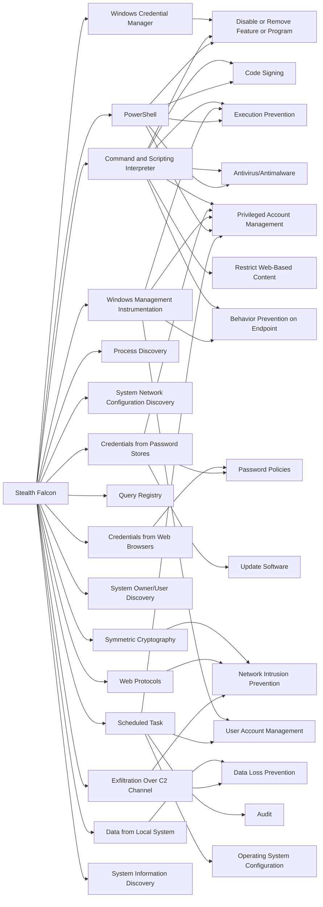

---
tags:
   - groups
---
# Stealth Falcon
## ID:G0038
[Stealth Falcon](/mitre/groups/G0038) is a threat group that has conducted targeted spyware attacks against Emirati journalists, activists, and dissidents since at least 2012. Circumstantial evidence suggests there could be a link between this group and the United Arab Emirates (UAE) government, but that has not been confirmed. (Citation: Citizen Lab Stealth Falcon May 2016)
## Techniques Used By Group
* [Windows Credential Manager](techniques/T1555/004)
* [Command and Scripting Interpreter](techniques/T1059)
* [Credentials from Web Browsers](techniques/T1555/003)
* [Credentials from Password Stores](techniques/T1555)
* [Process Discovery](techniques/T1057)
* [System Network Configuration Discovery](techniques/T1016)
* [Symmetric Cryptography](techniques/T1573/001)
* [Query Registry](techniques/T1012)
* [Web Protocols](techniques/T1071/001)
* [System Owner/User Discovery](techniques/T1033)
* [Windows Management Instrumentation](techniques/T1047)
* [Data from Local System](techniques/T1005)
* [Exfiltration Over C2 Channel](techniques/T1041)
* [PowerShell](techniques/T1059/001)
* [Scheduled Task](techniques/T1053/005)
* [System Information Discovery](techniques/T1082)

# Summary of Techniques and Mitigations
