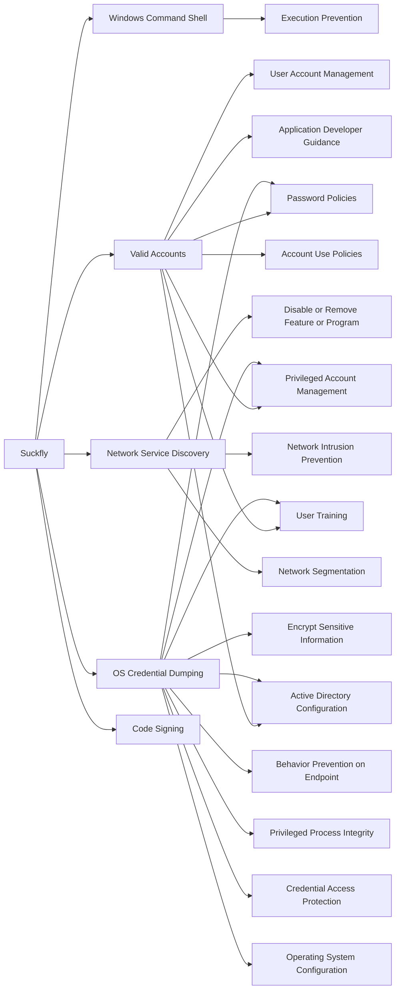

---
tags:
   - groups
---
# Suckfly
## ID:G0039
[Suckfly](groups/G0039) is a China-based threat group that has been active since at least 2014. (Citation: Symantec Suckfly March 2016)
## Techniques Used By Group
* [Windows Command Shell](techniques/T1059/003)
* [Valid Accounts](techniques/T1078)
* [Network Service Discovery](techniques/T1046)
* [OS Credential Dumping](techniques/T1003)
* [Code Signing](techniques/T1553/002)

# Summary of Techniques and Mitigations
