---
tags:
   - groups
---
# Patchwork
## ID:G0040
[Patchwork](groups/G0040) is a cyber espionage group that was first observed in December 2015. While the group has not been definitively attributed, circumstantial evidence suggests the group may be a pro-Indian or Indian entity. [Patchwork](groups/G0040) has been seen targeting industries related to diplomatic and government agencies. Much of the code used by this group was copied and pasted from online forums. [Patchwork](groups/G0040) was also seen operating spearphishing campaigns targeting U.S. think tank groups in March and April of 2018.(Citation: Cymmetria Patchwork) (Citation: Symantec Patchwork)(Citation: TrendMicro Patchwork Dec 2017)(Citation: Volexity Patchwork June 2018)
## Techniques Used By Group
* [Visual Basic](techniques/T1059/005)
* [Archive Collected Data](techniques/T1560)
* [File and Directory Discovery](techniques/T1083)
* [Code Signing](techniques/T1553/002)
* [DLL Side-Loading](techniques/T1574/002)
* [Modify Registry](techniques/T1112)
* [BITS Jobs](techniques/T1197)
* [Indicator Removal from Tools](techniques/T1027/005)
* [Credentials from Web Browsers](techniques/T1555/003)
* [Scheduled Task](techniques/T1053/005)
* [Standard Encoding](techniques/T1132/001)
* [Process Hollowing](techniques/T1055/012)
* [Remote Desktop Protocol](techniques/T1021/001)
* [Registry Run Keys / Startup Folder](techniques/T1547/001)
* [Local Data Staging](techniques/T1074/001)
* [Match Legitimate Name or Location](techniques/T1036/005)
* [Spearphishing Attachment](techniques/T1566/001)
* [Command Obfuscation](techniques/T1027/010)
* [Tool](techniques/T1588/002)
* [Drive-by Compromise](techniques/T1189)
* [Malicious Link](techniques/T1204/001)
* [Security Software Discovery](techniques/T1518/001)
* [Exploitation for Client Execution](techniques/T1203)
* [Software Packing](techniques/T1027/002)
* [System Owner/User Discovery](techniques/T1033)
* [Data from Local System](techniques/T1005)
* [Malicious File](techniques/T1204/002)
* [Code Signing Certificates](techniques/T1587/002)
* [File Deletion](techniques/T1070/004)
* [Automated Collection](techniques/T1119)
* [Dead Drop Resolver](techniques/T1102/001)
* [Windows Command Shell](techniques/T1059/003)
* [Binary Padding](techniques/T1027/001)
* [Bypass User Account Control](techniques/T1548/002)
* [PowerShell](techniques/T1059/001)
* [Spearphishing Link](techniques/T1598/003)
* [Ingress Tool Transfer](techniques/T1105)
* [Spearphishing Link](techniques/T1566/002)
* [System Information Discovery](techniques/T1082)
* [Dynamic Data Exchange](techniques/T1559/002)

# Summary of Techniques and Mitigations

```mermaid
flowchart LR
group[Patchwork] --> T1059.005[Visual Basic]
group[Patchwork] --> T1560[Archive Collected Data]
group[Patchwork] --> T1083[File and Directory Discovery]
group[Patchwork] --> T1553.002[Code Signing]
group[Patchwork] --> T1574.002[DLL Side-Loading]
group[Patchwork] --> T1112[Modify Registry]
group[Patchwork] --> T1197[BITS Jobs]
group[Patchwork] --> T1027.005[Indicator Removal from Tools]
group[Patchwork] --> T1555.003[Credentials from Web Browsers]
group[Patchwork] --> T1053.005[Scheduled Task]
group[Patchwork] --> T1132.001[Standard Encoding]
group[Patchwork] --> T1055.012[Process Hollowing]
group[Patchwork] --> T1021.001[Remote Desktop Protocol]
group[Patchwork] --> T1547.001[Registry Run Keys / Startup Folder]
group[Patchwork] --> T1074.001[Local Data Staging]
group[Patchwork] --> T1036.005[Match Legitimate Name or Location]
group[Patchwork] --> T1566.001[Spearphishing Attachment]
group[Patchwork] --> T1027.010[Command Obfuscation]
group[Patchwork] --> T1588.002[Tool]
group[Patchwork] --> T1189[Drive-by Compromise]
group[Patchwork] --> T1204.001[Malicious Link]
group[Patchwork] --> T1518.001[Security Software Discovery]
group[Patchwork] --> T1203[Exploitation for Client Execution]
group[Patchwork] --> T1027.002[Software Packing]
group[Patchwork] --> T1033[System Owner/User Discovery]
group[Patchwork] --> T1005[Data from Local System]
group[Patchwork] --> T1204.002[Malicious File]
group[Patchwork] --> T1587.002[Code Signing Certificates]
group[Patchwork] --> T1070.004[File Deletion]
group[Patchwork] --> T1119[Automated Collection]
group[Patchwork] --> T1102.001[Dead Drop Resolver]
group[Patchwork] --> T1059.003[Windows Command Shell]
group[Patchwork] --> T1027.001[Binary Padding]
group[Patchwork] --> T1548.002[Bypass User Account Control]
group[Patchwork] --> T1059.001[PowerShell]
group[Patchwork] --> T1598.003[Spearphishing Link]
group[Patchwork] --> T1105[Ingress Tool Transfer]
group[Patchwork] --> T1566.002[Spearphishing Link]
group[Patchwork] --> T1082[System Information Discovery]
group[Patchwork] --> T1559.002[Dynamic Data Exchange]
T1059.005[Visual Basic] --> M1042[Disable or Remove Feature or Program]
T1059.005[Visual Basic] --> M1049[Antivirus/Antimalware]
T1059.005[Visual Basic] --> M1038[Execution Prevention]
T1059.005[Visual Basic] --> M1040[Behavior Prevention on Endpoint]
T1059.005[Visual Basic] --> M1021[Restrict Web-Based Content]
T1560[Archive Collected Data] --> M1047[Audit]
T1574.002[DLL Side-Loading] --> M1051[Update Software]
T1574.002[DLL Side-Loading] --> M1013[Application Developer Guidance]
T1112[Modify Registry] --> M1024[Restrict Registry Permissions]
T1197[BITS Jobs] --> M1018[User Account Management]
T1197[BITS Jobs] --> M1037[Filter Network Traffic]
T1197[BITS Jobs] --> M1028[Operating System Configuration]
T1555.003[Credentials from Web Browsers] --> M1027[Password Policies]
T1053.005[Scheduled Task] --> M1026[Privileged Account Management]
T1053.005[Scheduled Task] --> M1018[User Account Management]
T1053.005[Scheduled Task] --> M1047[Audit]
T1053.005[Scheduled Task] --> M1028[Operating System Configuration]
T1132.001[Standard Encoding] --> M1031[Network Intrusion Prevention]
T1055.012[Process Hollowing] --> M1040[Behavior Prevention on Endpoint]
T1021.001[Remote Desktop Protocol] --> M1047[Audit]
T1021.001[Remote Desktop Protocol] --> M1035[Limit Access to Resource Over Network]
T1021.001[Remote Desktop Protocol] --> M1030[Network Segmentation]
T1021.001[Remote Desktop Protocol] --> M1028[Operating System Configuration]
T1021.001[Remote Desktop Protocol] --> M1042[Disable or Remove Feature or Program]
T1021.001[Remote Desktop Protocol] --> M1018[User Account Management]
T1021.001[Remote Desktop Protocol] --> M1032[Multi-factor Authentication]
T1021.001[Remote Desktop Protocol] --> M1026[Privileged Account Management]
T1036.005[Match Legitimate Name or Location] --> M1022[Restrict File and Directory Permissions]
T1036.005[Match Legitimate Name or Location] --> M1038[Execution Prevention]
T1036.005[Match Legitimate Name or Location] --> M1045[Code Signing]
T1566.001[Spearphishing Attachment] --> M1049[Antivirus/Antimalware]
T1566.001[Spearphishing Attachment] --> M1031[Network Intrusion Prevention]
T1566.001[Spearphishing Attachment] --> M1054[Software Configuration]
T1566.001[Spearphishing Attachment] --> M1017[User Training]
T1566.001[Spearphishing Attachment] --> M1021[Restrict Web-Based Content]
T1027.010[Command Obfuscation] --> M1040[Behavior Prevention on Endpoint]
T1027.010[Command Obfuscation] --> M1049[Antivirus/Antimalware]
T1588.002[Tool] --> M1056[Pre-compromise]
T1189[Drive-by Compromise] --> M1050[Exploit Protection]
T1189[Drive-by Compromise] --> M1051[Update Software]
T1189[Drive-by Compromise] --> M1048[Application Isolation and Sandboxing]
T1189[Drive-by Compromise] --> M1021[Restrict Web-Based Content]
T1204.001[Malicious Link] --> M1031[Network Intrusion Prevention]
T1204.001[Malicious Link] --> M1017[User Training]
T1204.001[Malicious Link] --> M1021[Restrict Web-Based Content]
T1203[Exploitation for Client Execution] --> M1050[Exploit Protection]
T1203[Exploitation for Client Execution] --> M1048[Application Isolation and Sandboxing]
T1027.002[Software Packing] --> M1049[Antivirus/Antimalware]
T1005[Data from Local System] --> M1057[Data Loss Prevention]
T1204.002[Malicious File] --> M1038[Execution Prevention]
T1204.002[Malicious File] --> M1040[Behavior Prevention on Endpoint]
T1204.002[Malicious File] --> M1017[User Training]
T1587.002[Code Signing Certificates] --> M1056[Pre-compromise]
T1119[Automated Collection] --> M1029[Remote Data Storage]
T1119[Automated Collection] --> M1041[Encrypt Sensitive Information]
T1102.001[Dead Drop Resolver] --> M1021[Restrict Web-Based Content]
T1102.001[Dead Drop Resolver] --> M1031[Network Intrusion Prevention]
T1059.003[Windows Command Shell] --> M1038[Execution Prevention]
T1548.002[Bypass User Account Control] --> M1051[Update Software]
T1548.002[Bypass User Account Control] --> M1047[Audit]
T1548.002[Bypass User Account Control] --> M1052[User Account Control]
T1548.002[Bypass User Account Control] --> M1026[Privileged Account Management]
T1059.001[PowerShell] --> M1042[Disable or Remove Feature or Program]
T1059.001[PowerShell] --> M1049[Antivirus/Antimalware]
T1059.001[PowerShell] --> M1045[Code Signing]
T1059.001[PowerShell] --> M1026[Privileged Account Management]
T1059.001[PowerShell] --> M1038[Execution Prevention]
T1598.003[Spearphishing Link] --> M1017[User Training]
T1598.003[Spearphishing Link] --> M1054[Software Configuration]
T1105[Ingress Tool Transfer] --> M1031[Network Intrusion Prevention]
T1566.002[Spearphishing Link] --> M1054[Software Configuration]
T1566.002[Spearphishing Link] --> M1021[Restrict Web-Based Content]
T1566.002[Spearphishing Link] --> M1047[Audit]
T1566.002[Spearphishing Link] --> M1018[User Account Management]
T1566.002[Spearphishing Link] --> M1017[User Training]
T1559.002[Dynamic Data Exchange] --> M1040[Behavior Prevention on Endpoint]
T1559.002[Dynamic Data Exchange] --> M1048[Application Isolation and Sandboxing]
T1559.002[Dynamic Data Exchange] --> M1054[Software Configuration]
T1559.002[Dynamic Data Exchange] --> M1042[Disable or Remove Feature or Program]
```
