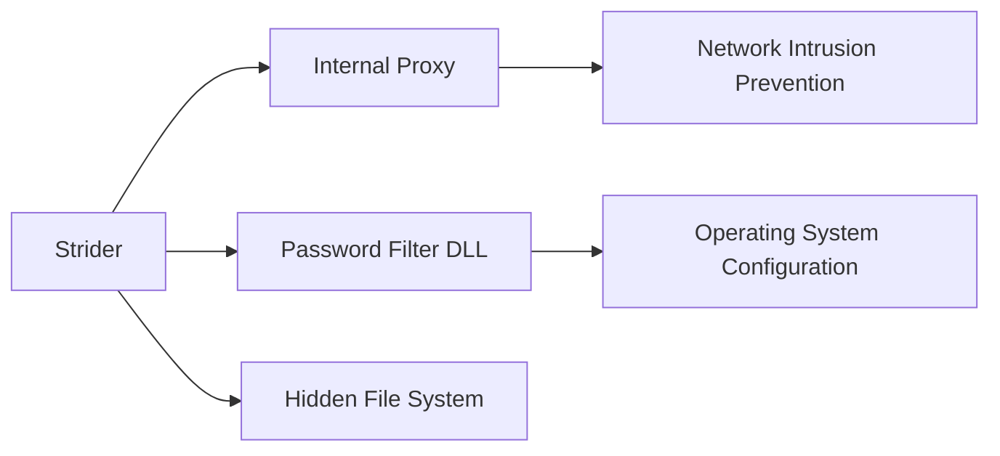

---
tags:
   - groups
---
# Strider
## ID:G0041
[Strider](groups/G0041) is a threat group that has been active since at least 2011 and has targeted victims in Russia, China, Sweden, Belgium, Iran, and Rwanda.(Citation: Symantec Strider Blog)(Citation: Kaspersky ProjectSauron Blog)
## Techniques Used By Group
* [Internal Proxy](techniques/T1090/001)
* [Password Filter DLL](techniques/T1556/002)
* [Hidden File System](techniques/T1564/005)

# Summary of Techniques and Mitigations
