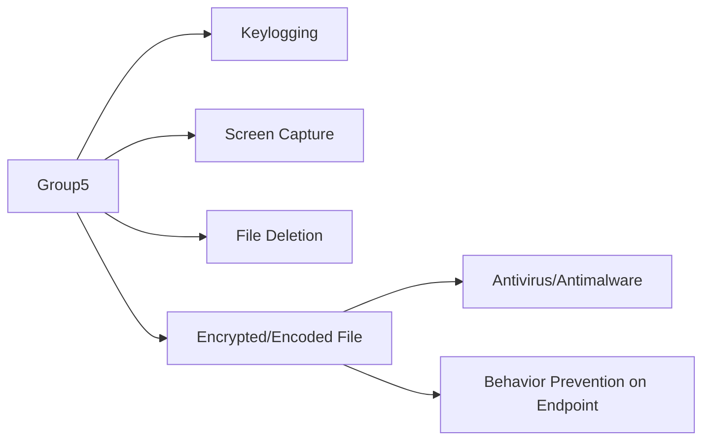

---
tags:
   - groups
---
# Group5
## ID:G0043
[Group5](/mitre/groups/G0043) is a threat group with a suspected Iranian nexus, though this attribution is not definite. The group has targeted individuals connected to the Syrian opposition via spearphishing and watering holes, normally using Syrian and Iranian themes. [Group5](/mitre/groups/G0043) has used two commonly available remote access tools (RATs), [njRAT](/mitre/software/S0385) and [NanoCore](/mitre/software/S0336), as well as an Android RAT, DroidJack. (Citation: Citizen Lab Group5)
## Techniques Used By Group
* [Keylogging](/mitre/techniques/T1056/001)
* [Screen Capture](/mitre/techniques/T1113)
* [File Deletion](/mitre/techniques/T1070/004)
* [Encrypted/Encoded File](/mitre/techniques/T1027/013)

# Summary of Techniques and Mitigations
