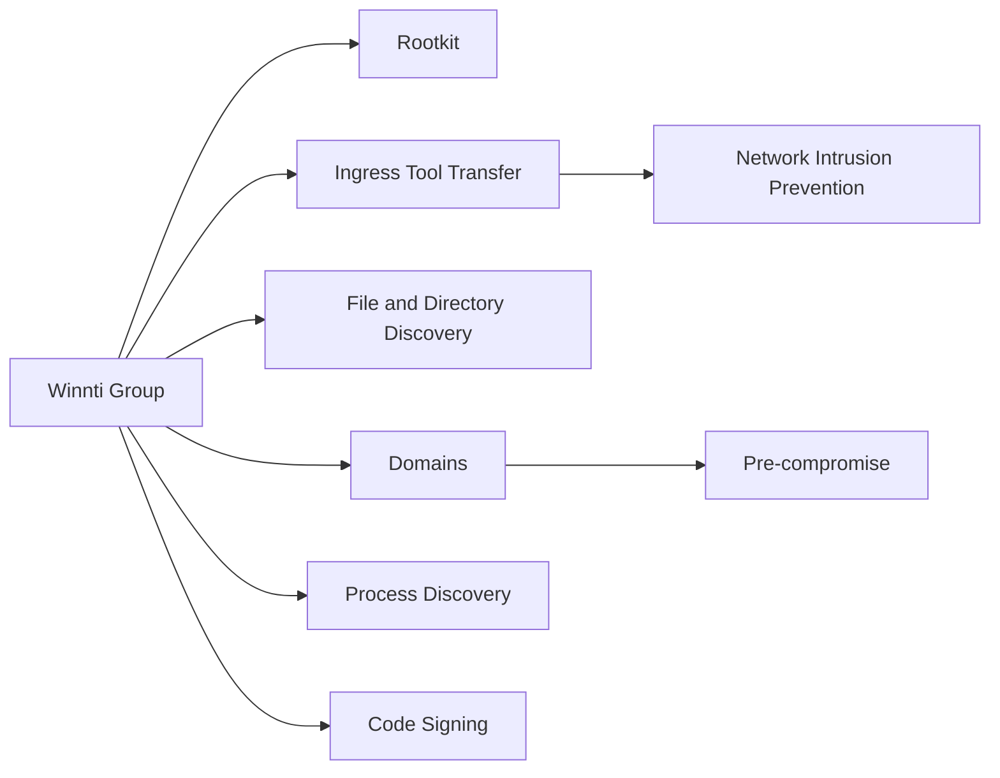

---
tags:
   - groups
---
# Winnti Group
## ID:G0044
[Winnti Group](groups/G0044) is a threat group with Chinese origins that has been active since at least 2010. The group has heavily targeted the gaming industry, but it has also expanded the scope of its targeting.(Citation: Kaspersky Winnti April 2013)(Citation: Kaspersky Winnti June 2015)(Citation: Novetta Winnti April 2015) Some reporting suggests a number of other groups, including [Axiom](groups/G0001), [APT17](groups/G0025), and [Ke3chang](groups/G0004), are closely linked to [Winnti Group](groups/G0044).(Citation: 401 TRG Winnti Umbrella May 2018)
## Techniques Used By Group
* [Rootkit](techniques/T1014)
* [Ingress Tool Transfer](techniques/T1105)
* [File and Directory Discovery](techniques/T1083)
* [Domains](techniques/T1583/001)
* [Process Discovery](techniques/T1057)
* [Code Signing](techniques/T1553/002)

# Summary of Techniques and Mitigations
