---
tags:
   - groups
---
# menuPass
## ID:G0045
[menuPass](groups/G0045) is a threat group that has been active since at least 2006. Individual members of [menuPass](groups/G0045) are known to have acted in association with the Chinese Ministry of State Security's (MSS) Tianjin State Security Bureau and worked for the Huaying Haitai Science and Technology Development Company.(Citation: DOJ APT10 Dec 2018)(Citation: District Court of NY APT10 Indictment December 2018)

[menuPass](groups/G0045) has targeted healthcare, defense, aerospace, finance, maritime, biotechnology, energy, and government sectors globally, with an emphasis on Japanese organizations. In 2016 and 2017, the group is known to have targeted managed IT service providers (MSPs), manufacturing and mining companies, and a university.(Citation: Palo Alto menuPass Feb 2017)(Citation: Crowdstrike CrowdCast Oct 2013)(Citation: FireEye Poison Ivy)(Citation: PWC Cloud Hopper April 2017)(Citation: FireEye APT10 April 2017)(Citation: DOJ APT10 Dec 2018)(Citation: District Court of NY APT10 Indictment December 2018)
## Techniques Used By Group
* [Remote System Discovery](techniques/T1018)
* [Windows Management Instrumentation](techniques/T1047)
* [Masquerading](techniques/T1036)
* [File Deletion](techniques/T1070/004)
* [Network Service Discovery](techniques/T1046)
* [System Network Connections Discovery](techniques/T1049)
* [Archive via Utility](techniques/T1560/001)
* [Spearphishing Attachment](techniques/T1566/001)
* [Ingress Tool Transfer](techniques/T1105)
* [Tool](techniques/T1588/002)
* [Malicious File](techniques/T1204/002)
* [External Proxy](techniques/T1090/002)
* [Valid Accounts](techniques/T1078)
* [System Network Configuration Discovery](techniques/T1016)
* [Fast Flux DNS](techniques/T1568/001)
* [Rename System Utilities](techniques/T1036/003)
* [Keylogging](techniques/T1056/001)
* [Domain Account](techniques/T1087/002)
* [NTDS](techniques/T1003/003)
* [InstallUtil](techniques/T1218/004)
* [Native API](techniques/T1106)
* [Security Account Manager](techniques/T1003/002)
* [Encrypted/Encoded File](techniques/T1027/013)
* [Trusted Relationship](techniques/T1199)
* [Exploit Public-Facing Application](techniques/T1190)
* [Remote Data Staging](techniques/T1074/002)
* [Clear Command History](techniques/T1070/003)
* [Deobfuscate/Decode Files or Information](techniques/T1140)
* [Code Signing](techniques/T1553/002)
* [Scheduled Task](techniques/T1053/005)
* [Process Hollowing](techniques/T1055/012)
* [Local Data Staging](techniques/T1074/001)
* [Remote Desktop Protocol](techniques/T1021/001)
* [Data from Network Shared Drive](techniques/T1039)
* [LSA Secrets](techniques/T1003/004)
* [File and Directory Discovery](techniques/T1083)
* [Match Legitimate Name or Location](techniques/T1036/005)
* [DLL Side-Loading](techniques/T1574/002)
* [Archive Collected Data](techniques/T1560)
* [Windows Command Shell](techniques/T1059/003)
* [Data from Local System](techniques/T1005)
* [PowerShell](techniques/T1059/001)
* [Exploitation of Remote Services](techniques/T1210)
* [SSH](techniques/T1021/004)
* [Automated Collection](techniques/T1119)
* [Domains](techniques/T1583/001)
* [DLL Search Order Hijacking](techniques/T1574/001)

# Summary of Techniques and Mitigations

```mermaid
flowchart LR
group[menuPass] --> T1018[Remote System Discovery]
group[menuPass] --> T1047[Windows Management Instrumentation]
group[menuPass] --> T1036[Masquerading]
group[menuPass] --> T1070.004[File Deletion]
group[menuPass] --> T1046[Network Service Discovery]
group[menuPass] --> T1049[System Network Connections Discovery]
group[menuPass] --> T1560.001[Archive via Utility]
group[menuPass] --> T1566.001[Spearphishing Attachment]
group[menuPass] --> T1105[Ingress Tool Transfer]
group[menuPass] --> T1588.002[Tool]
group[menuPass] --> T1204.002[Malicious File]
group[menuPass] --> T1090.002[External Proxy]
group[menuPass] --> T1078[Valid Accounts]
group[menuPass] --> T1016[System Network Configuration Discovery]
group[menuPass] --> T1568.001[Fast Flux DNS]
group[menuPass] --> T1036.003[Rename System Utilities]
group[menuPass] --> T1056.001[Keylogging]
group[menuPass] --> T1087.002[Domain Account]
group[menuPass] --> T1003.003[NTDS]
group[menuPass] --> T1218.004[InstallUtil]
group[menuPass] --> T1106[Native API]
group[menuPass] --> T1003.002[Security Account Manager]
group[menuPass] --> T1027.013[Encrypted/Encoded File]
group[menuPass] --> T1199[Trusted Relationship]
group[menuPass] --> T1190[Exploit Public-Facing Application]
group[menuPass] --> T1074.002[Remote Data Staging]
group[menuPass] --> T1070.003[Clear Command History]
group[menuPass] --> T1140[Deobfuscate/Decode Files or Information]
group[menuPass] --> T1553.002[Code Signing]
group[menuPass] --> T1053.005[Scheduled Task]
group[menuPass] --> T1055.012[Process Hollowing]
group[menuPass] --> T1074.001[Local Data Staging]
group[menuPass] --> T1021.001[Remote Desktop Protocol]
group[menuPass] --> T1039[Data from Network Shared Drive]
group[menuPass] --> T1003.004[LSA Secrets]
group[menuPass] --> T1083[File and Directory Discovery]
group[menuPass] --> T1036.005[Match Legitimate Name or Location]
group[menuPass] --> T1574.002[DLL Side-Loading]
group[menuPass] --> T1560[Archive Collected Data]
group[menuPass] --> T1059.003[Windows Command Shell]
group[menuPass] --> T1005[Data from Local System]
group[menuPass] --> T1059.001[PowerShell]
group[menuPass] --> T1210[Exploitation of Remote Services]
group[menuPass] --> T1021.004[SSH]
group[menuPass] --> T1119[Automated Collection]
group[menuPass] --> T1583.001[Domains]
group[menuPass] --> T1574.001[DLL Search Order Hijacking]
T1047[Windows Management Instrumentation] --> M1026[Privileged Account Management]
T1047[Windows Management Instrumentation] --> M1040[Behavior Prevention on Endpoint]
T1047[Windows Management Instrumentation] --> M1018[User Account Management]
T1047[Windows Management Instrumentation] --> M1038[Execution Prevention]
T1036[Masquerading] --> M1017[User Training]
T1036[Masquerading] --> M1045[Code Signing]
T1036[Masquerading] --> M1040[Behavior Prevention on Endpoint]
T1036[Masquerading] --> M1022[Restrict File and Directory Permissions]
T1036[Masquerading] --> M1049[Antivirus/Antimalware]
T1036[Masquerading] --> M1038[Execution Prevention]
T1046[Network Service Discovery] --> M1042[Disable or Remove Feature or Program]
T1046[Network Service Discovery] --> M1031[Network Intrusion Prevention]
T1046[Network Service Discovery] --> M1030[Network Segmentation]
T1560.001[Archive via Utility] --> M1047[Audit]
T1566.001[Spearphishing Attachment] --> M1049[Antivirus/Antimalware]
T1566.001[Spearphishing Attachment] --> M1031[Network Intrusion Prevention]
T1566.001[Spearphishing Attachment] --> M1054[Software Configuration]
T1566.001[Spearphishing Attachment] --> M1017[User Training]
T1566.001[Spearphishing Attachment] --> M1021[Restrict Web-Based Content]
T1105[Ingress Tool Transfer] --> M1031[Network Intrusion Prevention]
T1588.002[Tool] --> M1056[Pre-compromise]
T1204.002[Malicious File] --> M1038[Execution Prevention]
T1204.002[Malicious File] --> M1040[Behavior Prevention on Endpoint]
T1204.002[Malicious File] --> M1017[User Training]
T1090.002[External Proxy] --> M1031[Network Intrusion Prevention]
T1078[Valid Accounts] --> M1027[Password Policies]
T1078[Valid Accounts] --> M1018[User Account Management]
T1078[Valid Accounts] --> M1026[Privileged Account Management]
T1078[Valid Accounts] --> M1013[Application Developer Guidance]
T1078[Valid Accounts] --> M1017[User Training]
T1078[Valid Accounts] --> M1015[Active Directory Configuration]
T1078[Valid Accounts] --> M1036[Account Use Policies]
T1036.003[Rename System Utilities] --> M1022[Restrict File and Directory Permissions]
T1087.002[Domain Account] --> M1028[Operating System Configuration]
T1003.003[NTDS] --> M1027[Password Policies]
T1003.003[NTDS] --> M1026[Privileged Account Management]
T1003.003[NTDS] --> M1017[User Training]
T1003.003[NTDS] --> M1041[Encrypt Sensitive Information]
T1218.004[InstallUtil] --> M1038[Execution Prevention]
T1218.004[InstallUtil] --> M1042[Disable or Remove Feature or Program]
T1106[Native API] --> M1038[Execution Prevention]
T1106[Native API] --> M1040[Behavior Prevention on Endpoint]
T1003.002[Security Account Manager] --> M1027[Password Policies]
T1003.002[Security Account Manager] --> M1026[Privileged Account Management]
T1003.002[Security Account Manager] --> M1028[Operating System Configuration]
T1003.002[Security Account Manager] --> M1017[User Training]
T1027.013[Encrypted/Encoded File] --> M1049[Antivirus/Antimalware]
T1027.013[Encrypted/Encoded File] --> M1040[Behavior Prevention on Endpoint]
T1199[Trusted Relationship] --> M1032[Multi-factor Authentication]
T1199[Trusted Relationship] --> M1018[User Account Management]
T1199[Trusted Relationship] --> M1030[Network Segmentation]
T1190[Exploit Public-Facing Application] --> M1048[Application Isolation and Sandboxing]
T1190[Exploit Public-Facing Application] --> M1030[Network Segmentation]
T1190[Exploit Public-Facing Application] --> M1016[Vulnerability Scanning]
T1190[Exploit Public-Facing Application] --> M1026[Privileged Account Management]
T1190[Exploit Public-Facing Application] --> M1050[Exploit Protection]
T1190[Exploit Public-Facing Application] --> M1051[Update Software]
T1070.003[Clear Command History] --> M1029[Remote Data Storage]
T1070.003[Clear Command History] --> M1022[Restrict File and Directory Permissions]
T1070.003[Clear Command History] --> M1039[Environment Variable Permissions]
T1053.005[Scheduled Task] --> M1026[Privileged Account Management]
T1053.005[Scheduled Task] --> M1018[User Account Management]
T1053.005[Scheduled Task] --> M1047[Audit]
T1053.005[Scheduled Task] --> M1028[Operating System Configuration]
T1055.012[Process Hollowing] --> M1040[Behavior Prevention on Endpoint]
T1021.001[Remote Desktop Protocol] --> M1047[Audit]
T1021.001[Remote Desktop Protocol] --> M1035[Limit Access to Resource Over Network]
T1021.001[Remote Desktop Protocol] --> M1030[Network Segmentation]
T1021.001[Remote Desktop Protocol] --> M1028[Operating System Configuration]
T1021.001[Remote Desktop Protocol] --> M1042[Disable or Remove Feature or Program]
T1021.001[Remote Desktop Protocol] --> M1018[User Account Management]
T1021.001[Remote Desktop Protocol] --> M1032[Multi-factor Authentication]
T1021.001[Remote Desktop Protocol] --> M1026[Privileged Account Management]
T1003.004[LSA Secrets] --> M1027[Password Policies]
T1003.004[LSA Secrets] --> M1026[Privileged Account Management]
T1003.004[LSA Secrets] --> M1017[User Training]
T1036.005[Match Legitimate Name or Location] --> M1022[Restrict File and Directory Permissions]
T1036.005[Match Legitimate Name or Location] --> M1038[Execution Prevention]
T1036.005[Match Legitimate Name or Location] --> M1045[Code Signing]
T1574.002[DLL Side-Loading] --> M1051[Update Software]
T1574.002[DLL Side-Loading] --> M1013[Application Developer Guidance]
T1560[Archive Collected Data] --> M1047[Audit]
T1059.003[Windows Command Shell] --> M1038[Execution Prevention]
T1005[Data from Local System] --> M1057[Data Loss Prevention]
T1059.001[PowerShell] --> M1042[Disable or Remove Feature or Program]
T1059.001[PowerShell] --> M1049[Antivirus/Antimalware]
T1059.001[PowerShell] --> M1045[Code Signing]
T1059.001[PowerShell] --> M1026[Privileged Account Management]
T1059.001[PowerShell] --> M1038[Execution Prevention]
T1210[Exploitation of Remote Services] --> M1042[Disable or Remove Feature or Program]
T1210[Exploitation of Remote Services] --> M1016[Vulnerability Scanning]
T1210[Exploitation of Remote Services] --> M1050[Exploit Protection]
T1210[Exploitation of Remote Services] --> M1030[Network Segmentation]
T1210[Exploitation of Remote Services] --> M1019[Threat Intelligence Program]
T1210[Exploitation of Remote Services] --> M1048[Application Isolation and Sandboxing]
T1210[Exploitation of Remote Services] --> M1026[Privileged Account Management]
T1210[Exploitation of Remote Services] --> M1051[Update Software]
T1021.004[SSH] --> M1042[Disable or Remove Feature or Program]
T1021.004[SSH] --> M1032[Multi-factor Authentication]
T1021.004[SSH] --> M1018[User Account Management]
T1119[Automated Collection] --> M1029[Remote Data Storage]
T1119[Automated Collection] --> M1041[Encrypt Sensitive Information]
T1583.001[Domains] --> M1056[Pre-compromise]
T1574.001[DLL Search Order Hijacking] --> M1038[Execution Prevention]
T1574.001[DLL Search Order Hijacking] --> M1044[Restrict Library Loading]
T1574.001[DLL Search Order Hijacking] --> M1047[Audit]
```
