---
tags:
   - groups
---
# FIN7
## ID:G0046
[FIN7](groups/G0046) is a financially-motivated threat group that has been active since 2013. [FIN7](groups/G0046) has primarily targeted the retail, restaurant, hospitality, software, consulting, financial services, medical equipment, cloud services, media, food and beverage, transportation, and utilities industries in the U.S. A portion of [FIN7](groups/G0046) was run out of a front company called Combi Security and often used point-of-sale malware for targeting efforts. Since 2020, [FIN7](groups/G0046) shifted operations to a big game hunting (BGH) approach including use of [REvil](software/S0496) ransomware and their own Ransomware as a Service (RaaS), Darkside. FIN7 may be linked to the [Carbanak](groups/G0008) Group, but there appears to be several groups using [Carbanak](software/S0030) malware and are therefore tracked separately.(Citation: FireEye FIN7 March 2017)(Citation: FireEye FIN7 April 2017)(Citation: FireEye CARBANAK June 2017)(Citation: FireEye FIN7 Aug 2018)(Citation: CrowdStrike Carbon Spider August 2021)(Citation: Mandiant FIN7 Apr 2022)
## Techniques Used By Group
* [Malicious Link](techniques/T1204/001)
* [Code Signing](techniques/T1553/002)
* [Valid Accounts](techniques/T1078)
* [Command and Scripting Interpreter](techniques/T1059)
* [SSH](techniques/T1021/004)
* [Exploit Public-Facing Application](techniques/T1190)
* [Binary Padding](techniques/T1027/001)
* [System Owner/User Discovery](techniques/T1033)
* [Scheduled Task](techniques/T1053/005)
* [VNC](techniques/T1021/005)
* [Match Legitimate Name or Location](techniques/T1036/005)
* [Spearphishing Link](techniques/T1566/002)
* [Masquerade Task or Service](techniques/T1036/004)
* [Rundll32](techniques/T1218/011)
* [Windows Management Instrumentation](techniques/T1047)
* [Visual Basic](techniques/T1059/005)
* [Remote Access Software](techniques/T1219)
* [PowerShell](techniques/T1059/001)
* [Application Shimming](techniques/T1546/011)
* [Dynamic Data Exchange](techniques/T1559/002)
* [Domain Groups](techniques/T1069/002)
* [Remote Desktop Protocol](techniques/T1021/001)
* [Data Encrypted for Impact](techniques/T1486)
* [Tool](techniques/T1588/002)
* [Web Services](techniques/T1583/006)
* [User Activity Based Checks](techniques/T1497/002)
* [JavaScript](techniques/T1059/007)
* [Registry Run Keys / Startup Folder](techniques/T1547/001)
* [Drive-by Target](techniques/T1608/004)
* [Video Capture](techniques/T1125)
* [Non-Standard Port](techniques/T1571)
* [Command Obfuscation](techniques/T1027/010)
* [Malicious File](techniques/T1204/002)
* [Mshta](techniques/T1218/005)
* [Bidirectional Communication](techniques/T1102/002)
* [Ingress Tool Transfer](techniques/T1105)
* [Local Accounts](techniques/T1078/003)
* [Domains](techniques/T1583/001)
* [Data from Local System](techniques/T1005)
* [Windows Service](techniques/T1543/003)
* [Replication Through Removable Media](techniques/T1091)
* [DNS](techniques/T1071/004)
* [Windows Command Shell](techniques/T1059/003)
* [Spearphishing Attachment](techniques/T1566/001)
* [Upload Malware](techniques/T1608/001)
* [Fallback Channels](techniques/T1008)
* [Kerberoasting](techniques/T1558/003)
* [Compromise Software Supply Chain](techniques/T1195/002)
* [Screen Capture](techniques/T1113)
* [Exfiltration to Cloud Storage](techniques/T1567/002)
* [Exploitation of Remote Services](techniques/T1210)
* [Malware](techniques/T1587/001)

# Summary of Techniques and Mitigations

```mermaid
flowchart LR
group[FIN7] --> T1204.001[Malicious Link]
group[FIN7] --> T1553.002[Code Signing]
group[FIN7] --> T1078[Valid Accounts]
group[FIN7] --> T1059[Command and Scripting Interpreter]
group[FIN7] --> T1021.004[SSH]
group[FIN7] --> T1190[Exploit Public-Facing Application]
group[FIN7] --> T1027.001[Binary Padding]
group[FIN7] --> T1033[System Owner/User Discovery]
group[FIN7] --> T1053.005[Scheduled Task]
group[FIN7] --> T1021.005[VNC]
group[FIN7] --> T1036.005[Match Legitimate Name or Location]
group[FIN7] --> T1566.002[Spearphishing Link]
group[FIN7] --> T1036.004[Masquerade Task or Service]
group[FIN7] --> T1218.011[Rundll32]
group[FIN7] --> T1047[Windows Management Instrumentation]
group[FIN7] --> T1059.005[Visual Basic]
group[FIN7] --> T1219[Remote Access Software]
group[FIN7] --> T1059.001[PowerShell]
group[FIN7] --> T1546.011[Application Shimming]
group[FIN7] --> T1559.002[Dynamic Data Exchange]
group[FIN7] --> T1069.002[Domain Groups]
group[FIN7] --> T1021.001[Remote Desktop Protocol]
group[FIN7] --> T1486[Data Encrypted for Impact]
group[FIN7] --> T1588.002[Tool]
group[FIN7] --> T1583.006[Web Services]
group[FIN7] --> T1497.002[User Activity Based Checks]
group[FIN7] --> T1059.007[JavaScript]
group[FIN7] --> T1547.001[Registry Run Keys / Startup Folder]
group[FIN7] --> T1608.004[Drive-by Target]
group[FIN7] --> T1125[Video Capture]
group[FIN7] --> T1571[Non-Standard Port]
group[FIN7] --> T1027.010[Command Obfuscation]
group[FIN7] --> T1204.002[Malicious File]
group[FIN7] --> T1218.005[Mshta]
group[FIN7] --> T1102.002[Bidirectional Communication]
group[FIN7] --> T1105[Ingress Tool Transfer]
group[FIN7] --> T1078.003[Local Accounts]
group[FIN7] --> T1583.001[Domains]
group[FIN7] --> T1005[Data from Local System]
group[FIN7] --> T1543.003[Windows Service]
group[FIN7] --> T1091[Replication Through Removable Media]
group[FIN7] --> T1071.004[DNS]
group[FIN7] --> T1059.003[Windows Command Shell]
group[FIN7] --> T1566.001[Spearphishing Attachment]
group[FIN7] --> T1608.001[Upload Malware]
group[FIN7] --> T1008[Fallback Channels]
group[FIN7] --> T1558.003[Kerberoasting]
group[FIN7] --> T1195.002[Compromise Software Supply Chain]
group[FIN7] --> T1113[Screen Capture]
group[FIN7] --> T1567.002[Exfiltration to Cloud Storage]
group[FIN7] --> T1210[Exploitation of Remote Services]
group[FIN7] --> T1587.001[Malware]
T1204.001[Malicious Link] --> M1031[Network Intrusion Prevention]
T1204.001[Malicious Link] --> M1017[User Training]
T1204.001[Malicious Link] --> M1021[Restrict Web-Based Content]
T1078[Valid Accounts] --> M1027[Password Policies]
T1078[Valid Accounts] --> M1018[User Account Management]
T1078[Valid Accounts] --> M1026[Privileged Account Management]
T1078[Valid Accounts] --> M1013[Application Developer Guidance]
T1078[Valid Accounts] --> M1017[User Training]
T1078[Valid Accounts] --> M1015[Active Directory Configuration]
T1078[Valid Accounts] --> M1036[Account Use Policies]
T1059[Command and Scripting Interpreter] --> M1045[Code Signing]
T1059[Command and Scripting Interpreter] --> M1042[Disable or Remove Feature or Program]
T1059[Command and Scripting Interpreter] --> M1038[Execution Prevention]
T1059[Command and Scripting Interpreter] --> M1049[Antivirus/Antimalware]
T1059[Command and Scripting Interpreter] --> M1026[Privileged Account Management]
T1059[Command and Scripting Interpreter] --> M1021[Restrict Web-Based Content]
T1059[Command and Scripting Interpreter] --> M1040[Behavior Prevention on Endpoint]
T1021.004[SSH] --> M1042[Disable or Remove Feature or Program]
T1021.004[SSH] --> M1032[Multi-factor Authentication]
T1021.004[SSH] --> M1018[User Account Management]
T1190[Exploit Public-Facing Application] --> M1048[Application Isolation and Sandboxing]
T1190[Exploit Public-Facing Application] --> M1030[Network Segmentation]
T1190[Exploit Public-Facing Application] --> M1016[Vulnerability Scanning]
T1190[Exploit Public-Facing Application] --> M1026[Privileged Account Management]
T1190[Exploit Public-Facing Application] --> M1050[Exploit Protection]
T1190[Exploit Public-Facing Application] --> M1051[Update Software]
T1053.005[Scheduled Task] --> M1026[Privileged Account Management]
T1053.005[Scheduled Task] --> M1018[User Account Management]
T1053.005[Scheduled Task] --> M1047[Audit]
T1053.005[Scheduled Task] --> M1028[Operating System Configuration]
T1021.005[VNC] --> M1042[Disable or Remove Feature or Program]
T1021.005[VNC] --> M1037[Filter Network Traffic]
T1021.005[VNC] --> M1047[Audit]
T1021.005[VNC] --> M1033[Limit Software Installation]
T1036.005[Match Legitimate Name or Location] --> M1022[Restrict File and Directory Permissions]
T1036.005[Match Legitimate Name or Location] --> M1038[Execution Prevention]
T1036.005[Match Legitimate Name or Location] --> M1045[Code Signing]
T1566.002[Spearphishing Link] --> M1054[Software Configuration]
T1566.002[Spearphishing Link] --> M1021[Restrict Web-Based Content]
T1566.002[Spearphishing Link] --> M1047[Audit]
T1566.002[Spearphishing Link] --> M1018[User Account Management]
T1566.002[Spearphishing Link] --> M1017[User Training]
T1218.011[Rundll32] --> M1050[Exploit Protection]
T1047[Windows Management Instrumentation] --> M1026[Privileged Account Management]
T1047[Windows Management Instrumentation] --> M1040[Behavior Prevention on Endpoint]
T1047[Windows Management Instrumentation] --> M1018[User Account Management]
T1047[Windows Management Instrumentation] --> M1038[Execution Prevention]
T1059.005[Visual Basic] --> M1042[Disable or Remove Feature or Program]
T1059.005[Visual Basic] --> M1049[Antivirus/Antimalware]
T1059.005[Visual Basic] --> M1038[Execution Prevention]
T1059.005[Visual Basic] --> M1040[Behavior Prevention on Endpoint]
T1059.005[Visual Basic] --> M1021[Restrict Web-Based Content]
T1219[Remote Access Software] --> M1038[Execution Prevention]
T1219[Remote Access Software] --> M1037[Filter Network Traffic]
T1219[Remote Access Software] --> M1031[Network Intrusion Prevention]
T1219[Remote Access Software] --> M1042[Disable or Remove Feature or Program]
T1059.001[PowerShell] --> M1042[Disable or Remove Feature or Program]
T1059.001[PowerShell] --> M1049[Antivirus/Antimalware]
T1059.001[PowerShell] --> M1045[Code Signing]
T1059.001[PowerShell] --> M1026[Privileged Account Management]
T1059.001[PowerShell] --> M1038[Execution Prevention]
T1546.011[Application Shimming] --> M1052[User Account Control]
T1546.011[Application Shimming] --> M1051[Update Software]
T1559.002[Dynamic Data Exchange] --> M1040[Behavior Prevention on Endpoint]
T1559.002[Dynamic Data Exchange] --> M1048[Application Isolation and Sandboxing]
T1559.002[Dynamic Data Exchange] --> M1054[Software Configuration]
T1559.002[Dynamic Data Exchange] --> M1042[Disable or Remove Feature or Program]
T1021.001[Remote Desktop Protocol] --> M1047[Audit]
T1021.001[Remote Desktop Protocol] --> M1035[Limit Access to Resource Over Network]
T1021.001[Remote Desktop Protocol] --> M1030[Network Segmentation]
T1021.001[Remote Desktop Protocol] --> M1028[Operating System Configuration]
T1021.001[Remote Desktop Protocol] --> M1042[Disable or Remove Feature or Program]
T1021.001[Remote Desktop Protocol] --> M1018[User Account Management]
T1021.001[Remote Desktop Protocol] --> M1032[Multi-factor Authentication]
T1021.001[Remote Desktop Protocol] --> M1026[Privileged Account Management]
T1486[Data Encrypted for Impact] --> M1040[Behavior Prevention on Endpoint]
T1486[Data Encrypted for Impact] --> M1053[Data Backup]
T1588.002[Tool] --> M1056[Pre-compromise]
T1583.006[Web Services] --> M1056[Pre-compromise]
T1059.007[JavaScript] --> M1040[Behavior Prevention on Endpoint]
T1059.007[JavaScript] --> M1038[Execution Prevention]
T1059.007[JavaScript] --> M1042[Disable or Remove Feature or Program]
T1059.007[JavaScript] --> M1021[Restrict Web-Based Content]
T1608.004[Drive-by Target] --> M1056[Pre-compromise]
T1571[Non-Standard Port] --> M1030[Network Segmentation]
T1571[Non-Standard Port] --> M1031[Network Intrusion Prevention]
T1027.010[Command Obfuscation] --> M1040[Behavior Prevention on Endpoint]
T1027.010[Command Obfuscation] --> M1049[Antivirus/Antimalware]
T1204.002[Malicious File] --> M1038[Execution Prevention]
T1204.002[Malicious File] --> M1040[Behavior Prevention on Endpoint]
T1204.002[Malicious File] --> M1017[User Training]
T1218.005[Mshta] --> M1038[Execution Prevention]
T1218.005[Mshta] --> M1042[Disable or Remove Feature or Program]
T1102.002[Bidirectional Communication] --> M1021[Restrict Web-Based Content]
T1102.002[Bidirectional Communication] --> M1031[Network Intrusion Prevention]
T1105[Ingress Tool Transfer] --> M1031[Network Intrusion Prevention]
T1078.003[Local Accounts] --> M1026[Privileged Account Management]
T1078.003[Local Accounts] --> M1027[Password Policies]
T1583.001[Domains] --> M1056[Pre-compromise]
T1005[Data from Local System] --> M1057[Data Loss Prevention]
T1543.003[Windows Service] --> M1040[Behavior Prevention on Endpoint]
T1543.003[Windows Service] --> M1028[Operating System Configuration]
T1543.003[Windows Service] --> M1047[Audit]
T1543.003[Windows Service] --> M1045[Code Signing]
T1543.003[Windows Service] --> M1018[User Account Management]
T1091[Replication Through Removable Media] --> M1042[Disable or Remove Feature or Program]
T1091[Replication Through Removable Media] --> M1034[Limit Hardware Installation]
T1091[Replication Through Removable Media] --> M1040[Behavior Prevention on Endpoint]
T1071.004[DNS] --> M1037[Filter Network Traffic]
T1071.004[DNS] --> M1031[Network Intrusion Prevention]
T1059.003[Windows Command Shell] --> M1038[Execution Prevention]
T1566.001[Spearphishing Attachment] --> M1049[Antivirus/Antimalware]
T1566.001[Spearphishing Attachment] --> M1031[Network Intrusion Prevention]
T1566.001[Spearphishing Attachment] --> M1054[Software Configuration]
T1566.001[Spearphishing Attachment] --> M1017[User Training]
T1566.001[Spearphishing Attachment] --> M1021[Restrict Web-Based Content]
T1608.001[Upload Malware] --> M1056[Pre-compromise]
T1008[Fallback Channels] --> M1031[Network Intrusion Prevention]
T1558.003[Kerberoasting] --> M1027[Password Policies]
T1558.003[Kerberoasting] --> M1041[Encrypt Sensitive Information]
T1558.003[Kerberoasting] --> M1026[Privileged Account Management]
T1195.002[Compromise Software Supply Chain] --> M1051[Update Software]
T1195.002[Compromise Software Supply Chain] --> M1016[Vulnerability Scanning]
T1567.002[Exfiltration to Cloud Storage] --> M1021[Restrict Web-Based Content]
T1210[Exploitation of Remote Services] --> M1042[Disable or Remove Feature or Program]
T1210[Exploitation of Remote Services] --> M1016[Vulnerability Scanning]
T1210[Exploitation of Remote Services] --> M1050[Exploit Protection]
T1210[Exploitation of Remote Services] --> M1030[Network Segmentation]
T1210[Exploitation of Remote Services] --> M1019[Threat Intelligence Program]
T1210[Exploitation of Remote Services] --> M1048[Application Isolation and Sandboxing]
T1210[Exploitation of Remote Services] --> M1026[Privileged Account Management]
T1210[Exploitation of Remote Services] --> M1051[Update Software]
T1587.001[Malware] --> M1056[Pre-compromise]
```
