---
tags:
   - groups
---
# Gamaredon Group
## ID:G0047
[Gamaredon Group](/mitre/groups/G0047) is a suspected Russian cyber espionage threat group that has targeted military, NGO, judiciary, law enforcement, and non-profit organizations in Ukraine since at least 2013. The name [Gamaredon Group](/mitre/groups/G0047) comes from a misspelling of the word "Armageddon", which was detected in the adversary's early campaigns.(Citation: Palo Alto Gamaredon Feb 2017)(Citation: TrendMicro Gamaredon April 2020)(Citation: ESET Gamaredon June 2020)(Citation: Symantec Shuckworm January 2022)(Citation: Microsoft Actinium February 2022)

In November 2021, the Ukrainian government publicly attributed [Gamaredon Group](/mitre/groups/G0047) to Russia's Federal Security Service (FSB) Center 18.(Citation: Bleepingcomputer Gamardeon FSB November 2021)(Citation: Microsoft Actinium February 2022)
## Techniques Used By Group
* [Internal Defacement](/mitre/techniques/T1491/001)
* [Internal Spearphishing](/mitre/techniques/T1534)
* [Windows Management Instrumentation](/mitre/techniques/T1047)
* [File and Directory Discovery](/mitre/techniques/T1083)
* [Automated Collection](/mitre/techniques/T1119)
* [Match Legitimate Name or Location](/mitre/techniques/T1036/005)
* [Compile After Delivery](/mitre/techniques/T1027/004)
* [Ingress Tool Transfer](/mitre/techniques/T1105)
* [VNC](/mitre/techniques/T1021/005)
* [Binary Padding](/mitre/techniques/T1027/001)
* [Rundll32](/mitre/techniques/T1218/011)
* [Spearphishing Attachment](/mitre/techniques/T1566/001)
* [System Information Discovery](/mitre/techniques/T1082)
* [Visual Basic](/mitre/techniques/T1059/005)
* [Screen Capture](/mitre/techniques/T1113)
* [Data from Local System](/mitre/techniques/T1005)
* [Data from Network Shared Drive](/mitre/techniques/T1039)
* [Upload Malware](/mitre/techniques/T1608/001)
* [Modify Registry](/mitre/techniques/T1112)
* [Internet Connection Discovery](/mitre/techniques/T1016/001)
* [Component Object Model](/mitre/techniques/T1559/001)
* [Disable or Modify Tools](/mitre/techniques/T1562/001)
* [Data from Removable Media](/mitre/techniques/T1025)
* [Template Injection](/mitre/techniques/T1221)
* [Deobfuscate/Decode Files or Information](/mitre/techniques/T1140)
* [Taint Shared Content](/mitre/techniques/T1080)
* [Native API](/mitre/techniques/T1106)
* [Data Destruction](/mitre/techniques/T1485)
* [System Owner/User Discovery](/mitre/techniques/T1033)
* [Hidden Window](/mitre/techniques/T1564/003)
* [File Deletion](/mitre/techniques/T1070/004)
* [PowerShell](/mitre/techniques/T1059/001)
* [Automated Exfiltration](/mitre/techniques/T1020)
* [Web Protocols](/mitre/techniques/T1071/001)
* [Domains](/mitre/techniques/T1583/001)
* [Peripheral Device Discovery](/mitre/techniques/T1120)
* [Exfiltration Over C2 Channel](/mitre/techniques/T1041)
* [Scheduled Task](/mitre/techniques/T1053/005)
* [Obfuscated Files or Information](/mitre/techniques/T1027)
* [Process Discovery](/mitre/techniques/T1057)
* [Command Obfuscation](/mitre/techniques/T1027/010)
* [Malicious File](/mitre/techniques/T1204/002)
* [Dynamic Resolution](/mitre/techniques/T1568)
* [Registry Run Keys / Startup Folder](/mitre/techniques/T1547/001)
* [Windows Command Shell](/mitre/techniques/T1059/003)
* [Mshta](/mitre/techniques/T1218/005)
* [Office Application Startup](/mitre/techniques/T1137)
* [Web Service](/mitre/techniques/T1102)

# Summary of Techniques and Mitigations

```mermaid
flowchart LR
group[Gamaredon Group] --> T1491.001[Internal Defacement]
group[Gamaredon Group] --> T1534[Internal Spearphishing]
group[Gamaredon Group] --> T1047[Windows Management Instrumentation]
group[Gamaredon Group] --> T1083[File and Directory Discovery]
group[Gamaredon Group] --> T1119[Automated Collection]
group[Gamaredon Group] --> T1036.005[Match Legitimate Name or Location]
group[Gamaredon Group] --> T1027.004[Compile After Delivery]
group[Gamaredon Group] --> T1105[Ingress Tool Transfer]
group[Gamaredon Group] --> T1021.005[VNC]
group[Gamaredon Group] --> T1027.001[Binary Padding]
group[Gamaredon Group] --> T1218.011[Rundll32]
group[Gamaredon Group] --> T1566.001[Spearphishing Attachment]
group[Gamaredon Group] --> T1082[System Information Discovery]
group[Gamaredon Group] --> T1059.005[Visual Basic]
group[Gamaredon Group] --> T1113[Screen Capture]
group[Gamaredon Group] --> T1005[Data from Local System]
group[Gamaredon Group] --> T1039[Data from Network Shared Drive]
group[Gamaredon Group] --> T1608.001[Upload Malware]
group[Gamaredon Group] --> T1112[Modify Registry]
group[Gamaredon Group] --> T1016.001[Internet Connection Discovery]
group[Gamaredon Group] --> T1559.001[Component Object Model]
group[Gamaredon Group] --> T1562.001[Disable or Modify Tools]
group[Gamaredon Group] --> T1025[Data from Removable Media]
group[Gamaredon Group] --> T1221[Template Injection]
group[Gamaredon Group] --> T1140[Deobfuscate/Decode Files or Information]
group[Gamaredon Group] --> T1080[Taint Shared Content]
group[Gamaredon Group] --> T1106[Native API]
group[Gamaredon Group] --> T1485[Data Destruction]
group[Gamaredon Group] --> T1033[System Owner/User Discovery]
group[Gamaredon Group] --> T1564.003[Hidden Window]
group[Gamaredon Group] --> T1070.004[File Deletion]
group[Gamaredon Group] --> T1059.001[PowerShell]
group[Gamaredon Group] --> T1020[Automated Exfiltration]
group[Gamaredon Group] --> T1071.001[Web Protocols]
group[Gamaredon Group] --> T1583.001[Domains]
group[Gamaredon Group] --> T1120[Peripheral Device Discovery]
group[Gamaredon Group] --> T1041[Exfiltration Over C2 Channel]
group[Gamaredon Group] --> T1053.005[Scheduled Task]
group[Gamaredon Group] --> T1027[Obfuscated Files or Information]
group[Gamaredon Group] --> T1057[Process Discovery]
group[Gamaredon Group] --> T1027.010[Command Obfuscation]
group[Gamaredon Group] --> T1204.002[Malicious File]
group[Gamaredon Group] --> T1568[Dynamic Resolution]
group[Gamaredon Group] --> T1547.001[Registry Run Keys / Startup Folder]
group[Gamaredon Group] --> T1059.003[Windows Command Shell]
group[Gamaredon Group] --> T1218.005[Mshta]
group[Gamaredon Group] --> T1137[Office Application Startup]
group[Gamaredon Group] --> T1102[Web Service]
T1491.001[Internal Defacement] --> M1053[Data Backup]
T1047[Windows Management Instrumentation] --> M1026[Privileged Account Management]
T1047[Windows Management Instrumentation] --> M1040[Behavior Prevention on Endpoint]
T1047[Windows Management Instrumentation] --> M1018[User Account Management]
T1047[Windows Management Instrumentation] --> M1038[Execution Prevention]
T1119[Automated Collection] --> M1029[Remote Data Storage]
T1119[Automated Collection] --> M1041[Encrypt Sensitive Information]
T1036.005[Match Legitimate Name or Location] --> M1022[Restrict File and Directory Permissions]
T1036.005[Match Legitimate Name or Location] --> M1038[Execution Prevention]
T1036.005[Match Legitimate Name or Location] --> M1045[Code Signing]
T1105[Ingress Tool Transfer] --> M1031[Network Intrusion Prevention]
T1021.005[VNC] --> M1042[Disable or Remove Feature or Program]
T1021.005[VNC] --> M1037[Filter Network Traffic]
T1021.005[VNC] --> M1047[Audit]
T1021.005[VNC] --> M1033[Limit Software Installation]
T1218.011[Rundll32] --> M1050[Exploit Protection]
T1566.001[Spearphishing Attachment] --> M1049[Antivirus/Antimalware]
T1566.001[Spearphishing Attachment] --> M1031[Network Intrusion Prevention]
T1566.001[Spearphishing Attachment] --> M1054[Software Configuration]
T1566.001[Spearphishing Attachment] --> M1017[User Training]
T1566.001[Spearphishing Attachment] --> M1021[Restrict Web-Based Content]
T1059.005[Visual Basic] --> M1042[Disable or Remove Feature or Program]
T1059.005[Visual Basic] --> M1049[Antivirus/Antimalware]
T1059.005[Visual Basic] --> M1038[Execution Prevention]
T1059.005[Visual Basic] --> M1040[Behavior Prevention on Endpoint]
T1059.005[Visual Basic] --> M1021[Restrict Web-Based Content]
T1005[Data from Local System] --> M1057[Data Loss Prevention]
T1608.001[Upload Malware] --> M1056[Pre-compromise]
T1112[Modify Registry] --> M1024[Restrict Registry Permissions]
T1559.001[Component Object Model] --> M1026[Privileged Account Management]
T1559.001[Component Object Model] --> M1048[Application Isolation and Sandboxing]
T1562.001[Disable or Modify Tools] --> M1038[Execution Prevention]
T1562.001[Disable or Modify Tools] --> M1024[Restrict Registry Permissions]
T1562.001[Disable or Modify Tools] --> M1018[User Account Management]
T1562.001[Disable or Modify Tools] --> M1022[Restrict File and Directory Permissions]
T1025[Data from Removable Media] --> M1057[Data Loss Prevention]
T1221[Template Injection] --> M1049[Antivirus/Antimalware]
T1221[Template Injection] --> M1031[Network Intrusion Prevention]
T1221[Template Injection] --> M1017[User Training]
T1221[Template Injection] --> M1042[Disable or Remove Feature or Program]
T1080[Taint Shared Content] --> M1049[Antivirus/Antimalware]
T1080[Taint Shared Content] --> M1038[Execution Prevention]
T1080[Taint Shared Content] --> M1022[Restrict File and Directory Permissions]
T1080[Taint Shared Content] --> M1050[Exploit Protection]
T1106[Native API] --> M1038[Execution Prevention]
T1106[Native API] --> M1040[Behavior Prevention on Endpoint]
T1485[Data Destruction] --> M1053[Data Backup]
T1564.003[Hidden Window] --> M1038[Execution Prevention]
T1564.003[Hidden Window] --> M1033[Limit Software Installation]
T1059.001[PowerShell] --> M1042[Disable or Remove Feature or Program]
T1059.001[PowerShell] --> M1049[Antivirus/Antimalware]
T1059.001[PowerShell] --> M1045[Code Signing]
T1059.001[PowerShell] --> M1026[Privileged Account Management]
T1059.001[PowerShell] --> M1038[Execution Prevention]
T1071.001[Web Protocols] --> M1031[Network Intrusion Prevention]
T1583.001[Domains] --> M1056[Pre-compromise]
T1041[Exfiltration Over C2 Channel] --> M1031[Network Intrusion Prevention]
T1041[Exfiltration Over C2 Channel] --> M1057[Data Loss Prevention]
T1053.005[Scheduled Task] --> M1026[Privileged Account Management]
T1053.005[Scheduled Task] --> M1018[User Account Management]
T1053.005[Scheduled Task] --> M1047[Audit]
T1053.005[Scheduled Task] --> M1028[Operating System Configuration]
T1027[Obfuscated Files or Information] --> M1047[Audit]
T1027[Obfuscated Files or Information] --> M1040[Behavior Prevention on Endpoint]
T1027[Obfuscated Files or Information] --> M1017[User Training]
T1027[Obfuscated Files or Information] --> M1049[Antivirus/Antimalware]
T1027.010[Command Obfuscation] --> M1040[Behavior Prevention on Endpoint]
T1027.010[Command Obfuscation] --> M1049[Antivirus/Antimalware]
T1204.002[Malicious File] --> M1038[Execution Prevention]
T1204.002[Malicious File] --> M1040[Behavior Prevention on Endpoint]
T1204.002[Malicious File] --> M1017[User Training]
T1568[Dynamic Resolution] --> M1031[Network Intrusion Prevention]
T1568[Dynamic Resolution] --> M1021[Restrict Web-Based Content]
T1059.003[Windows Command Shell] --> M1038[Execution Prevention]
T1218.005[Mshta] --> M1038[Execution Prevention]
T1218.005[Mshta] --> M1042[Disable or Remove Feature or Program]
T1137[Office Application Startup] --> M1042[Disable or Remove Feature or Program]
T1137[Office Application Startup] --> M1040[Behavior Prevention on Endpoint]
T1137[Office Application Startup] --> M1051[Update Software]
T1137[Office Application Startup] --> M1054[Software Configuration]
T1102[Web Service] --> M1031[Network Intrusion Prevention]
T1102[Web Service] --> M1021[Restrict Web-Based Content]
```
