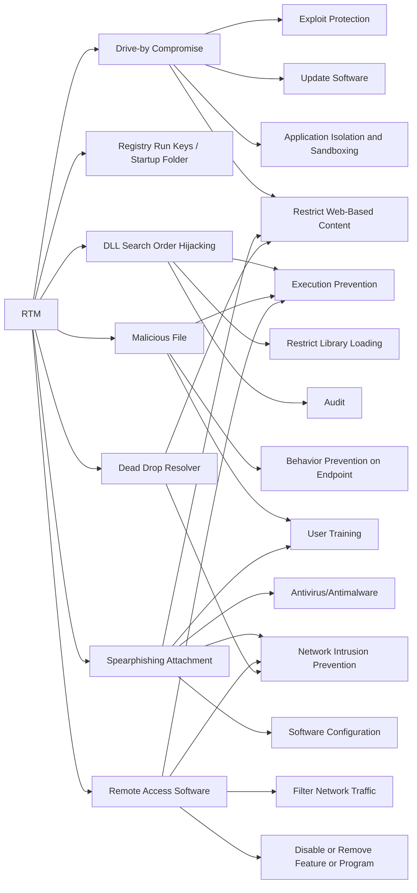

---
tags:
   - groups
---
# RTM
## ID:G0048
[RTM](/mitre/groups/G0048) is a cybercriminal group that has been active since at least 2015 and is primarily interested in users of remote banking systems in Russia and neighboring countries. The group uses a Trojan by the same name ([RTM](/mitre/software/S0148)). (Citation: ESET RTM Feb 2017)
## Techniques Used By Group
* [Drive-by Compromise](/mitre/techniques/T1189)
* [Registry Run Keys / Startup Folder](/mitre/techniques/T1547/001)
* [DLL Search Order Hijacking](/mitre/techniques/T1574/001)
* [Malicious File](/mitre/techniques/T1204/002)
* [Spearphishing Attachment](/mitre/techniques/T1566/001)
* [Remote Access Software](/mitre/techniques/T1219)
* [Dead Drop Resolver](/mitre/techniques/T1102/001)

# Summary of Techniques and Mitigations
