---
tags:
   - groups
---
# OilRig
## ID:G0049
[OilRig](/mitre/groups/G0049) is a suspected Iranian threat group that has targeted Middle Eastern and international victims since at least 2014. The group has targeted a variety of sectors, including financial, government, energy, chemical, and telecommunications. It appears the group carries out supply chain attacks, leveraging the trust relationship between organizations to attack their primary targets. The group works on behalf of the Iranian government based on infrastructure details that contain references to Iran, use of Iranian infrastructure, and targeting that aligns with nation-state interests.(Citation: FireEye APT34 Dec 2017)(Citation: Palo Alto OilRig April 2017)(Citation: ClearSky OilRig Jan 2017)(Citation: Palo Alto OilRig May 2016)(Citation: Palo Alto OilRig Oct 2016)(Citation: Unit42 OilRig Playbook 2023)(Citation: Unit 42 QUADAGENT July 2018)
## Techniques Used By Group
* [Windows Credential Manager](techniques/T1555/004)
* [System Information Discovery](techniques/T1082)
* [LSASS Memory](techniques/T1003/001)
* [Fallback Channels](techniques/T1008)
* [Web Protocols](techniques/T1071/001)
* [Windows Command Shell](techniques/T1059/003)
* [Remote Desktop Protocol](techniques/T1021/001)
* [Web Shell](techniques/T1505/003)
* [Masquerading](techniques/T1036)
* [Compiled HTML File](techniques/T1218/001)
* [Network Service Discovery](techniques/T1046)
* [Local Account](techniques/T1087/001)
* [Outlook Home Page](techniques/T1137/004)
* [Domain Groups](techniques/T1069/002)
* [Screen Capture](techniques/T1113)
* [System Service Discovery](techniques/T1007)
* [PowerShell](techniques/T1059/001)
* [File Deletion](techniques/T1070/004)
* [Malicious File](techniques/T1204/002)
* [External Remote Services](techniques/T1133)
* [Password Policy Discovery](techniques/T1201)
* [Domain Account](techniques/T1087/002)
* [LSA Secrets](techniques/T1003/004)
* [Deobfuscate/Decode Files or Information](techniques/T1140)
* [Exfiltration Over Unencrypted Non-C2 Protocol](techniques/T1048/003)
* [Brute Force](techniques/T1110)
* [Visual Basic](techniques/T1059/005)
* [Spearphishing Link](techniques/T1566/002)
* [Peripheral Device Discovery](techniques/T1120)
* [DNS](techniques/T1071/004)
* [Ingress Tool Transfer](techniques/T1105)
* [System Network Connections Discovery](techniques/T1049)
* [Malicious Link](techniques/T1204/001)
* [Valid Accounts](techniques/T1078)
* [Asymmetric Cryptography](techniques/T1573/002)
* [Spearphishing Attachment](techniques/T1566/001)
* [Scheduled Task](techniques/T1053/005)
* [Automated Collection](techniques/T1119)
* [Keylogging](techniques/T1056/001)
* [System Owner/User Discovery](techniques/T1033)
* [Spearphishing via Service](techniques/T1566/003)
* [Protocol Tunneling](techniques/T1572)
* [Windows Management Instrumentation](techniques/T1047)
* [SSH](techniques/T1021/004)
* [Credentials from Password Stores](techniques/T1555)
* [Cached Domain Credentials](techniques/T1003/005)
* [Encrypted/Encoded File](techniques/T1027/013)
* [Local Groups](techniques/T1069/001)
* [Credentials In Files](techniques/T1552/001)
* [Process Discovery](techniques/T1057)
* [Credentials from Web Browsers](techniques/T1555/003)
* [System Network Configuration Discovery](techniques/T1016)
* [Query Registry](techniques/T1012)
* [Command and Scripting Interpreter](techniques/T1059)
* [System Checks](techniques/T1497/001)
* [Indicator Removal from Tools](techniques/T1027/005)

# Summary of Techniques and Mitigations

```mermaid
flowchart LR
group[OilRig] --> T1555.004[Windows Credential Manager]
group[OilRig] --> T1082[System Information Discovery]
group[OilRig] --> T1003.001[LSASS Memory]
group[OilRig] --> T1008[Fallback Channels]
group[OilRig] --> T1071.001[Web Protocols]
group[OilRig] --> T1059.003[Windows Command Shell]
group[OilRig] --> T1021.001[Remote Desktop Protocol]
group[OilRig] --> T1505.003[Web Shell]
group[OilRig] --> T1036[Masquerading]
group[OilRig] --> T1218.001[Compiled HTML File]
group[OilRig] --> T1046[Network Service Discovery]
group[OilRig] --> T1087.001[Local Account]
group[OilRig] --> T1137.004[Outlook Home Page]
group[OilRig] --> T1069.002[Domain Groups]
group[OilRig] --> T1113[Screen Capture]
group[OilRig] --> T1007[System Service Discovery]
group[OilRig] --> T1059.001[PowerShell]
group[OilRig] --> T1070.004[File Deletion]
group[OilRig] --> T1204.002[Malicious File]
group[OilRig] --> T1133[External Remote Services]
group[OilRig] --> T1201[Password Policy Discovery]
group[OilRig] --> T1087.002[Domain Account]
group[OilRig] --> T1003.004[LSA Secrets]
group[OilRig] --> T1140[Deobfuscate/Decode Files or Information]
group[OilRig] --> T1048.003[Exfiltration Over Unencrypted Non-C2 Protocol]
group[OilRig] --> T1110[Brute Force]
group[OilRig] --> T1059.005[Visual Basic]
group[OilRig] --> T1566.002[Spearphishing Link]
group[OilRig] --> T1120[Peripheral Device Discovery]
group[OilRig] --> T1071.004[DNS]
group[OilRig] --> T1105[Ingress Tool Transfer]
group[OilRig] --> T1049[System Network Connections Discovery]
group[OilRig] --> T1204.001[Malicious Link]
group[OilRig] --> T1078[Valid Accounts]
group[OilRig] --> T1573.002[Asymmetric Cryptography]
group[OilRig] --> T1566.001[Spearphishing Attachment]
group[OilRig] --> T1053.005[Scheduled Task]
group[OilRig] --> T1119[Automated Collection]
group[OilRig] --> T1056.001[Keylogging]
group[OilRig] --> T1033[System Owner/User Discovery]
group[OilRig] --> T1566.003[Spearphishing via Service]
group[OilRig] --> T1572[Protocol Tunneling]
group[OilRig] --> T1047[Windows Management Instrumentation]
group[OilRig] --> T1021.004[SSH]
group[OilRig] --> T1555[Credentials from Password Stores]
group[OilRig] --> T1003.005[Cached Domain Credentials]
group[OilRig] --> T1027.013[Encrypted/Encoded File]
group[OilRig] --> T1069.001[Local Groups]
group[OilRig] --> T1552.001[Credentials In Files]
group[OilRig] --> T1057[Process Discovery]
group[OilRig] --> T1555.003[Credentials from Web Browsers]
group[OilRig] --> T1016[System Network Configuration Discovery]
group[OilRig] --> T1012[Query Registry]
group[OilRig] --> T1059[Command and Scripting Interpreter]
group[OilRig] --> T1497.001[System Checks]
group[OilRig] --> T1027.005[Indicator Removal from Tools]
T1555.004[Windows Credential Manager] --> M1042[Disable or Remove Feature or Program]
T1003.001[LSASS Memory] --> M1028[Operating System Configuration]
T1003.001[LSASS Memory] --> M1043[Credential Access Protection]
T1003.001[LSASS Memory] --> M1025[Privileged Process Integrity]
T1003.001[LSASS Memory] --> M1026[Privileged Account Management]
T1003.001[LSASS Memory] --> M1017[User Training]
T1003.001[LSASS Memory] --> M1040[Behavior Prevention on Endpoint]
T1003.001[LSASS Memory] --> M1027[Password Policies]
T1008[Fallback Channels] --> M1031[Network Intrusion Prevention]
T1071.001[Web Protocols] --> M1031[Network Intrusion Prevention]
T1059.003[Windows Command Shell] --> M1038[Execution Prevention]
T1021.001[Remote Desktop Protocol] --> M1047[Audit]
T1021.001[Remote Desktop Protocol] --> M1035[Limit Access to Resource Over Network]
T1021.001[Remote Desktop Protocol] --> M1030[Network Segmentation]
T1021.001[Remote Desktop Protocol] --> M1028[Operating System Configuration]
T1021.001[Remote Desktop Protocol] --> M1042[Disable or Remove Feature or Program]
T1021.001[Remote Desktop Protocol] --> M1018[User Account Management]
T1021.001[Remote Desktop Protocol] --> M1032[Multi-factor Authentication]
T1021.001[Remote Desktop Protocol] --> M1026[Privileged Account Management]
T1505.003[Web Shell] --> M1042[Disable or Remove Feature or Program]
T1505.003[Web Shell] --> M1018[User Account Management]
T1036[Masquerading] --> M1017[User Training]
T1036[Masquerading] --> M1045[Code Signing]
T1036[Masquerading] --> M1040[Behavior Prevention on Endpoint]
T1036[Masquerading] --> M1022[Restrict File and Directory Permissions]
T1036[Masquerading] --> M1049[Antivirus/Antimalware]
T1036[Masquerading] --> M1038[Execution Prevention]
T1218.001[Compiled HTML File] --> M1021[Restrict Web-Based Content]
T1218.001[Compiled HTML File] --> M1038[Execution Prevention]
T1046[Network Service Discovery] --> M1042[Disable or Remove Feature or Program]
T1046[Network Service Discovery] --> M1031[Network Intrusion Prevention]
T1046[Network Service Discovery] --> M1030[Network Segmentation]
T1087.001[Local Account] --> M1028[Operating System Configuration]
T1137.004[Outlook Home Page] --> M1051[Update Software]
T1137.004[Outlook Home Page] --> M1040[Behavior Prevention on Endpoint]
T1059.001[PowerShell] --> M1042[Disable or Remove Feature or Program]
T1059.001[PowerShell] --> M1049[Antivirus/Antimalware]
T1059.001[PowerShell] --> M1045[Code Signing]
T1059.001[PowerShell] --> M1026[Privileged Account Management]
T1059.001[PowerShell] --> M1038[Execution Prevention]
T1204.002[Malicious File] --> M1038[Execution Prevention]
T1204.002[Malicious File] --> M1040[Behavior Prevention on Endpoint]
T1204.002[Malicious File] --> M1017[User Training]
T1133[External Remote Services] --> M1030[Network Segmentation]
T1133[External Remote Services] --> M1042[Disable or Remove Feature or Program]
T1133[External Remote Services] --> M1035[Limit Access to Resource Over Network]
T1133[External Remote Services] --> M1032[Multi-factor Authentication]
T1201[Password Policy Discovery] --> M1027[Password Policies]
T1087.002[Domain Account] --> M1028[Operating System Configuration]
T1003.004[LSA Secrets] --> M1027[Password Policies]
T1003.004[LSA Secrets] --> M1026[Privileged Account Management]
T1003.004[LSA Secrets] --> M1017[User Training]
T1048.003[Exfiltration Over Unencrypted Non-C2 Protocol] --> M1031[Network Intrusion Prevention]
T1048.003[Exfiltration Over Unencrypted Non-C2 Protocol] --> M1057[Data Loss Prevention]
T1048.003[Exfiltration Over Unencrypted Non-C2 Protocol] --> M1037[Filter Network Traffic]
T1048.003[Exfiltration Over Unencrypted Non-C2 Protocol] --> M1030[Network Segmentation]
T1110[Brute Force] --> M1018[User Account Management]
T1110[Brute Force] --> M1036[Account Use Policies]
T1110[Brute Force] --> M1032[Multi-factor Authentication]
T1110[Brute Force] --> M1027[Password Policies]
T1059.005[Visual Basic] --> M1042[Disable or Remove Feature or Program]
T1059.005[Visual Basic] --> M1049[Antivirus/Antimalware]
T1059.005[Visual Basic] --> M1038[Execution Prevention]
T1059.005[Visual Basic] --> M1040[Behavior Prevention on Endpoint]
T1059.005[Visual Basic] --> M1021[Restrict Web-Based Content]
T1566.002[Spearphishing Link] --> M1054[Software Configuration]
T1566.002[Spearphishing Link] --> M1021[Restrict Web-Based Content]
T1566.002[Spearphishing Link] --> M1047[Audit]
T1566.002[Spearphishing Link] --> M1018[User Account Management]
T1566.002[Spearphishing Link] --> M1017[User Training]
T1071.004[DNS] --> M1037[Filter Network Traffic]
T1071.004[DNS] --> M1031[Network Intrusion Prevention]
T1105[Ingress Tool Transfer] --> M1031[Network Intrusion Prevention]
T1204.001[Malicious Link] --> M1031[Network Intrusion Prevention]
T1204.001[Malicious Link] --> M1017[User Training]
T1204.001[Malicious Link] --> M1021[Restrict Web-Based Content]
T1078[Valid Accounts] --> M1027[Password Policies]
T1078[Valid Accounts] --> M1018[User Account Management]
T1078[Valid Accounts] --> M1026[Privileged Account Management]
T1078[Valid Accounts] --> M1013[Application Developer Guidance]
T1078[Valid Accounts] --> M1017[User Training]
T1078[Valid Accounts] --> M1015[Active Directory Configuration]
T1078[Valid Accounts] --> M1036[Account Use Policies]
T1573.002[Asymmetric Cryptography] --> M1031[Network Intrusion Prevention]
T1573.002[Asymmetric Cryptography] --> M1020[SSL/TLS Inspection]
T1566.001[Spearphishing Attachment] --> M1049[Antivirus/Antimalware]
T1566.001[Spearphishing Attachment] --> M1031[Network Intrusion Prevention]
T1566.001[Spearphishing Attachment] --> M1054[Software Configuration]
T1566.001[Spearphishing Attachment] --> M1017[User Training]
T1566.001[Spearphishing Attachment] --> M1021[Restrict Web-Based Content]
T1053.005[Scheduled Task] --> M1026[Privileged Account Management]
T1053.005[Scheduled Task] --> M1018[User Account Management]
T1053.005[Scheduled Task] --> M1047[Audit]
T1053.005[Scheduled Task] --> M1028[Operating System Configuration]
T1119[Automated Collection] --> M1029[Remote Data Storage]
T1119[Automated Collection] --> M1041[Encrypt Sensitive Information]
T1566.003[Spearphishing via Service] --> M1017[User Training]
T1566.003[Spearphishing via Service] --> M1049[Antivirus/Antimalware]
T1566.003[Spearphishing via Service] --> M1021[Restrict Web-Based Content]
T1572[Protocol Tunneling] --> M1037[Filter Network Traffic]
T1572[Protocol Tunneling] --> M1031[Network Intrusion Prevention]
T1047[Windows Management Instrumentation] --> M1026[Privileged Account Management]
T1047[Windows Management Instrumentation] --> M1040[Behavior Prevention on Endpoint]
T1047[Windows Management Instrumentation] --> M1018[User Account Management]
T1047[Windows Management Instrumentation] --> M1038[Execution Prevention]
T1021.004[SSH] --> M1042[Disable or Remove Feature or Program]
T1021.004[SSH] --> M1032[Multi-factor Authentication]
T1021.004[SSH] --> M1018[User Account Management]
T1555[Credentials from Password Stores] --> M1026[Privileged Account Management]
T1555[Credentials from Password Stores] --> M1051[Update Software]
T1555[Credentials from Password Stores] --> M1027[Password Policies]
T1003.005[Cached Domain Credentials] --> M1015[Active Directory Configuration]
T1003.005[Cached Domain Credentials] --> M1017[User Training]
T1003.005[Cached Domain Credentials] --> M1027[Password Policies]
T1003.005[Cached Domain Credentials] --> M1028[Operating System Configuration]
T1003.005[Cached Domain Credentials] --> M1026[Privileged Account Management]
T1027.013[Encrypted/Encoded File] --> M1049[Antivirus/Antimalware]
T1027.013[Encrypted/Encoded File] --> M1040[Behavior Prevention on Endpoint]
T1552.001[Credentials In Files] --> M1017[User Training]
T1552.001[Credentials In Files] --> M1047[Audit]
T1552.001[Credentials In Files] --> M1022[Restrict File and Directory Permissions]
T1552.001[Credentials In Files] --> M1027[Password Policies]
T1555.003[Credentials from Web Browsers] --> M1027[Password Policies]
T1059[Command and Scripting Interpreter] --> M1045[Code Signing]
T1059[Command and Scripting Interpreter] --> M1042[Disable or Remove Feature or Program]
T1059[Command and Scripting Interpreter] --> M1038[Execution Prevention]
T1059[Command and Scripting Interpreter] --> M1049[Antivirus/Antimalware]
T1059[Command and Scripting Interpreter] --> M1026[Privileged Account Management]
T1059[Command and Scripting Interpreter] --> M1021[Restrict Web-Based Content]
T1059[Command and Scripting Interpreter] --> M1040[Behavior Prevention on Endpoint]
```
