---
tags:
   - groups
---
# APT32
## ID:G0050
[APT32](/mitre/groups/G0050) is a suspected Vietnam-based threat group that has been active since at least 2014. The group has targeted multiple private sector industries as well as foreign governments, dissidents, and journalists with a strong focus on Southeast Asian countries like Vietnam, the Philippines, Laos, and Cambodia. They have extensively used strategic web compromises to compromise victims.(Citation: FireEye APT32 May 2017)(Citation: Volexity OceanLotus Nov 2017)(Citation: ESET OceanLotus)
## Techniques Used By Group
* [Pass the Hash](/mitre/techniques/T1550/002)
* [Masquerading](/mitre/techniques/T1036)
* [JavaScript](/mitre/techniques/T1059/007)
* [Windows Management Instrumentation](/mitre/techniques/T1047)
* [Software Deployment Tools](/mitre/techniques/T1072)
* [Lateral Tool Transfer](/mitre/techniques/T1570)
* [NTFS File Attributes](/mitre/techniques/T1564/004)
* [Credentials in Registry](/mitre/techniques/T1552/002)
* [Process Injection](/mitre/techniques/T1055)
* [PubPrn](/mitre/techniques/T1216/001)
* [Spearphishing Attachment](/mitre/techniques/T1566/001)
* [Network Share Discovery](/mitre/techniques/T1135)
* [System Owner/User Discovery](/mitre/techniques/T1033)
* [Non-Standard Port](/mitre/techniques/T1571)
* [System Information Discovery](/mitre/techniques/T1082)
* [Domains](/mitre/techniques/T1583/001)
* [Query Registry](/mitre/techniques/T1012)
* [Command Obfuscation](/mitre/techniques/T1027/010)
* [Windows Command Shell](/mitre/techniques/T1059/003)
* [Exfiltration Over Unencrypted Non-C2 Protocol](/mitre/techniques/T1048/003)
* [DLL Side-Loading](/mitre/techniques/T1574/002)
* [Spearphishing Link](/mitre/techniques/T1566/002)
* [Spearphishing Link](/mitre/techniques/T1598/003)
* [Local Account](/mitre/techniques/T1087/001)
* [PowerShell](/mitre/techniques/T1059/001)
* [LSASS Memory](/mitre/techniques/T1003/001)
* [Network Service Discovery](/mitre/techniques/T1046)
* [Drive-by Target](/mitre/techniques/T1608/004)
* [Exfiltration Over C2 Channel](/mitre/techniques/T1041)
* [Masquerade Task or Service](/mitre/techniques/T1036/004)
* [OS Credential Dumping](/mitre/techniques/T1003)
* [Local Accounts](/mitre/techniques/T1078/003)
* [Gather Victim Identity Information](/mitre/techniques/T1589)
* [Timestomp](/mitre/techniques/T1070/006)
* [Drive-by Compromise](/mitre/techniques/T1189)
* [Rundll32](/mitre/techniques/T1218/011)
* [Command and Scripting Interpreter](/mitre/techniques/T1059)
* [Modify Registry](/mitre/techniques/T1112)
* [Mail Protocols](/mitre/techniques/T1071/003)
* [Archive Collected Data](/mitre/techniques/T1560)
* [Malicious Link](/mitre/techniques/T1204/001)
* [Web Protocols](/mitre/techniques/T1071/001)
* [Match Legitimate Name or Location](/mitre/techniques/T1036/005)
* [File Deletion](/mitre/techniques/T1070/004)
* [Clear Windows Event Logs](/mitre/techniques/T1070/001)
* [Fileless Storage](/mitre/techniques/T1027/011)
* [Ingress Tool Transfer](/mitre/techniques/T1105)
* [Scheduled Task](/mitre/techniques/T1053/005)
* [Rename System Utilities](/mitre/techniques/T1036/003)
* [Windows Service](/mitre/techniques/T1543/003)
* [Upload Malware](/mitre/techniques/T1608/001)
* [Linux and Mac File and Directory Permissions Modification](/mitre/techniques/T1222/002)
* [Service Execution](/mitre/techniques/T1569/002)
* [Remote System Discovery](/mitre/techniques/T1018)
* [Mshta](/mitre/techniques/T1218/005)
* [File and Directory Discovery](/mitre/techniques/T1083)
* [Visual Basic](/mitre/techniques/T1059/005)
* [Tool](/mitre/techniques/T1588/002)
* [SMB/Windows Admin Shares](/mitre/techniques/T1021/002)
* [Pass the Ticket](/mitre/techniques/T1550/003)
* [Web Services](/mitre/techniques/T1583/006)
* [Web Shell](/mitre/techniques/T1505/003)
* [Hidden Files and Directories](/mitre/techniques/T1564/001)
* [System Network Configuration Discovery](/mitre/techniques/T1016)
* [Binary Padding](/mitre/techniques/T1027/001)
* [System Network Connections Discovery](/mitre/techniques/T1049)
* [Hidden Window](/mitre/techniques/T1564/003)
* [Encrypted/Encoded File](/mitre/techniques/T1027/013)
* [Keylogging](/mitre/techniques/T1056/001)
* [Email Addresses](/mitre/techniques/T1589/002)
* [Regsvr32](/mitre/techniques/T1218/010)
* [Exploitation for Privilege Escalation](/mitre/techniques/T1068)
* [Social Media Accounts](/mitre/techniques/T1585/001)
* [Office Application Startup](/mitre/techniques/T1137)
* [Exploitation for Client Execution](/mitre/techniques/T1203)
* [Malicious File](/mitre/techniques/T1204/002)
* [Registry Run Keys / Startup Folder](/mitre/techniques/T1547/001)
* [Web Service](/mitre/techniques/T1102)

# Summary of Techniques and Mitigations

```mermaid
flowchart LR
group[APT32] --> T1550.002[Pass the Hash]
group[APT32] --> T1036[Masquerading]
group[APT32] --> T1059.007[JavaScript]
group[APT32] --> T1047[Windows Management Instrumentation]
group[APT32] --> T1072[Software Deployment Tools]
group[APT32] --> T1570[Lateral Tool Transfer]
group[APT32] --> T1564.004[NTFS File Attributes]
group[APT32] --> T1552.002[Credentials in Registry]
group[APT32] --> T1055[Process Injection]
group[APT32] --> T1216.001[PubPrn]
group[APT32] --> T1566.001[Spearphishing Attachment]
group[APT32] --> T1135[Network Share Discovery]
group[APT32] --> T1033[System Owner/User Discovery]
group[APT32] --> T1571[Non-Standard Port]
group[APT32] --> T1082[System Information Discovery]
group[APT32] --> T1583.001[Domains]
group[APT32] --> T1012[Query Registry]
group[APT32] --> T1027.010[Command Obfuscation]
group[APT32] --> T1059.003[Windows Command Shell]
group[APT32] --> T1048.003[Exfiltration Over Unencrypted Non-C2 Protocol]
group[APT32] --> T1574.002[DLL Side-Loading]
group[APT32] --> T1566.002[Spearphishing Link]
group[APT32] --> T1598.003[Spearphishing Link]
group[APT32] --> T1087.001[Local Account]
group[APT32] --> T1059.001[PowerShell]
group[APT32] --> T1003.001[LSASS Memory]
group[APT32] --> T1046[Network Service Discovery]
group[APT32] --> T1608.004[Drive-by Target]
group[APT32] --> T1041[Exfiltration Over C2 Channel]
group[APT32] --> T1036.004[Masquerade Task or Service]
group[APT32] --> T1003[OS Credential Dumping]
group[APT32] --> T1078.003[Local Accounts]
group[APT32] --> T1589[Gather Victim Identity Information]
group[APT32] --> T1070.006[Timestomp]
group[APT32] --> T1189[Drive-by Compromise]
group[APT32] --> T1218.011[Rundll32]
group[APT32] --> T1059[Command and Scripting Interpreter]
group[APT32] --> T1112[Modify Registry]
group[APT32] --> T1071.003[Mail Protocols]
group[APT32] --> T1560[Archive Collected Data]
group[APT32] --> T1204.001[Malicious Link]
group[APT32] --> T1071.001[Web Protocols]
group[APT32] --> T1036.005[Match Legitimate Name or Location]
group[APT32] --> T1070.004[File Deletion]
group[APT32] --> T1070.001[Clear Windows Event Logs]
group[APT32] --> T1027.011[Fileless Storage]
group[APT32] --> T1105[Ingress Tool Transfer]
group[APT32] --> T1053.005[Scheduled Task]
group[APT32] --> T1036.003[Rename System Utilities]
group[APT32] --> T1543.003[Windows Service]
group[APT32] --> T1608.001[Upload Malware]
group[APT32] --> T1222.002[Linux and Mac File and Directory Permissions Modification]
group[APT32] --> T1569.002[Service Execution]
group[APT32] --> T1018[Remote System Discovery]
group[APT32] --> T1218.005[Mshta]
group[APT32] --> T1083[File and Directory Discovery]
group[APT32] --> T1059.005[Visual Basic]
group[APT32] --> T1588.002[Tool]
group[APT32] --> T1021.002[SMB/Windows Admin Shares]
group[APT32] --> T1550.003[Pass the Ticket]
group[APT32] --> T1583.006[Web Services]
group[APT32] --> T1505.003[Web Shell]
group[APT32] --> T1564.001[Hidden Files and Directories]
group[APT32] --> T1016[System Network Configuration Discovery]
group[APT32] --> T1027.001[Binary Padding]
group[APT32] --> T1049[System Network Connections Discovery]
group[APT32] --> T1564.003[Hidden Window]
group[APT32] --> T1027.013[Encrypted/Encoded File]
group[APT32] --> T1056.001[Keylogging]
group[APT32] --> T1589.002[Email Addresses]
group[APT32] --> T1218.010[Regsvr32]
group[APT32] --> T1068[Exploitation for Privilege Escalation]
group[APT32] --> T1585.001[Social Media Accounts]
group[APT32] --> T1137[Office Application Startup]
group[APT32] --> T1203[Exploitation for Client Execution]
group[APT32] --> T1204.002[Malicious File]
group[APT32] --> T1547.001[Registry Run Keys / Startup Folder]
group[APT32] --> T1102[Web Service]
T1550.002[Pass the Hash] --> M1051[Update Software]
T1550.002[Pass the Hash] --> M1052[User Account Control]
T1550.002[Pass the Hash] --> M1018[User Account Management]
T1550.002[Pass the Hash] --> M1026[Privileged Account Management]
T1036[Masquerading] --> M1017[User Training]
T1036[Masquerading] --> M1045[Code Signing]
T1036[Masquerading] --> M1040[Behavior Prevention on Endpoint]
T1036[Masquerading] --> M1022[Restrict File and Directory Permissions]
T1036[Masquerading] --> M1049[Antivirus/Antimalware]
T1036[Masquerading] --> M1038[Execution Prevention]
T1059.007[JavaScript] --> M1040[Behavior Prevention on Endpoint]
T1059.007[JavaScript] --> M1038[Execution Prevention]
T1059.007[JavaScript] --> M1042[Disable or Remove Feature or Program]
T1059.007[JavaScript] --> M1021[Restrict Web-Based Content]
T1047[Windows Management Instrumentation] --> M1026[Privileged Account Management]
T1047[Windows Management Instrumentation] --> M1040[Behavior Prevention on Endpoint]
T1047[Windows Management Instrumentation] --> M1018[User Account Management]
T1047[Windows Management Instrumentation] --> M1038[Execution Prevention]
T1072[Software Deployment Tools] --> M1018[User Account Management]
T1072[Software Deployment Tools] --> M1015[Active Directory Configuration]
T1072[Software Deployment Tools] --> M1051[Update Software]
T1072[Software Deployment Tools] --> M1026[Privileged Account Management]
T1072[Software Deployment Tools] --> M1027[Password Policies]
T1072[Software Deployment Tools] --> M1033[Limit Software Installation]
T1072[Software Deployment Tools] --> M1030[Network Segmentation]
T1072[Software Deployment Tools] --> M1017[User Training]
T1072[Software Deployment Tools] --> M1032[Multi-factor Authentication]
T1072[Software Deployment Tools] --> M1029[Remote Data Storage]
T1570[Lateral Tool Transfer] --> M1037[Filter Network Traffic]
T1570[Lateral Tool Transfer] --> M1031[Network Intrusion Prevention]
T1564.004[NTFS File Attributes] --> M1022[Restrict File and Directory Permissions]
T1552.002[Credentials in Registry] --> M1027[Password Policies]
T1552.002[Credentials in Registry] --> M1026[Privileged Account Management]
T1552.002[Credentials in Registry] --> M1047[Audit]
T1055[Process Injection] --> M1026[Privileged Account Management]
T1055[Process Injection] --> M1040[Behavior Prevention on Endpoint]
T1216.001[PubPrn] --> M1038[Execution Prevention]
T1216.001[PubPrn] --> M1040[Behavior Prevention on Endpoint]
T1566.001[Spearphishing Attachment] --> M1049[Antivirus/Antimalware]
T1566.001[Spearphishing Attachment] --> M1031[Network Intrusion Prevention]
T1566.001[Spearphishing Attachment] --> M1054[Software Configuration]
T1566.001[Spearphishing Attachment] --> M1017[User Training]
T1566.001[Spearphishing Attachment] --> M1021[Restrict Web-Based Content]
T1135[Network Share Discovery] --> M1028[Operating System Configuration]
T1571[Non-Standard Port] --> M1030[Network Segmentation]
T1571[Non-Standard Port] --> M1031[Network Intrusion Prevention]
T1583.001[Domains] --> M1056[Pre-compromise]
T1027.010[Command Obfuscation] --> M1040[Behavior Prevention on Endpoint]
T1027.010[Command Obfuscation] --> M1049[Antivirus/Antimalware]
T1059.003[Windows Command Shell] --> M1038[Execution Prevention]
T1048.003[Exfiltration Over Unencrypted Non-C2 Protocol] --> M1031[Network Intrusion Prevention]
T1048.003[Exfiltration Over Unencrypted Non-C2 Protocol] --> M1057[Data Loss Prevention]
T1048.003[Exfiltration Over Unencrypted Non-C2 Protocol] --> M1037[Filter Network Traffic]
T1048.003[Exfiltration Over Unencrypted Non-C2 Protocol] --> M1030[Network Segmentation]
T1574.002[DLL Side-Loading] --> M1051[Update Software]
T1574.002[DLL Side-Loading] --> M1013[Application Developer Guidance]
T1566.002[Spearphishing Link] --> M1054[Software Configuration]
T1566.002[Spearphishing Link] --> M1021[Restrict Web-Based Content]
T1566.002[Spearphishing Link] --> M1047[Audit]
T1566.002[Spearphishing Link] --> M1018[User Account Management]
T1566.002[Spearphishing Link] --> M1017[User Training]
T1598.003[Spearphishing Link] --> M1017[User Training]
T1598.003[Spearphishing Link] --> M1054[Software Configuration]
T1087.001[Local Account] --> M1028[Operating System Configuration]
T1059.001[PowerShell] --> M1042[Disable or Remove Feature or Program]
T1059.001[PowerShell] --> M1049[Antivirus/Antimalware]
T1059.001[PowerShell] --> M1045[Code Signing]
T1059.001[PowerShell] --> M1026[Privileged Account Management]
T1059.001[PowerShell] --> M1038[Execution Prevention]
T1003.001[LSASS Memory] --> M1028[Operating System Configuration]
T1003.001[LSASS Memory] --> M1043[Credential Access Protection]
T1003.001[LSASS Memory] --> M1025[Privileged Process Integrity]
T1003.001[LSASS Memory] --> M1026[Privileged Account Management]
T1003.001[LSASS Memory] --> M1017[User Training]
T1003.001[LSASS Memory] --> M1040[Behavior Prevention on Endpoint]
T1003.001[LSASS Memory] --> M1027[Password Policies]
T1046[Network Service Discovery] --> M1042[Disable or Remove Feature or Program]
T1046[Network Service Discovery] --> M1031[Network Intrusion Prevention]
T1046[Network Service Discovery] --> M1030[Network Segmentation]
T1608.004[Drive-by Target] --> M1056[Pre-compromise]
T1041[Exfiltration Over C2 Channel] --> M1031[Network Intrusion Prevention]
T1041[Exfiltration Over C2 Channel] --> M1057[Data Loss Prevention]
T1003[OS Credential Dumping] --> M1041[Encrypt Sensitive Information]
T1003[OS Credential Dumping] --> M1040[Behavior Prevention on Endpoint]
T1003[OS Credential Dumping] --> M1027[Password Policies]
T1003[OS Credential Dumping] --> M1017[User Training]
T1003[OS Credential Dumping] --> M1026[Privileged Account Management]
T1003[OS Credential Dumping] --> M1025[Privileged Process Integrity]
T1003[OS Credential Dumping] --> M1043[Credential Access Protection]
T1003[OS Credential Dumping] --> M1015[Active Directory Configuration]
T1003[OS Credential Dumping] --> M1028[Operating System Configuration]
T1078.003[Local Accounts] --> M1026[Privileged Account Management]
T1078.003[Local Accounts] --> M1027[Password Policies]
T1589[Gather Victim Identity Information] --> M1056[Pre-compromise]
T1189[Drive-by Compromise] --> M1050[Exploit Protection]
T1189[Drive-by Compromise] --> M1051[Update Software]
T1189[Drive-by Compromise] --> M1048[Application Isolation and Sandboxing]
T1189[Drive-by Compromise] --> M1021[Restrict Web-Based Content]
T1218.011[Rundll32] --> M1050[Exploit Protection]
T1059[Command and Scripting Interpreter] --> M1045[Code Signing]
T1059[Command and Scripting Interpreter] --> M1042[Disable or Remove Feature or Program]
T1059[Command and Scripting Interpreter] --> M1038[Execution Prevention]
T1059[Command and Scripting Interpreter] --> M1049[Antivirus/Antimalware]
T1059[Command and Scripting Interpreter] --> M1026[Privileged Account Management]
T1059[Command and Scripting Interpreter] --> M1021[Restrict Web-Based Content]
T1059[Command and Scripting Interpreter] --> M1040[Behavior Prevention on Endpoint]
T1112[Modify Registry] --> M1024[Restrict Registry Permissions]
T1071.003[Mail Protocols] --> M1031[Network Intrusion Prevention]
T1560[Archive Collected Data] --> M1047[Audit]
T1204.001[Malicious Link] --> M1031[Network Intrusion Prevention]
T1204.001[Malicious Link] --> M1017[User Training]
T1204.001[Malicious Link] --> M1021[Restrict Web-Based Content]
T1071.001[Web Protocols] --> M1031[Network Intrusion Prevention]
T1036.005[Match Legitimate Name or Location] --> M1022[Restrict File and Directory Permissions]
T1036.005[Match Legitimate Name or Location] --> M1038[Execution Prevention]
T1036.005[Match Legitimate Name or Location] --> M1045[Code Signing]
T1070.001[Clear Windows Event Logs] --> M1022[Restrict File and Directory Permissions]
T1070.001[Clear Windows Event Logs] --> M1029[Remote Data Storage]
T1070.001[Clear Windows Event Logs] --> M1041[Encrypt Sensitive Information]
T1027.011[Fileless Storage] --> M1047[Audit]
T1105[Ingress Tool Transfer] --> M1031[Network Intrusion Prevention]
T1053.005[Scheduled Task] --> M1026[Privileged Account Management]
T1053.005[Scheduled Task] --> M1018[User Account Management]
T1053.005[Scheduled Task] --> M1047[Audit]
T1053.005[Scheduled Task] --> M1028[Operating System Configuration]
T1036.003[Rename System Utilities] --> M1022[Restrict File and Directory Permissions]
T1543.003[Windows Service] --> M1040[Behavior Prevention on Endpoint]
T1543.003[Windows Service] --> M1028[Operating System Configuration]
T1543.003[Windows Service] --> M1047[Audit]
T1543.003[Windows Service] --> M1045[Code Signing]
T1543.003[Windows Service] --> M1018[User Account Management]
T1608.001[Upload Malware] --> M1056[Pre-compromise]
T1222.002[Linux and Mac File and Directory Permissions Modification] --> M1022[Restrict File and Directory Permissions]
T1222.002[Linux and Mac File and Directory Permissions Modification] --> M1026[Privileged Account Management]
T1569.002[Service Execution] --> M1026[Privileged Account Management]
T1569.002[Service Execution] --> M1040[Behavior Prevention on Endpoint]
T1569.002[Service Execution] --> M1022[Restrict File and Directory Permissions]
T1218.005[Mshta] --> M1038[Execution Prevention]
T1218.005[Mshta] --> M1042[Disable or Remove Feature or Program]
T1059.005[Visual Basic] --> M1042[Disable or Remove Feature or Program]
T1059.005[Visual Basic] --> M1049[Antivirus/Antimalware]
T1059.005[Visual Basic] --> M1038[Execution Prevention]
T1059.005[Visual Basic] --> M1040[Behavior Prevention on Endpoint]
T1059.005[Visual Basic] --> M1021[Restrict Web-Based Content]
T1588.002[Tool] --> M1056[Pre-compromise]
T1021.002[SMB/Windows Admin Shares] --> M1026[Privileged Account Management]
T1021.002[SMB/Windows Admin Shares] --> M1035[Limit Access to Resource Over Network]
T1021.002[SMB/Windows Admin Shares] --> M1037[Filter Network Traffic]
T1021.002[SMB/Windows Admin Shares] --> M1027[Password Policies]
T1550.003[Pass the Ticket] --> M1026[Privileged Account Management]
T1550.003[Pass the Ticket] --> M1027[Password Policies]
T1550.003[Pass the Ticket] --> M1018[User Account Management]
T1550.003[Pass the Ticket] --> M1015[Active Directory Configuration]
T1583.006[Web Services] --> M1056[Pre-compromise]
T1505.003[Web Shell] --> M1042[Disable or Remove Feature or Program]
T1505.003[Web Shell] --> M1018[User Account Management]
T1564.003[Hidden Window] --> M1038[Execution Prevention]
T1564.003[Hidden Window] --> M1033[Limit Software Installation]
T1027.013[Encrypted/Encoded File] --> M1049[Antivirus/Antimalware]
T1027.013[Encrypted/Encoded File] --> M1040[Behavior Prevention on Endpoint]
T1589.002[Email Addresses] --> M1056[Pre-compromise]
T1218.010[Regsvr32] --> M1050[Exploit Protection]
T1068[Exploitation for Privilege Escalation] --> M1051[Update Software]
T1068[Exploitation for Privilege Escalation] --> M1050[Exploit Protection]
T1068[Exploitation for Privilege Escalation] --> M1048[Application Isolation and Sandboxing]
T1068[Exploitation for Privilege Escalation] --> M1019[Threat Intelligence Program]
T1068[Exploitation for Privilege Escalation] --> M1038[Execution Prevention]
T1585.001[Social Media Accounts] --> M1056[Pre-compromise]
T1137[Office Application Startup] --> M1042[Disable or Remove Feature or Program]
T1137[Office Application Startup] --> M1040[Behavior Prevention on Endpoint]
T1137[Office Application Startup] --> M1051[Update Software]
T1137[Office Application Startup] --> M1054[Software Configuration]
T1203[Exploitation for Client Execution] --> M1050[Exploit Protection]
T1203[Exploitation for Client Execution] --> M1048[Application Isolation and Sandboxing]
T1204.002[Malicious File] --> M1038[Execution Prevention]
T1204.002[Malicious File] --> M1040[Behavior Prevention on Endpoint]
T1204.002[Malicious File] --> M1017[User Training]
T1102[Web Service] --> M1031[Network Intrusion Prevention]
T1102[Web Service] --> M1021[Restrict Web-Based Content]
```
