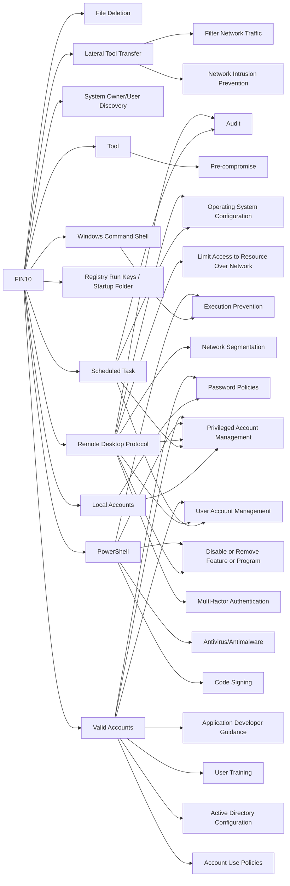

---
tags:
   - groups
---
# FIN10
## ID:G0051
[FIN10](/mitre/groups/G0051) is a financially motivated threat group that has targeted organizations in North America since at least 2013 through 2016. The group uses stolen data exfiltrated from victims to extort organizations. (Citation: FireEye FIN10 June 2017)
## Techniques Used By Group
* [File Deletion](techniques/T1070/004)
* [Lateral Tool Transfer](techniques/T1570)
* [System Owner/User Discovery](techniques/T1033)
* [Windows Command Shell](techniques/T1059/003)
* [Local Accounts](techniques/T1078/003)
* [Registry Run Keys / Startup Folder](techniques/T1547/001)
* [Scheduled Task](techniques/T1053/005)
* [Tool](techniques/T1588/002)
* [Remote Desktop Protocol](techniques/T1021/001)
* [PowerShell](techniques/T1059/001)
* [Valid Accounts](techniques/T1078)

# Summary of Techniques and Mitigations
