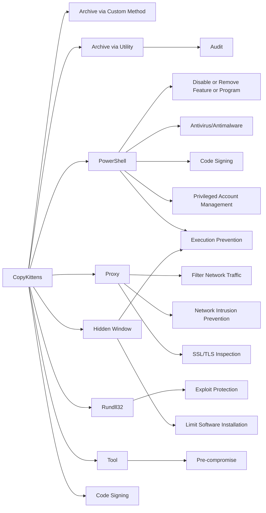

---
tags:
   - groups
---
# CopyKittens
## ID:G0052
[CopyKittens](/mitre/groups/G0052) is an Iranian cyber espionage group that has been operating since at least 2013. It has targeted countries including Israel, Saudi Arabia, Turkey, the U.S., Jordan, and Germany. The group is responsible for the campaign known as Operation Wilted Tulip.(Citation: ClearSky CopyKittens March 2017)(Citation: ClearSky Wilted Tulip July 2017)(Citation: CopyKittens Nov 2015)
## Techniques Used By Group
* [Archive via Custom Method](/mitre/techniques/T1560/003)
* [Archive via Utility](/mitre/techniques/T1560/001)
* [PowerShell](/mitre/techniques/T1059/001)
* [Proxy](/mitre/techniques/T1090)
* [Rundll32](/mitre/techniques/T1218/011)
* [Hidden Window](/mitre/techniques/T1564/003)
* [Tool](/mitre/techniques/T1588/002)
* [Code Signing](/mitre/techniques/T1553/002)

# Summary of Techniques and Mitigations
