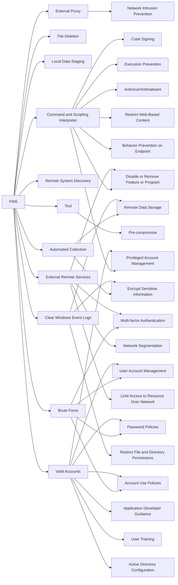

---
tags:
   - groups
---
# FIN5
## ID:G0053
[FIN5](groups/G0053) is a financially motivated threat group that has targeted personally identifiable information and payment card information. The group has been active since at least 2008 and has targeted the restaurant, gaming, and hotel industries. The group is made up of actors who likely speak Russian. (Citation: FireEye Respond Webinar July 2017) (Citation: Mandiant FIN5 GrrCON Oct 2016) (Citation: DarkReading FireEye FIN5 Oct 2015)
## Techniques Used By Group
* [External Proxy](techniques/T1090/002)
* [File Deletion](techniques/T1070/004)
* [Local Data Staging](techniques/T1074/001)
* [Command and Scripting Interpreter](techniques/T1059)
* [Remote System Discovery](techniques/T1018)
* [Automated Collection](techniques/T1119)
* [Brute Force](techniques/T1110)
* [Tool](techniques/T1588/002)
* [External Remote Services](techniques/T1133)
* [Clear Windows Event Logs](techniques/T1070/001)
* [Valid Accounts](techniques/T1078)

# Summary of Techniques and Mitigations
