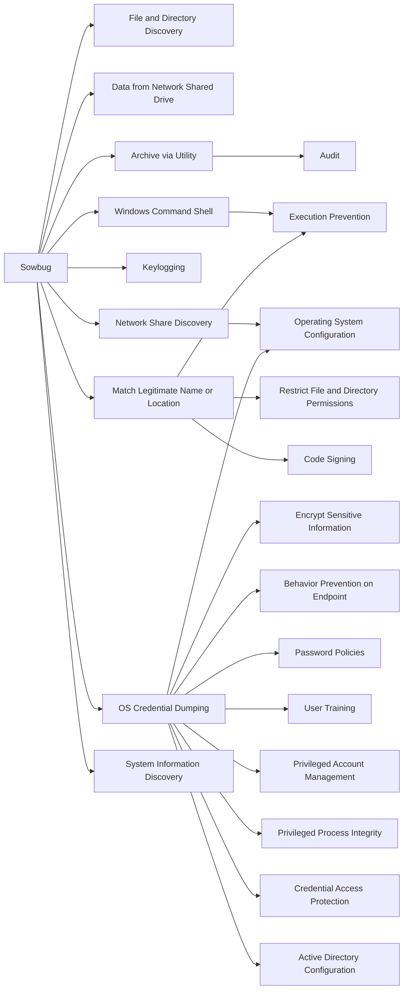

---
tags:
   - groups
---
# Sowbug
## ID:G0054
[Sowbug](/mitre/groups/G0054) is a threat group that has conducted targeted attacks against organizations in South America and Southeast Asia, particularly government entities, since at least 2015. (Citation: Symantec Sowbug Nov 2017)
## Techniques Used By Group
* [File and Directory Discovery](techniques/T1083)
* [Data from Network Shared Drive](techniques/T1039)
* [Archive via Utility](techniques/T1560/001)
* [Windows Command Shell](techniques/T1059/003)
* [Keylogging](techniques/T1056/001)
* [Network Share Discovery](techniques/T1135)
* [Match Legitimate Name or Location](techniques/T1036/005)
* [OS Credential Dumping](techniques/T1003)
* [System Information Discovery](techniques/T1082)

# Summary of Techniques and Mitigations
