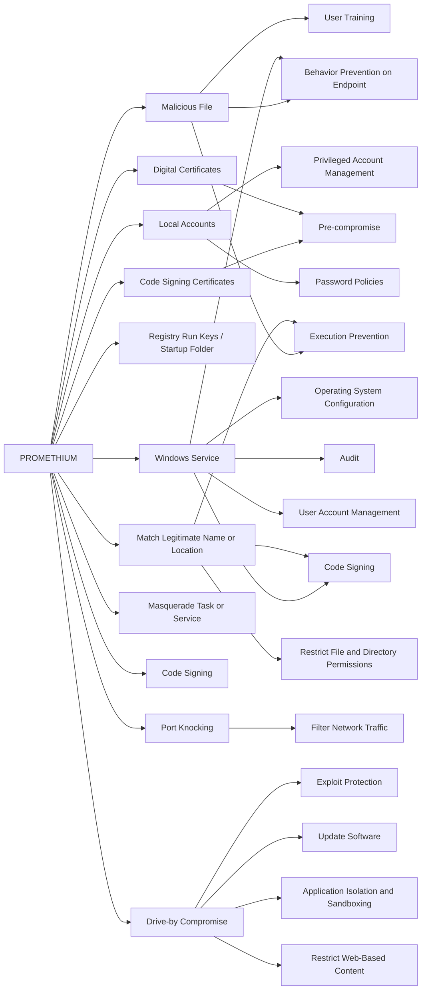

---
tags:
   - groups
---
# PROMETHIUM
## ID:G0056
[PROMETHIUM](/mitre/groups/G0056) is an activity group focused on espionage that has been active since at least 2012. The group has conducted operations globally with a heavy emphasis on Turkish targets. [PROMETHIUM](/mitre/groups/G0056) has demonstrated similarity to another activity group called [NEODYMIUM](/mitre/groups/G0055) due to overlapping victim and campaign characteristics.(Citation: Microsoft NEODYMIUM Dec 2016)(Citation: Microsoft SIR Vol 21)(Citation: Talos Promethium June 2020)
## Techniques Used By Group
* [Malicious File](techniques/T1204/002)
* [Code Signing Certificates](techniques/T1587/002)
* [Local Accounts](techniques/T1078/003)
* [Digital Certificates](techniques/T1587/003)
* [Registry Run Keys / Startup Folder](techniques/T1547/001)
* [Windows Service](techniques/T1543/003)
* [Match Legitimate Name or Location](techniques/T1036/005)
* [Masquerade Task or Service](techniques/T1036/004)
* [Code Signing](techniques/T1553/002)
* [Port Knocking](techniques/T1205/001)
* [Drive-by Compromise](techniques/T1189)

# Summary of Techniques and Mitigations
