---
tags:
   - groups
---
# Magic Hound
## ID:G0059
[Magic Hound](/mitre/groups/G0059) is an Iranian-sponsored threat group that conducts long term, resource-intensive cyber espionage operations, likely on behalf of the Islamic Revolutionary Guard Corps. They have targeted European, U.S., and Middle Eastern government and military personnel, academics, journalists, and organizations such as the World Health Organization (WHO), via complex social engineering campaigns since at least 2014.(Citation: FireEye APT35 2018)(Citation: ClearSky Kittens Back 3 August 2020)(Citation: Certfa Charming Kitten January 2021)(Citation: Secureworks COBALT ILLUSION Threat Profile)(Citation: Proofpoint TA453 July2021)
## Techniques Used By Group
* [Keylogging](techniques/T1056/001)
* [Exfiltration Over Web Service](techniques/T1567)
* [Credentials](techniques/T1589/001)
* [Registry Run Keys / Startup Folder](techniques/T1547/001)
* [PowerShell](techniques/T1059/001)
* [Wi-Fi Discovery](techniques/T1016/002)
* [Tool](techniques/T1588/002)
* [Domains](techniques/T1584/001)
* [Windows Command Shell](techniques/T1059/003)
* [Protocol Tunneling](techniques/T1572)
* [Email Accounts](techniques/T1585/002)
* [Determine Physical Locations](techniques/T1591/001)
* [Application Layer Protocol](techniques/T1071)
* [Web Protocols](techniques/T1071/001)
* [Data Encrypted for Impact](techniques/T1486)
* [Internet Connection Discovery](techniques/T1016/001)
* [Email Accounts](techniques/T1586/002)
* [Scheduled Task](techniques/T1053/005)
* [Software](techniques/T1592/002)
* [Remote Desktop Protocol](techniques/T1021/001)
* [Email Account](techniques/T1087/003)
* [Ingress Tool Transfer](techniques/T1105)
* [Exploit Public-Facing Application](techniques/T1190)
* [Malicious File](techniques/T1204/002)
* [Rundll32](techniques/T1218/011)
* [Command Obfuscation](techniques/T1027/010)
* [Network Service Discovery](techniques/T1046)
* [IP Addresses](techniques/T1590/005)
* [Screen Capture](techniques/T1113)
* [Encrypted Channel](techniques/T1573)
* [Visual Basic](techniques/T1059/005)
* [Vulnerability Scanning](techniques/T1595/002)
* [Email Addresses](techniques/T1589/002)
* [Malicious Link](techniques/T1204/001)
* [Bidirectional Communication](techniques/T1102/002)
* [System Owner/User Discovery](techniques/T1033)
* [Additional Email Delegate Permissions](techniques/T1098/002)
* [File Deletion](techniques/T1070/004)
* [Encrypted/Encoded File](techniques/T1027/013)
* [Spearphishing Link](techniques/T1566/002)
* [Default Accounts](techniques/T1078/001)
* [File and Directory Discovery](techniques/T1083)
* [System Network Configuration Discovery](techniques/T1016)
* [Match Legitimate Name or Location](techniques/T1036/005)
* [Account Manipulation](techniques/T1098)
* [Spearphishing Link](techniques/T1598/003)
* [Disable Windows Event Logging](techniques/T1562/002)
* [Disable or Modify Tools](techniques/T1562/001)
* [System Network Connections Discovery](techniques/T1049)
* [Email Collection](techniques/T1114)
* [LSASS Memory](techniques/T1003/001)
* [Lateral Tool Transfer](techniques/T1570)
* [Local Account](techniques/T1136/001)
* [Process Discovery](techniques/T1057)
* [Disable or Modify System Firewall](techniques/T1562/004)
* [Remote Email Collection](techniques/T1114/002)
* [Non-Standard Port](techniques/T1571)
* [Clear Command History](techniques/T1070/003)
* [System Information Discovery](techniques/T1082)
* [Local Email Collection](techniques/T1114/001)
* [Web Shell](techniques/T1505/003)
* [Proxy](techniques/T1090)
* [Masquerade Task or Service](techniques/T1036/004)
* [Domains](techniques/T1583/001)
* [Remote System Discovery](techniques/T1018)
* [Modify Registry](techniques/T1112)
* [Domain Trust Discovery](techniques/T1482)
* [Gather Victim Identity Information](techniques/T1589)
* [Domain Accounts](techniques/T1078/002)
* [Spearphishing via Service](techniques/T1566/003)
* [Archive via Utility](techniques/T1560/001)
* [Social Media Accounts](techniques/T1585/001)
* [Hidden Window](techniques/T1564/003)
* [Impair Defenses](techniques/T1562)
* [Data from Local System](techniques/T1005)
* [Windows Management Instrumentation](techniques/T1047)
* [Web Services](techniques/T1583/006)
* [Drive-by Compromise](techniques/T1189)

# Summary of Techniques and Mitigations

```mermaid
flowchart LR
group[Magic Hound] --> T1056.001[Keylogging]
group[Magic Hound] --> T1567[Exfiltration Over Web Service]
group[Magic Hound] --> T1589.001[Credentials]
group[Magic Hound] --> T1547.001[Registry Run Keys / Startup Folder]
group[Magic Hound] --> T1059.001[PowerShell]
group[Magic Hound] --> T1016.002[Wi-Fi Discovery]
group[Magic Hound] --> T1588.002[Tool]
group[Magic Hound] --> T1584.001[Domains]
group[Magic Hound] --> T1059.003[Windows Command Shell]
group[Magic Hound] --> T1572[Protocol Tunneling]
group[Magic Hound] --> T1585.002[Email Accounts]
group[Magic Hound] --> T1591.001[Determine Physical Locations]
group[Magic Hound] --> T1071[Application Layer Protocol]
group[Magic Hound] --> T1071.001[Web Protocols]
group[Magic Hound] --> T1486[Data Encrypted for Impact]
group[Magic Hound] --> T1016.001[Internet Connection Discovery]
group[Magic Hound] --> T1586.002[Email Accounts]
group[Magic Hound] --> T1053.005[Scheduled Task]
group[Magic Hound] --> T1592.002[Software]
group[Magic Hound] --> T1021.001[Remote Desktop Protocol]
group[Magic Hound] --> T1087.003[Email Account]
group[Magic Hound] --> T1105[Ingress Tool Transfer]
group[Magic Hound] --> T1190[Exploit Public-Facing Application]
group[Magic Hound] --> T1204.002[Malicious File]
group[Magic Hound] --> T1218.011[Rundll32]
group[Magic Hound] --> T1027.010[Command Obfuscation]
group[Magic Hound] --> T1046[Network Service Discovery]
group[Magic Hound] --> T1590.005[IP Addresses]
group[Magic Hound] --> T1113[Screen Capture]
group[Magic Hound] --> T1573[Encrypted Channel]
group[Magic Hound] --> T1059.005[Visual Basic]
group[Magic Hound] --> T1595.002[Vulnerability Scanning]
group[Magic Hound] --> T1589.002[Email Addresses]
group[Magic Hound] --> T1204.001[Malicious Link]
group[Magic Hound] --> T1102.002[Bidirectional Communication]
group[Magic Hound] --> T1033[System Owner/User Discovery]
group[Magic Hound] --> T1098.002[Additional Email Delegate Permissions]
group[Magic Hound] --> T1070.004[File Deletion]
group[Magic Hound] --> T1027.013[Encrypted/Encoded File]
group[Magic Hound] --> T1566.002[Spearphishing Link]
group[Magic Hound] --> T1078.001[Default Accounts]
group[Magic Hound] --> T1083[File and Directory Discovery]
group[Magic Hound] --> T1016[System Network Configuration Discovery]
group[Magic Hound] --> T1036.005[Match Legitimate Name or Location]
group[Magic Hound] --> T1098[Account Manipulation]
group[Magic Hound] --> T1598.003[Spearphishing Link]
group[Magic Hound] --> T1562.002[Disable Windows Event Logging]
group[Magic Hound] --> T1562.001[Disable or Modify Tools]
group[Magic Hound] --> T1049[System Network Connections Discovery]
group[Magic Hound] --> T1114[Email Collection]
group[Magic Hound] --> T1003.001[LSASS Memory]
group[Magic Hound] --> T1570[Lateral Tool Transfer]
group[Magic Hound] --> T1136.001[Local Account]
group[Magic Hound] --> T1057[Process Discovery]
group[Magic Hound] --> T1562.004[Disable or Modify System Firewall]
group[Magic Hound] --> T1114.002[Remote Email Collection]
group[Magic Hound] --> T1571[Non-Standard Port]
group[Magic Hound] --> T1070.003[Clear Command History]
group[Magic Hound] --> T1082[System Information Discovery]
group[Magic Hound] --> T1114.001[Local Email Collection]
group[Magic Hound] --> T1505.003[Web Shell]
group[Magic Hound] --> T1090[Proxy]
group[Magic Hound] --> T1036.004[Masquerade Task or Service]
group[Magic Hound] --> T1583.001[Domains]
group[Magic Hound] --> T1018[Remote System Discovery]
group[Magic Hound] --> T1112[Modify Registry]
group[Magic Hound] --> T1482[Domain Trust Discovery]
group[Magic Hound] --> T1589[Gather Victim Identity Information]
group[Magic Hound] --> T1078.002[Domain Accounts]
group[Magic Hound] --> T1566.003[Spearphishing via Service]
group[Magic Hound] --> T1560.001[Archive via Utility]
group[Magic Hound] --> T1585.001[Social Media Accounts]
group[Magic Hound] --> T1564.003[Hidden Window]
group[Magic Hound] --> T1562[Impair Defenses]
group[Magic Hound] --> T1005[Data from Local System]
group[Magic Hound] --> T1047[Windows Management Instrumentation]
group[Magic Hound] --> T1583.006[Web Services]
group[Magic Hound] --> T1189[Drive-by Compromise]
T1567[Exfiltration Over Web Service] --> M1021[Restrict Web-Based Content]
T1567[Exfiltration Over Web Service] --> M1057[Data Loss Prevention]
T1589.001[Credentials] --> M1056[Pre-compromise]
T1059.001[PowerShell] --> M1042[Disable or Remove Feature or Program]
T1059.001[PowerShell] --> M1049[Antivirus/Antimalware]
T1059.001[PowerShell] --> M1045[Code Signing]
T1059.001[PowerShell] --> M1026[Privileged Account Management]
T1059.001[PowerShell] --> M1038[Execution Prevention]
T1588.002[Tool] --> M1056[Pre-compromise]
T1584.001[Domains] --> M1056[Pre-compromise]
T1059.003[Windows Command Shell] --> M1038[Execution Prevention]
T1572[Protocol Tunneling] --> M1037[Filter Network Traffic]
T1572[Protocol Tunneling] --> M1031[Network Intrusion Prevention]
T1585.002[Email Accounts] --> M1056[Pre-compromise]
T1591.001[Determine Physical Locations] --> M1056[Pre-compromise]
T1071[Application Layer Protocol] --> M1031[Network Intrusion Prevention]
T1071[Application Layer Protocol] --> M1037[Filter Network Traffic]
T1071.001[Web Protocols] --> M1031[Network Intrusion Prevention]
T1486[Data Encrypted for Impact] --> M1040[Behavior Prevention on Endpoint]
T1486[Data Encrypted for Impact] --> M1053[Data Backup]
T1586.002[Email Accounts] --> M1056[Pre-compromise]
T1053.005[Scheduled Task] --> M1026[Privileged Account Management]
T1053.005[Scheduled Task] --> M1018[User Account Management]
T1053.005[Scheduled Task] --> M1047[Audit]
T1053.005[Scheduled Task] --> M1028[Operating System Configuration]
T1592.002[Software] --> M1056[Pre-compromise]
T1021.001[Remote Desktop Protocol] --> M1047[Audit]
T1021.001[Remote Desktop Protocol] --> M1035[Limit Access to Resource Over Network]
T1021.001[Remote Desktop Protocol] --> M1030[Network Segmentation]
T1021.001[Remote Desktop Protocol] --> M1028[Operating System Configuration]
T1021.001[Remote Desktop Protocol] --> M1042[Disable or Remove Feature or Program]
T1021.001[Remote Desktop Protocol] --> M1018[User Account Management]
T1021.001[Remote Desktop Protocol] --> M1032[Multi-factor Authentication]
T1021.001[Remote Desktop Protocol] --> M1026[Privileged Account Management]
T1105[Ingress Tool Transfer] --> M1031[Network Intrusion Prevention]
T1190[Exploit Public-Facing Application] --> M1048[Application Isolation and Sandboxing]
T1190[Exploit Public-Facing Application] --> M1030[Network Segmentation]
T1190[Exploit Public-Facing Application] --> M1016[Vulnerability Scanning]
T1190[Exploit Public-Facing Application] --> M1026[Privileged Account Management]
T1190[Exploit Public-Facing Application] --> M1050[Exploit Protection]
T1190[Exploit Public-Facing Application] --> M1051[Update Software]
T1204.002[Malicious File] --> M1038[Execution Prevention]
T1204.002[Malicious File] --> M1040[Behavior Prevention on Endpoint]
T1204.002[Malicious File] --> M1017[User Training]
T1218.011[Rundll32] --> M1050[Exploit Protection]
T1027.010[Command Obfuscation] --> M1040[Behavior Prevention on Endpoint]
T1027.010[Command Obfuscation] --> M1049[Antivirus/Antimalware]
T1046[Network Service Discovery] --> M1042[Disable or Remove Feature or Program]
T1046[Network Service Discovery] --> M1031[Network Intrusion Prevention]
T1046[Network Service Discovery] --> M1030[Network Segmentation]
T1590.005[IP Addresses] --> M1056[Pre-compromise]
T1573[Encrypted Channel] --> M1031[Network Intrusion Prevention]
T1573[Encrypted Channel] --> M1020[SSL/TLS Inspection]
T1059.005[Visual Basic] --> M1042[Disable or Remove Feature or Program]
T1059.005[Visual Basic] --> M1049[Antivirus/Antimalware]
T1059.005[Visual Basic] --> M1038[Execution Prevention]
T1059.005[Visual Basic] --> M1040[Behavior Prevention on Endpoint]
T1059.005[Visual Basic] --> M1021[Restrict Web-Based Content]
T1595.002[Vulnerability Scanning] --> M1056[Pre-compromise]
T1589.002[Email Addresses] --> M1056[Pre-compromise]
T1204.001[Malicious Link] --> M1031[Network Intrusion Prevention]
T1204.001[Malicious Link] --> M1017[User Training]
T1204.001[Malicious Link] --> M1021[Restrict Web-Based Content]
T1102.002[Bidirectional Communication] --> M1021[Restrict Web-Based Content]
T1102.002[Bidirectional Communication] --> M1031[Network Intrusion Prevention]
T1098.002[Additional Email Delegate Permissions] --> M1026[Privileged Account Management]
T1098.002[Additional Email Delegate Permissions] --> M1032[Multi-factor Authentication]
T1098.002[Additional Email Delegate Permissions] --> M1042[Disable or Remove Feature or Program]
T1027.013[Encrypted/Encoded File] --> M1049[Antivirus/Antimalware]
T1027.013[Encrypted/Encoded File] --> M1040[Behavior Prevention on Endpoint]
T1566.002[Spearphishing Link] --> M1054[Software Configuration]
T1566.002[Spearphishing Link] --> M1021[Restrict Web-Based Content]
T1566.002[Spearphishing Link] --> M1047[Audit]
T1566.002[Spearphishing Link] --> M1018[User Account Management]
T1566.002[Spearphishing Link] --> M1017[User Training]
T1078.001[Default Accounts] --> M1027[Password Policies]
T1036.005[Match Legitimate Name or Location] --> M1022[Restrict File and Directory Permissions]
T1036.005[Match Legitimate Name or Location] --> M1038[Execution Prevention]
T1036.005[Match Legitimate Name or Location] --> M1045[Code Signing]
T1098[Account Manipulation] --> M1030[Network Segmentation]
T1098[Account Manipulation] --> M1018[User Account Management]
T1098[Account Manipulation] --> M1032[Multi-factor Authentication]
T1098[Account Manipulation] --> M1026[Privileged Account Management]
T1098[Account Manipulation] --> M1028[Operating System Configuration]
T1598.003[Spearphishing Link] --> M1017[User Training]
T1598.003[Spearphishing Link] --> M1054[Software Configuration]
T1562.002[Disable Windows Event Logging] --> M1022[Restrict File and Directory Permissions]
T1562.002[Disable Windows Event Logging] --> M1024[Restrict Registry Permissions]
T1562.002[Disable Windows Event Logging] --> M1047[Audit]
T1562.002[Disable Windows Event Logging] --> M1018[User Account Management]
T1562.001[Disable or Modify Tools] --> M1038[Execution Prevention]
T1562.001[Disable or Modify Tools] --> M1024[Restrict Registry Permissions]
T1562.001[Disable or Modify Tools] --> M1018[User Account Management]
T1562.001[Disable or Modify Tools] --> M1022[Restrict File and Directory Permissions]
T1114[Email Collection] --> M1032[Multi-factor Authentication]
T1114[Email Collection] --> M1041[Encrypt Sensitive Information]
T1114[Email Collection] --> M1047[Audit]
T1003.001[LSASS Memory] --> M1028[Operating System Configuration]
T1003.001[LSASS Memory] --> M1043[Credential Access Protection]
T1003.001[LSASS Memory] --> M1025[Privileged Process Integrity]
T1003.001[LSASS Memory] --> M1026[Privileged Account Management]
T1003.001[LSASS Memory] --> M1017[User Training]
T1003.001[LSASS Memory] --> M1040[Behavior Prevention on Endpoint]
T1003.001[LSASS Memory] --> M1027[Password Policies]
T1570[Lateral Tool Transfer] --> M1037[Filter Network Traffic]
T1570[Lateral Tool Transfer] --> M1031[Network Intrusion Prevention]
T1136.001[Local Account] --> M1032[Multi-factor Authentication]
T1136.001[Local Account] --> M1026[Privileged Account Management]
T1562.004[Disable or Modify System Firewall] --> M1047[Audit]
T1562.004[Disable or Modify System Firewall] --> M1018[User Account Management]
T1562.004[Disable or Modify System Firewall] --> M1024[Restrict Registry Permissions]
T1562.004[Disable or Modify System Firewall] --> M1022[Restrict File and Directory Permissions]
T1114.002[Remote Email Collection] --> M1041[Encrypt Sensitive Information]
T1114.002[Remote Email Collection] --> M1032[Multi-factor Authentication]
T1571[Non-Standard Port] --> M1030[Network Segmentation]
T1571[Non-Standard Port] --> M1031[Network Intrusion Prevention]
T1070.003[Clear Command History] --> M1029[Remote Data Storage]
T1070.003[Clear Command History] --> M1022[Restrict File and Directory Permissions]
T1070.003[Clear Command History] --> M1039[Environment Variable Permissions]
T1114.001[Local Email Collection] --> M1041[Encrypt Sensitive Information]
T1505.003[Web Shell] --> M1042[Disable or Remove Feature or Program]
T1505.003[Web Shell] --> M1018[User Account Management]
T1090[Proxy] --> M1037[Filter Network Traffic]
T1090[Proxy] --> M1031[Network Intrusion Prevention]
T1090[Proxy] --> M1020[SSL/TLS Inspection]
T1583.001[Domains] --> M1056[Pre-compromise]
T1112[Modify Registry] --> M1024[Restrict Registry Permissions]
T1482[Domain Trust Discovery] --> M1047[Audit]
T1482[Domain Trust Discovery] --> M1030[Network Segmentation]
T1589[Gather Victim Identity Information] --> M1056[Pre-compromise]
T1078.002[Domain Accounts] --> M1032[Multi-factor Authentication]
T1078.002[Domain Accounts] --> M1026[Privileged Account Management]
T1078.002[Domain Accounts] --> M1017[User Training]
T1566.003[Spearphishing via Service] --> M1017[User Training]
T1566.003[Spearphishing via Service] --> M1049[Antivirus/Antimalware]
T1566.003[Spearphishing via Service] --> M1021[Restrict Web-Based Content]
T1560.001[Archive via Utility] --> M1047[Audit]
T1585.001[Social Media Accounts] --> M1056[Pre-compromise]
T1564.003[Hidden Window] --> M1038[Execution Prevention]
T1564.003[Hidden Window] --> M1033[Limit Software Installation]
T1562[Impair Defenses] --> M1054[Software Configuration]
T1562[Impair Defenses] --> M1018[User Account Management]
T1562[Impair Defenses] --> M1038[Execution Prevention]
T1562[Impair Defenses] --> M1022[Restrict File and Directory Permissions]
T1562[Impair Defenses] --> M1024[Restrict Registry Permissions]
T1562[Impair Defenses] --> M1047[Audit]
T1005[Data from Local System] --> M1057[Data Loss Prevention]
T1047[Windows Management Instrumentation] --> M1026[Privileged Account Management]
T1047[Windows Management Instrumentation] --> M1040[Behavior Prevention on Endpoint]
T1047[Windows Management Instrumentation] --> M1018[User Account Management]
T1047[Windows Management Instrumentation] --> M1038[Execution Prevention]
T1583.006[Web Services] --> M1056[Pre-compromise]
T1189[Drive-by Compromise] --> M1050[Exploit Protection]
T1189[Drive-by Compromise] --> M1051[Update Software]
T1189[Drive-by Compromise] --> M1048[Application Isolation and Sandboxing]
T1189[Drive-by Compromise] --> M1021[Restrict Web-Based Content]
```
