---
tags:
   - groups
---
# BRONZE BUTLER
## ID:G0060
[BRONZE BUTLER](groups/G0060) is a cyber espionage group with likely Chinese origins that has been active since at least 2008. The group primarily targets Japanese organizations, particularly those in government, biotechnology, electronics manufacturing, and industrial chemistry.(Citation: Trend Micro Daserf Nov 2017)(Citation: Secureworks BRONZE BUTLER Oct 2017)(Citation: Trend Micro Tick November 2019)
## Techniques Used By Group
* [Deobfuscate/Decode Files or Information](techniques/T1140)
* [Data from Local System](techniques/T1005)
* [System Service Discovery](techniques/T1007)
* [File Deletion](techniques/T1070/004)
* [Python](techniques/T1059/006)
* [Spearphishing Attachment](techniques/T1566/001)
* [Match Legitimate Name or Location](techniques/T1036/005)
* [Screen Capture](techniques/T1113)
* [Masquerading](techniques/T1036)
* [Tool](techniques/T1588/002)
* [Bypass User Account Control](techniques/T1548/002)
* [Visual Basic](techniques/T1059/005)
* [Standard Encoding](techniques/T1132/001)
* [Software Discovery](techniques/T1518)
* [Web Protocols](techniques/T1071/001)
* [Data from Network Shared Drive](techniques/T1039)
* [System Time Discovery](techniques/T1124)
* [Drive-by Compromise](techniques/T1189)
* [DLL Side-Loading](techniques/T1574/002)
* [Disable or Modify Tools](techniques/T1562/001)
* [LSASS Memory](techniques/T1003/001)
* [Exploitation for Client Execution](techniques/T1203)
* [Remote System Discovery](techniques/T1018)
* [Archive via Utility](techniques/T1560/001)
* [At](techniques/T1053/002)
* [Dead Drop Resolver](techniques/T1102/001)
* [Scheduled Task](techniques/T1053/005)
* [Taint Shared Content](techniques/T1080)
* [Malicious File](techniques/T1204/002)
* [Binary Padding](techniques/T1027/001)
* [Registry Run Keys / Startup Folder](techniques/T1547/001)
* [PowerShell](techniques/T1059/001)
* [Windows Command Shell](techniques/T1059/003)
* [Ingress Tool Transfer](techniques/T1105)
* [Pass the Ticket](techniques/T1550/003)
* [Symmetric Cryptography](techniques/T1573/001)
* [Steganography](techniques/T1027/003)
* [Domain Account](techniques/T1087/002)
* [File and Directory Discovery](techniques/T1083)
* [Right-to-Left Override](techniques/T1036/002)

# Summary of Techniques and Mitigations

```mermaid
flowchart LR
group[BRONZE BUTLER] --> T1140[Deobfuscate/Decode Files or Information]
group[BRONZE BUTLER] --> T1005[Data from Local System]
group[BRONZE BUTLER] --> T1007[System Service Discovery]
group[BRONZE BUTLER] --> T1070.004[File Deletion]
group[BRONZE BUTLER] --> T1059.006[Python]
group[BRONZE BUTLER] --> T1566.001[Spearphishing Attachment]
group[BRONZE BUTLER] --> T1036.005[Match Legitimate Name or Location]
group[BRONZE BUTLER] --> T1113[Screen Capture]
group[BRONZE BUTLER] --> T1036[Masquerading]
group[BRONZE BUTLER] --> T1588.002[Tool]
group[BRONZE BUTLER] --> T1548.002[Bypass User Account Control]
group[BRONZE BUTLER] --> T1059.005[Visual Basic]
group[BRONZE BUTLER] --> T1132.001[Standard Encoding]
group[BRONZE BUTLER] --> T1518[Software Discovery]
group[BRONZE BUTLER] --> T1071.001[Web Protocols]
group[BRONZE BUTLER] --> T1039[Data from Network Shared Drive]
group[BRONZE BUTLER] --> T1124[System Time Discovery]
group[BRONZE BUTLER] --> T1189[Drive-by Compromise]
group[BRONZE BUTLER] --> T1574.002[DLL Side-Loading]
group[BRONZE BUTLER] --> T1562.001[Disable or Modify Tools]
group[BRONZE BUTLER] --> T1003.001[LSASS Memory]
group[BRONZE BUTLER] --> T1203[Exploitation for Client Execution]
group[BRONZE BUTLER] --> T1018[Remote System Discovery]
group[BRONZE BUTLER] --> T1560.001[Archive via Utility]
group[BRONZE BUTLER] --> T1053.002[At]
group[BRONZE BUTLER] --> T1102.001[Dead Drop Resolver]
group[BRONZE BUTLER] --> T1053.005[Scheduled Task]
group[BRONZE BUTLER] --> T1080[Taint Shared Content]
group[BRONZE BUTLER] --> T1204.002[Malicious File]
group[BRONZE BUTLER] --> T1027.001[Binary Padding]
group[BRONZE BUTLER] --> T1547.001[Registry Run Keys / Startup Folder]
group[BRONZE BUTLER] --> T1059.001[PowerShell]
group[BRONZE BUTLER] --> T1059.003[Windows Command Shell]
group[BRONZE BUTLER] --> T1105[Ingress Tool Transfer]
group[BRONZE BUTLER] --> T1550.003[Pass the Ticket]
group[BRONZE BUTLER] --> T1573.001[Symmetric Cryptography]
group[BRONZE BUTLER] --> T1027.003[Steganography]
group[BRONZE BUTLER] --> T1087.002[Domain Account]
group[BRONZE BUTLER] --> T1083[File and Directory Discovery]
group[BRONZE BUTLER] --> T1036.002[Right-to-Left Override]
T1005[Data from Local System] --> M1057[Data Loss Prevention]
T1059.006[Python] --> M1047[Audit]
T1059.006[Python] --> M1049[Antivirus/Antimalware]
T1059.006[Python] --> M1033[Limit Software Installation]
T1059.006[Python] --> M1038[Execution Prevention]
T1566.001[Spearphishing Attachment] --> M1049[Antivirus/Antimalware]
T1566.001[Spearphishing Attachment] --> M1031[Network Intrusion Prevention]
T1566.001[Spearphishing Attachment] --> M1054[Software Configuration]
T1566.001[Spearphishing Attachment] --> M1017[User Training]
T1566.001[Spearphishing Attachment] --> M1021[Restrict Web-Based Content]
T1036.005[Match Legitimate Name or Location] --> M1022[Restrict File and Directory Permissions]
T1036.005[Match Legitimate Name or Location] --> M1038[Execution Prevention]
T1036.005[Match Legitimate Name or Location] --> M1045[Code Signing]
T1036[Masquerading] --> M1017[User Training]
T1036[Masquerading] --> M1045[Code Signing]
T1036[Masquerading] --> M1040[Behavior Prevention on Endpoint]
T1036[Masquerading] --> M1022[Restrict File and Directory Permissions]
T1036[Masquerading] --> M1049[Antivirus/Antimalware]
T1036[Masquerading] --> M1038[Execution Prevention]
T1588.002[Tool] --> M1056[Pre-compromise]
T1548.002[Bypass User Account Control] --> M1051[Update Software]
T1548.002[Bypass User Account Control] --> M1047[Audit]
T1548.002[Bypass User Account Control] --> M1052[User Account Control]
T1548.002[Bypass User Account Control] --> M1026[Privileged Account Management]
T1059.005[Visual Basic] --> M1042[Disable or Remove Feature or Program]
T1059.005[Visual Basic] --> M1049[Antivirus/Antimalware]
T1059.005[Visual Basic] --> M1038[Execution Prevention]
T1059.005[Visual Basic] --> M1040[Behavior Prevention on Endpoint]
T1059.005[Visual Basic] --> M1021[Restrict Web-Based Content]
T1132.001[Standard Encoding] --> M1031[Network Intrusion Prevention]
T1071.001[Web Protocols] --> M1031[Network Intrusion Prevention]
T1189[Drive-by Compromise] --> M1050[Exploit Protection]
T1189[Drive-by Compromise] --> M1051[Update Software]
T1189[Drive-by Compromise] --> M1048[Application Isolation and Sandboxing]
T1189[Drive-by Compromise] --> M1021[Restrict Web-Based Content]
T1574.002[DLL Side-Loading] --> M1051[Update Software]
T1574.002[DLL Side-Loading] --> M1013[Application Developer Guidance]
T1562.001[Disable or Modify Tools] --> M1038[Execution Prevention]
T1562.001[Disable or Modify Tools] --> M1024[Restrict Registry Permissions]
T1562.001[Disable or Modify Tools] --> M1018[User Account Management]
T1562.001[Disable or Modify Tools] --> M1022[Restrict File and Directory Permissions]
T1003.001[LSASS Memory] --> M1028[Operating System Configuration]
T1003.001[LSASS Memory] --> M1043[Credential Access Protection]
T1003.001[LSASS Memory] --> M1025[Privileged Process Integrity]
T1003.001[LSASS Memory] --> M1026[Privileged Account Management]
T1003.001[LSASS Memory] --> M1017[User Training]
T1003.001[LSASS Memory] --> M1040[Behavior Prevention on Endpoint]
T1003.001[LSASS Memory] --> M1027[Password Policies]
T1203[Exploitation for Client Execution] --> M1050[Exploit Protection]
T1203[Exploitation for Client Execution] --> M1048[Application Isolation and Sandboxing]
T1560.001[Archive via Utility] --> M1047[Audit]
T1053.002[At] --> M1028[Operating System Configuration]
T1053.002[At] --> M1047[Audit]
T1053.002[At] --> M1018[User Account Management]
T1053.002[At] --> M1026[Privileged Account Management]
T1102.001[Dead Drop Resolver] --> M1021[Restrict Web-Based Content]
T1102.001[Dead Drop Resolver] --> M1031[Network Intrusion Prevention]
T1053.005[Scheduled Task] --> M1026[Privileged Account Management]
T1053.005[Scheduled Task] --> M1018[User Account Management]
T1053.005[Scheduled Task] --> M1047[Audit]
T1053.005[Scheduled Task] --> M1028[Operating System Configuration]
T1080[Taint Shared Content] --> M1049[Antivirus/Antimalware]
T1080[Taint Shared Content] --> M1038[Execution Prevention]
T1080[Taint Shared Content] --> M1022[Restrict File and Directory Permissions]
T1080[Taint Shared Content] --> M1050[Exploit Protection]
T1204.002[Malicious File] --> M1038[Execution Prevention]
T1204.002[Malicious File] --> M1040[Behavior Prevention on Endpoint]
T1204.002[Malicious File] --> M1017[User Training]
T1059.001[PowerShell] --> M1042[Disable or Remove Feature or Program]
T1059.001[PowerShell] --> M1049[Antivirus/Antimalware]
T1059.001[PowerShell] --> M1045[Code Signing]
T1059.001[PowerShell] --> M1026[Privileged Account Management]
T1059.001[PowerShell] --> M1038[Execution Prevention]
T1059.003[Windows Command Shell] --> M1038[Execution Prevention]
T1105[Ingress Tool Transfer] --> M1031[Network Intrusion Prevention]
T1550.003[Pass the Ticket] --> M1026[Privileged Account Management]
T1550.003[Pass the Ticket] --> M1027[Password Policies]
T1550.003[Pass the Ticket] --> M1018[User Account Management]
T1550.003[Pass the Ticket] --> M1015[Active Directory Configuration]
T1573.001[Symmetric Cryptography] --> M1031[Network Intrusion Prevention]
T1087.002[Domain Account] --> M1028[Operating System Configuration]
```
