---
tags:
   - groups
---
# FIN8
## ID:G0061
[FIN8](groups/G0061) is a financially motivated threat group that has been active since at least January 2016, and known for targeting organizations in the hospitality, retail, entertainment, insurance, technology, chemical, and financial sectors. In June 2021, security researchers detected [FIN8](groups/G0061) switching from targeting point-of-sale (POS) devices to distributing a number of ransomware variants.(Citation: FireEye Obfuscation June 2017)(Citation: FireEye Fin8 May 2016)(Citation: Bitdefender Sardonic Aug 2021)(Citation: Symantec FIN8 Jul 2023)
## Techniques Used By Group
* [Valid Accounts](techniques/T1078)
* [Clear Windows Event Logs](techniques/T1070/001)
* [Exfiltration Over Unencrypted Non-C2 Protocol](techniques/T1048/003)
* [System Owner/User Discovery](techniques/T1033)
* [Security Software Discovery](techniques/T1518/001)
* [Remote Desktop Protocol](techniques/T1021/001)
* [LSASS Memory](techniques/T1003/001)
* [Tool](techniques/T1588/002)
* [Malicious File](techniques/T1204/002)
* [Code Signing Certificates](techniques/T1588/003)
* [Exploitation for Privilege Escalation](techniques/T1068)
* [Windows Management Instrumentation Event Subscription](techniques/T1546/003)
* [Spearphishing Link](techniques/T1566/002)
* [Scheduled Task](techniques/T1053/005)
* [Malicious Link](techniques/T1204/001)
* [Web Service](techniques/T1102)
* [Command Obfuscation](techniques/T1027/010)
* [File Deletion](techniques/T1070/004)
* [Spearphishing Attachment](techniques/T1566/001)
* [Web Protocols](techniques/T1071/001)
* [SMB/Windows Admin Shares](techniques/T1021/002)
* [Archive via Utility](techniques/T1560/001)
* [Remote Data Staging](techniques/T1074/002)
* [Ingress Tool Transfer](techniques/T1105)
* [System Information Discovery](techniques/T1082)
* [PowerShell](techniques/T1059/001)
* [Windows Command Shell](techniques/T1059/003)
* [Asymmetric Cryptography](techniques/T1573/002)
* [Asynchronous Procedure Call](techniques/T1055/004)
* [Remote System Discovery](techniques/T1018)
* [Data Encrypted for Impact](techniques/T1486)
* [Domain Trust Discovery](techniques/T1482)
* [Modify Registry](techniques/T1112)
* [Token Impersonation/Theft](techniques/T1134/001)
* [Internet Connection Discovery](techniques/T1016/001)
* [Windows Management Instrumentation](techniques/T1047)

# Summary of Techniques and Mitigations

```mermaid
flowchart LR
group[FIN8] --> T1078[Valid Accounts]
group[FIN8] --> T1070.001[Clear Windows Event Logs]
group[FIN8] --> T1048.003[Exfiltration Over Unencrypted Non-C2 Protocol]
group[FIN8] --> T1033[System Owner/User Discovery]
group[FIN8] --> T1518.001[Security Software Discovery]
group[FIN8] --> T1021.001[Remote Desktop Protocol]
group[FIN8] --> T1003.001[LSASS Memory]
group[FIN8] --> T1588.002[Tool]
group[FIN8] --> T1204.002[Malicious File]
group[FIN8] --> T1588.003[Code Signing Certificates]
group[FIN8] --> T1068[Exploitation for Privilege Escalation]
group[FIN8] --> T1546.003[Windows Management Instrumentation Event Subscription]
group[FIN8] --> T1566.002[Spearphishing Link]
group[FIN8] --> T1053.005[Scheduled Task]
group[FIN8] --> T1204.001[Malicious Link]
group[FIN8] --> T1102[Web Service]
group[FIN8] --> T1027.010[Command Obfuscation]
group[FIN8] --> T1070.004[File Deletion]
group[FIN8] --> T1566.001[Spearphishing Attachment]
group[FIN8] --> T1071.001[Web Protocols]
group[FIN8] --> T1021.002[SMB/Windows Admin Shares]
group[FIN8] --> T1560.001[Archive via Utility]
group[FIN8] --> T1074.002[Remote Data Staging]
group[FIN8] --> T1105[Ingress Tool Transfer]
group[FIN8] --> T1082[System Information Discovery]
group[FIN8] --> T1059.001[PowerShell]
group[FIN8] --> T1059.003[Windows Command Shell]
group[FIN8] --> T1573.002[Asymmetric Cryptography]
group[FIN8] --> T1055.004[Asynchronous Procedure Call]
group[FIN8] --> T1018[Remote System Discovery]
group[FIN8] --> T1486[Data Encrypted for Impact]
group[FIN8] --> T1482[Domain Trust Discovery]
group[FIN8] --> T1112[Modify Registry]
group[FIN8] --> T1134.001[Token Impersonation/Theft]
group[FIN8] --> T1016.001[Internet Connection Discovery]
group[FIN8] --> T1047[Windows Management Instrumentation]
T1078[Valid Accounts] --> M1027[Password Policies]
T1078[Valid Accounts] --> M1018[User Account Management]
T1078[Valid Accounts] --> M1026[Privileged Account Management]
T1078[Valid Accounts] --> M1013[Application Developer Guidance]
T1078[Valid Accounts] --> M1017[User Training]
T1078[Valid Accounts] --> M1015[Active Directory Configuration]
T1078[Valid Accounts] --> M1036[Account Use Policies]
T1070.001[Clear Windows Event Logs] --> M1022[Restrict File and Directory Permissions]
T1070.001[Clear Windows Event Logs] --> M1029[Remote Data Storage]
T1070.001[Clear Windows Event Logs] --> M1041[Encrypt Sensitive Information]
T1048.003[Exfiltration Over Unencrypted Non-C2 Protocol] --> M1031[Network Intrusion Prevention]
T1048.003[Exfiltration Over Unencrypted Non-C2 Protocol] --> M1057[Data Loss Prevention]
T1048.003[Exfiltration Over Unencrypted Non-C2 Protocol] --> M1037[Filter Network Traffic]
T1048.003[Exfiltration Over Unencrypted Non-C2 Protocol] --> M1030[Network Segmentation]
T1021.001[Remote Desktop Protocol] --> M1047[Audit]
T1021.001[Remote Desktop Protocol] --> M1035[Limit Access to Resource Over Network]
T1021.001[Remote Desktop Protocol] --> M1030[Network Segmentation]
T1021.001[Remote Desktop Protocol] --> M1028[Operating System Configuration]
T1021.001[Remote Desktop Protocol] --> M1042[Disable or Remove Feature or Program]
T1021.001[Remote Desktop Protocol] --> M1018[User Account Management]
T1021.001[Remote Desktop Protocol] --> M1032[Multi-factor Authentication]
T1021.001[Remote Desktop Protocol] --> M1026[Privileged Account Management]
T1003.001[LSASS Memory] --> M1028[Operating System Configuration]
T1003.001[LSASS Memory] --> M1043[Credential Access Protection]
T1003.001[LSASS Memory] --> M1025[Privileged Process Integrity]
T1003.001[LSASS Memory] --> M1026[Privileged Account Management]
T1003.001[LSASS Memory] --> M1017[User Training]
T1003.001[LSASS Memory] --> M1040[Behavior Prevention on Endpoint]
T1003.001[LSASS Memory] --> M1027[Password Policies]
T1588.002[Tool] --> M1056[Pre-compromise]
T1204.002[Malicious File] --> M1038[Execution Prevention]
T1204.002[Malicious File] --> M1040[Behavior Prevention on Endpoint]
T1204.002[Malicious File] --> M1017[User Training]
T1588.003[Code Signing Certificates] --> M1056[Pre-compromise]
T1068[Exploitation for Privilege Escalation] --> M1051[Update Software]
T1068[Exploitation for Privilege Escalation] --> M1050[Exploit Protection]
T1068[Exploitation for Privilege Escalation] --> M1048[Application Isolation and Sandboxing]
T1068[Exploitation for Privilege Escalation] --> M1019[Threat Intelligence Program]
T1068[Exploitation for Privilege Escalation] --> M1038[Execution Prevention]
T1546.003[Windows Management Instrumentation Event Subscription] --> M1018[User Account Management]
T1546.003[Windows Management Instrumentation Event Subscription] --> M1026[Privileged Account Management]
T1546.003[Windows Management Instrumentation Event Subscription] --> M1040[Behavior Prevention on Endpoint]
T1566.002[Spearphishing Link] --> M1054[Software Configuration]
T1566.002[Spearphishing Link] --> M1021[Restrict Web-Based Content]
T1566.002[Spearphishing Link] --> M1047[Audit]
T1566.002[Spearphishing Link] --> M1018[User Account Management]
T1566.002[Spearphishing Link] --> M1017[User Training]
T1053.005[Scheduled Task] --> M1026[Privileged Account Management]
T1053.005[Scheduled Task] --> M1018[User Account Management]
T1053.005[Scheduled Task] --> M1047[Audit]
T1053.005[Scheduled Task] --> M1028[Operating System Configuration]
T1204.001[Malicious Link] --> M1031[Network Intrusion Prevention]
T1204.001[Malicious Link] --> M1017[User Training]
T1204.001[Malicious Link] --> M1021[Restrict Web-Based Content]
T1102[Web Service] --> M1031[Network Intrusion Prevention]
T1102[Web Service] --> M1021[Restrict Web-Based Content]
T1027.010[Command Obfuscation] --> M1040[Behavior Prevention on Endpoint]
T1027.010[Command Obfuscation] --> M1049[Antivirus/Antimalware]
T1566.001[Spearphishing Attachment] --> M1049[Antivirus/Antimalware]
T1566.001[Spearphishing Attachment] --> M1031[Network Intrusion Prevention]
T1566.001[Spearphishing Attachment] --> M1054[Software Configuration]
T1566.001[Spearphishing Attachment] --> M1017[User Training]
T1566.001[Spearphishing Attachment] --> M1021[Restrict Web-Based Content]
T1071.001[Web Protocols] --> M1031[Network Intrusion Prevention]
T1021.002[SMB/Windows Admin Shares] --> M1026[Privileged Account Management]
T1021.002[SMB/Windows Admin Shares] --> M1035[Limit Access to Resource Over Network]
T1021.002[SMB/Windows Admin Shares] --> M1037[Filter Network Traffic]
T1021.002[SMB/Windows Admin Shares] --> M1027[Password Policies]
T1560.001[Archive via Utility] --> M1047[Audit]
T1105[Ingress Tool Transfer] --> M1031[Network Intrusion Prevention]
T1059.001[PowerShell] --> M1042[Disable or Remove Feature or Program]
T1059.001[PowerShell] --> M1049[Antivirus/Antimalware]
T1059.001[PowerShell] --> M1045[Code Signing]
T1059.001[PowerShell] --> M1026[Privileged Account Management]
T1059.001[PowerShell] --> M1038[Execution Prevention]
T1059.003[Windows Command Shell] --> M1038[Execution Prevention]
T1573.002[Asymmetric Cryptography] --> M1031[Network Intrusion Prevention]
T1573.002[Asymmetric Cryptography] --> M1020[SSL/TLS Inspection]
T1055.004[Asynchronous Procedure Call] --> M1040[Behavior Prevention on Endpoint]
T1486[Data Encrypted for Impact] --> M1040[Behavior Prevention on Endpoint]
T1486[Data Encrypted for Impact] --> M1053[Data Backup]
T1482[Domain Trust Discovery] --> M1047[Audit]
T1482[Domain Trust Discovery] --> M1030[Network Segmentation]
T1112[Modify Registry] --> M1024[Restrict Registry Permissions]
T1134.001[Token Impersonation/Theft] --> M1018[User Account Management]
T1134.001[Token Impersonation/Theft] --> M1026[Privileged Account Management]
T1047[Windows Management Instrumentation] --> M1026[Privileged Account Management]
T1047[Windows Management Instrumentation] --> M1040[Behavior Prevention on Endpoint]
T1047[Windows Management Instrumentation] --> M1018[User Account Management]
T1047[Windows Management Instrumentation] --> M1038[Execution Prevention]
```
