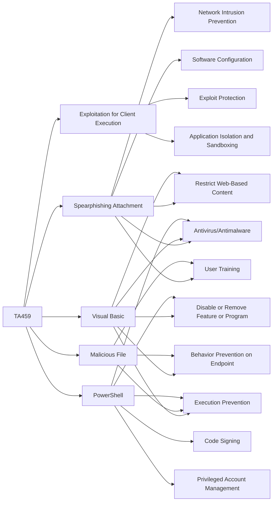

---
tags:
   - groups
---
# TA459
## ID:G0062
[TA459](/mitre/groups/G0062) is a threat group believed to operate out of China that has targeted countries including Russia, Belarus, Mongolia, and others. (Citation: Proofpoint TA459 April 2017)
## Techniques Used By Group
* [Spearphishing Attachment](techniques/T1566/001)
* [Exploitation for Client Execution](techniques/T1203)
* [Visual Basic](techniques/T1059/005)
* [Malicious File](techniques/T1204/002)
* [PowerShell](techniques/T1059/001)

# Summary of Techniques and Mitigations
