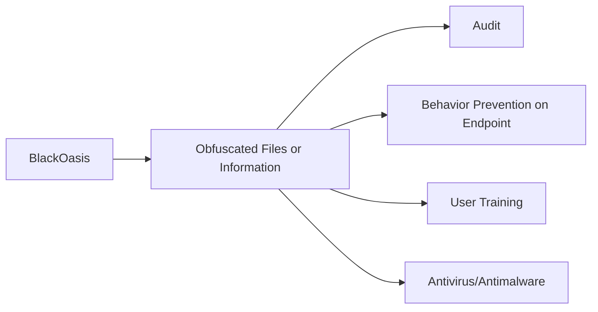

---
tags:
   - groups
---
# BlackOasis
## ID:G0063
[BlackOasis](/mitre/groups/G0063) is a Middle Eastern threat group that is believed to be a customer of Gamma Group. The group has shown interest in prominent figures in the United Nations, as well as opposition bloggers, activists, regional news correspondents, and think tanks. (Citation: Securelist BlackOasis Oct 2017) (Citation: Securelist APT Trends Q2 2017) A group known by Microsoft as [NEODYMIUM](/mitre/groups/G0055) is reportedly associated closely with [BlackOasis](/mitre/groups/G0063) operations, but evidence that the group names are aliases has not been identified. (Citation: CyberScoop BlackOasis Oct 2017)
## Techniques Used By Group
* [Obfuscated Files or Information](techniques/T1027)

# Summary of Techniques and Mitigations
