---
tags:
   - groups
---
# APT33
## ID:G0064
[APT33](groups/G0064) is a suspected Iranian threat group that has carried out operations since at least 2013. The group has targeted organizations across multiple industries in the United States, Saudi Arabia, and South Korea, with a particular interest in the aviation and energy sectors.(Citation: FireEye APT33 Sept 2017)(Citation: FireEye APT33 Webinar Sept 2017)
## Techniques Used By Group
* [Credentials In Files](techniques/T1552/001)
* [Cached Domain Credentials](techniques/T1003/005)
* [Archive via Utility](techniques/T1560/001)
* [Credentials from Web Browsers](techniques/T1555/003)
* [Group Policy Preferences](techniques/T1552/006)
* [Encrypted/Encoded File](techniques/T1027/013)
* [Spearphishing Attachment](techniques/T1566/001)
* [LSASS Memory](techniques/T1003/001)
* [Spearphishing Link](techniques/T1566/002)
* [Password Spraying](techniques/T1110/003)
* [LSA Secrets](techniques/T1003/004)
* [Scheduled Task](techniques/T1053/005)
* [Credentials from Password Stores](techniques/T1555)
* [Windows Management Instrumentation Event Subscription](techniques/T1546/003)
* [Ingress Tool Transfer](techniques/T1105)
* [Exfiltration Over Unencrypted Non-C2 Protocol](techniques/T1048/003)
* [Tool](techniques/T1588/002)
* [Network Sniffing](techniques/T1040)
* [Web Protocols](techniques/T1071/001)
* [PowerShell](techniques/T1059/001)
* [Registry Run Keys / Startup Folder](techniques/T1547/001)
* [Valid Accounts](techniques/T1078)
* [Symmetric Cryptography](techniques/T1573/001)
* [Visual Basic](techniques/T1059/005)
* [Standard Encoding](techniques/T1132/001)
* [Non-Standard Port](techniques/T1571)
* [Cloud Accounts](techniques/T1078/004)
* [Exploitation for Client Execution](techniques/T1203)
* [Malicious File](techniques/T1204/002)
* [Malicious Link](techniques/T1204/001)
* [Exploitation for Privilege Escalation](techniques/T1068)

# Summary of Techniques and Mitigations

```mermaid
flowchart LR
group[APT33] --> T1552.001[Credentials In Files]
group[APT33] --> T1003.005[Cached Domain Credentials]
group[APT33] --> T1560.001[Archive via Utility]
group[APT33] --> T1555.003[Credentials from Web Browsers]
group[APT33] --> T1552.006[Group Policy Preferences]
group[APT33] --> T1027.013[Encrypted/Encoded File]
group[APT33] --> T1566.001[Spearphishing Attachment]
group[APT33] --> T1003.001[LSASS Memory]
group[APT33] --> T1566.002[Spearphishing Link]
group[APT33] --> T1110.003[Password Spraying]
group[APT33] --> T1003.004[LSA Secrets]
group[APT33] --> T1053.005[Scheduled Task]
group[APT33] --> T1555[Credentials from Password Stores]
group[APT33] --> T1546.003[Windows Management Instrumentation Event Subscription]
group[APT33] --> T1105[Ingress Tool Transfer]
group[APT33] --> T1048.003[Exfiltration Over Unencrypted Non-C2 Protocol]
group[APT33] --> T1588.002[Tool]
group[APT33] --> T1040[Network Sniffing]
group[APT33] --> T1071.001[Web Protocols]
group[APT33] --> T1059.001[PowerShell]
group[APT33] --> T1547.001[Registry Run Keys / Startup Folder]
group[APT33] --> T1078[Valid Accounts]
group[APT33] --> T1573.001[Symmetric Cryptography]
group[APT33] --> T1059.005[Visual Basic]
group[APT33] --> T1132.001[Standard Encoding]
group[APT33] --> T1571[Non-Standard Port]
group[APT33] --> T1078.004[Cloud Accounts]
group[APT33] --> T1203[Exploitation for Client Execution]
group[APT33] --> T1204.002[Malicious File]
group[APT33] --> T1204.001[Malicious Link]
group[APT33] --> T1068[Exploitation for Privilege Escalation]
T1552.001[Credentials In Files] --> M1017[User Training]
T1552.001[Credentials In Files] --> M1047[Audit]
T1552.001[Credentials In Files] --> M1022[Restrict File and Directory Permissions]
T1552.001[Credentials In Files] --> M1027[Password Policies]
T1003.005[Cached Domain Credentials] --> M1015[Active Directory Configuration]
T1003.005[Cached Domain Credentials] --> M1017[User Training]
T1003.005[Cached Domain Credentials] --> M1027[Password Policies]
T1003.005[Cached Domain Credentials] --> M1028[Operating System Configuration]
T1003.005[Cached Domain Credentials] --> M1026[Privileged Account Management]
T1560.001[Archive via Utility] --> M1047[Audit]
T1555.003[Credentials from Web Browsers] --> M1027[Password Policies]
T1552.006[Group Policy Preferences] --> M1047[Audit]
T1552.006[Group Policy Preferences] --> M1051[Update Software]
T1552.006[Group Policy Preferences] --> M1015[Active Directory Configuration]
T1027.013[Encrypted/Encoded File] --> M1049[Antivirus/Antimalware]
T1027.013[Encrypted/Encoded File] --> M1040[Behavior Prevention on Endpoint]
T1566.001[Spearphishing Attachment] --> M1049[Antivirus/Antimalware]
T1566.001[Spearphishing Attachment] --> M1031[Network Intrusion Prevention]
T1566.001[Spearphishing Attachment] --> M1054[Software Configuration]
T1566.001[Spearphishing Attachment] --> M1017[User Training]
T1566.001[Spearphishing Attachment] --> M1021[Restrict Web-Based Content]
T1003.001[LSASS Memory] --> M1028[Operating System Configuration]
T1003.001[LSASS Memory] --> M1043[Credential Access Protection]
T1003.001[LSASS Memory] --> M1025[Privileged Process Integrity]
T1003.001[LSASS Memory] --> M1026[Privileged Account Management]
T1003.001[LSASS Memory] --> M1017[User Training]
T1003.001[LSASS Memory] --> M1040[Behavior Prevention on Endpoint]
T1003.001[LSASS Memory] --> M1027[Password Policies]
T1566.002[Spearphishing Link] --> M1054[Software Configuration]
T1566.002[Spearphishing Link] --> M1021[Restrict Web-Based Content]
T1566.002[Spearphishing Link] --> M1047[Audit]
T1566.002[Spearphishing Link] --> M1018[User Account Management]
T1566.002[Spearphishing Link] --> M1017[User Training]
T1110.003[Password Spraying] --> M1032[Multi-factor Authentication]
T1110.003[Password Spraying] --> M1027[Password Policies]
T1110.003[Password Spraying] --> M1036[Account Use Policies]
T1003.004[LSA Secrets] --> M1027[Password Policies]
T1003.004[LSA Secrets] --> M1026[Privileged Account Management]
T1003.004[LSA Secrets] --> M1017[User Training]
T1053.005[Scheduled Task] --> M1026[Privileged Account Management]
T1053.005[Scheduled Task] --> M1018[User Account Management]
T1053.005[Scheduled Task] --> M1047[Audit]
T1053.005[Scheduled Task] --> M1028[Operating System Configuration]
T1555[Credentials from Password Stores] --> M1026[Privileged Account Management]
T1555[Credentials from Password Stores] --> M1051[Update Software]
T1555[Credentials from Password Stores] --> M1027[Password Policies]
T1546.003[Windows Management Instrumentation Event Subscription] --> M1018[User Account Management]
T1546.003[Windows Management Instrumentation Event Subscription] --> M1026[Privileged Account Management]
T1546.003[Windows Management Instrumentation Event Subscription] --> M1040[Behavior Prevention on Endpoint]
T1105[Ingress Tool Transfer] --> M1031[Network Intrusion Prevention]
T1048.003[Exfiltration Over Unencrypted Non-C2 Protocol] --> M1031[Network Intrusion Prevention]
T1048.003[Exfiltration Over Unencrypted Non-C2 Protocol] --> M1057[Data Loss Prevention]
T1048.003[Exfiltration Over Unencrypted Non-C2 Protocol] --> M1037[Filter Network Traffic]
T1048.003[Exfiltration Over Unencrypted Non-C2 Protocol] --> M1030[Network Segmentation]
T1588.002[Tool] --> M1056[Pre-compromise]
T1040[Network Sniffing] --> M1018[User Account Management]
T1040[Network Sniffing] --> M1032[Multi-factor Authentication]
T1040[Network Sniffing] --> M1041[Encrypt Sensitive Information]
T1040[Network Sniffing] --> M1030[Network Segmentation]
T1071.001[Web Protocols] --> M1031[Network Intrusion Prevention]
T1059.001[PowerShell] --> M1042[Disable or Remove Feature or Program]
T1059.001[PowerShell] --> M1049[Antivirus/Antimalware]
T1059.001[PowerShell] --> M1045[Code Signing]
T1059.001[PowerShell] --> M1026[Privileged Account Management]
T1059.001[PowerShell] --> M1038[Execution Prevention]
T1078[Valid Accounts] --> M1027[Password Policies]
T1078[Valid Accounts] --> M1018[User Account Management]
T1078[Valid Accounts] --> M1026[Privileged Account Management]
T1078[Valid Accounts] --> M1013[Application Developer Guidance]
T1078[Valid Accounts] --> M1017[User Training]
T1078[Valid Accounts] --> M1015[Active Directory Configuration]
T1078[Valid Accounts] --> M1036[Account Use Policies]
T1573.001[Symmetric Cryptography] --> M1031[Network Intrusion Prevention]
T1059.005[Visual Basic] --> M1042[Disable or Remove Feature or Program]
T1059.005[Visual Basic] --> M1049[Antivirus/Antimalware]
T1059.005[Visual Basic] --> M1038[Execution Prevention]
T1059.005[Visual Basic] --> M1040[Behavior Prevention on Endpoint]
T1059.005[Visual Basic] --> M1021[Restrict Web-Based Content]
T1132.001[Standard Encoding] --> M1031[Network Intrusion Prevention]
T1571[Non-Standard Port] --> M1030[Network Segmentation]
T1571[Non-Standard Port] --> M1031[Network Intrusion Prevention]
T1078.004[Cloud Accounts] --> M1027[Password Policies]
T1078.004[Cloud Accounts] --> M1015[Active Directory Configuration]
T1078.004[Cloud Accounts] --> M1026[Privileged Account Management]
T1078.004[Cloud Accounts] --> M1032[Multi-factor Authentication]
T1078.004[Cloud Accounts] --> M1036[Account Use Policies]
T1078.004[Cloud Accounts] --> M1017[User Training]
T1078.004[Cloud Accounts] --> M1018[User Account Management]
T1203[Exploitation for Client Execution] --> M1050[Exploit Protection]
T1203[Exploitation for Client Execution] --> M1048[Application Isolation and Sandboxing]
T1204.002[Malicious File] --> M1038[Execution Prevention]
T1204.002[Malicious File] --> M1040[Behavior Prevention on Endpoint]
T1204.002[Malicious File] --> M1017[User Training]
T1204.001[Malicious Link] --> M1031[Network Intrusion Prevention]
T1204.001[Malicious Link] --> M1017[User Training]
T1204.001[Malicious Link] --> M1021[Restrict Web-Based Content]
T1068[Exploitation for Privilege Escalation] --> M1051[Update Software]
T1068[Exploitation for Privilege Escalation] --> M1050[Exploit Protection]
T1068[Exploitation for Privilege Escalation] --> M1048[Application Isolation and Sandboxing]
T1068[Exploitation for Privilege Escalation] --> M1019[Threat Intelligence Program]
T1068[Exploitation for Privilege Escalation] --> M1038[Execution Prevention]
```
