---
tags:
   - groups
---
# Leviathan
## ID:G0065
[Leviathan](/mitre/groups/G0065) is a Chinese state-sponsored cyber espionage group that has been attributed to the Ministry of State Security's (MSS) Hainan State Security Department and an affiliated front company.(Citation: CISA AA21-200A APT40 July 2021) Active since at least 2009, [Leviathan](/mitre/groups/G0065) has targeted the following sectors: academia, aerospace/aviation, biomedical, defense industrial base, government, healthcare, manufacturing, maritime, and transportation across the US, Canada, Europe, the Middle East, and Southeast Asia.(Citation: CISA AA21-200A APT40 July 2021)(Citation: Proofpoint Leviathan Oct 2017)(Citation: FireEye Periscope March 2018)
## Techniques Used By Group
* [Exfiltration to Cloud Storage](techniques/T1567/002)
* [One-Way Communication](techniques/T1102/003)
* [Windows Management Instrumentation](techniques/T1047)
* [SSH](techniques/T1021/004)
* [Ingress Tool Transfer](techniques/T1105)
* [Registry Run Keys / Startup Folder](techniques/T1547/001)
* [Encrypted/Encoded File](techniques/T1027/013)
* [Credentials](techniques/T1589/001)
* [LSASS Memory](techniques/T1003/001)
* [Social Media Accounts](techniques/T1586/001)
* [Multi-hop Proxy](techniques/T1090/003)
* [Binary Padding](techniques/T1027/001)
* [Domains](techniques/T1583/001)
* [Email Accounts](techniques/T1585/002)
* [Spearphishing Link](techniques/T1566/002)
* [Drive-by Compromise](techniques/T1189)
* [Windows Management Instrumentation Event Subscription](techniques/T1546/003)
* [Steganography](techniques/T1027/003)
* [Social Media Accounts](techniques/T1585/001)
* [PowerShell](techniques/T1059/001)
* [Shortcut Modification](techniques/T1547/009)
* [Dynamic-link Library Injection](techniques/T1055/001)
* [Spearphishing Attachment](techniques/T1566/001)
* [Exploitation for Client Execution](techniques/T1203)
* [Visual Basic](techniques/T1059/005)
* [Valid Accounts](techniques/T1078)
* [Code Signing](techniques/T1553/002)
* [Dynamic Data Exchange](techniques/T1559/002)
* [BITS Jobs](techniques/T1197)
* [Local Data Staging](techniques/T1074/001)
* [Malicious File](techniques/T1204/002)
* [Deobfuscate/Decode Files or Information](techniques/T1140)
* [Remote Data Staging](techniques/T1074/002)
* [Internal Spearphishing](techniques/T1534)
* [Regsvr32](techniques/T1218/010)
* [Exfiltration Over C2 Channel](techniques/T1041)
* [Web Shell](techniques/T1505/003)
* [Remote Desktop Protocol](techniques/T1021/001)
* [Archive Collected Data](techniques/T1560)
* [Protocol Tunneling](techniques/T1572)
* [Malicious Link](techniques/T1204/001)
* [External Remote Services](techniques/T1133)
* [OS Credential Dumping](techniques/T1003)
* [Email Accounts](techniques/T1586/002)

# Summary of Techniques and Mitigations

```mermaid
flowchart LR
group[Leviathan] --> T1567.002[Exfiltration to Cloud Storage]
group[Leviathan] --> T1102.003[One-Way Communication]
group[Leviathan] --> T1047[Windows Management Instrumentation]
group[Leviathan] --> T1021.004[SSH]
group[Leviathan] --> T1105[Ingress Tool Transfer]
group[Leviathan] --> T1547.001[Registry Run Keys / Startup Folder]
group[Leviathan] --> T1027.013[Encrypted/Encoded File]
group[Leviathan] --> T1589.001[Credentials]
group[Leviathan] --> T1003.001[LSASS Memory]
group[Leviathan] --> T1586.001[Social Media Accounts]
group[Leviathan] --> T1090.003[Multi-hop Proxy]
group[Leviathan] --> T1027.001[Binary Padding]
group[Leviathan] --> T1583.001[Domains]
group[Leviathan] --> T1585.002[Email Accounts]
group[Leviathan] --> T1566.002[Spearphishing Link]
group[Leviathan] --> T1189[Drive-by Compromise]
group[Leviathan] --> T1546.003[Windows Management Instrumentation Event Subscription]
group[Leviathan] --> T1027.003[Steganography]
group[Leviathan] --> T1585.001[Social Media Accounts]
group[Leviathan] --> T1059.001[PowerShell]
group[Leviathan] --> T1547.009[Shortcut Modification]
group[Leviathan] --> T1055.001[Dynamic-link Library Injection]
group[Leviathan] --> T1566.001[Spearphishing Attachment]
group[Leviathan] --> T1203[Exploitation for Client Execution]
group[Leviathan] --> T1059.005[Visual Basic]
group[Leviathan] --> T1078[Valid Accounts]
group[Leviathan] --> T1553.002[Code Signing]
group[Leviathan] --> T1559.002[Dynamic Data Exchange]
group[Leviathan] --> T1197[BITS Jobs]
group[Leviathan] --> T1074.001[Local Data Staging]
group[Leviathan] --> T1204.002[Malicious File]
group[Leviathan] --> T1140[Deobfuscate/Decode Files or Information]
group[Leviathan] --> T1074.002[Remote Data Staging]
group[Leviathan] --> T1534[Internal Spearphishing]
group[Leviathan] --> T1218.010[Regsvr32]
group[Leviathan] --> T1041[Exfiltration Over C2 Channel]
group[Leviathan] --> T1505.003[Web Shell]
group[Leviathan] --> T1021.001[Remote Desktop Protocol]
group[Leviathan] --> T1560[Archive Collected Data]
group[Leviathan] --> T1572[Protocol Tunneling]
group[Leviathan] --> T1204.001[Malicious Link]
group[Leviathan] --> T1133[External Remote Services]
group[Leviathan] --> T1003[OS Credential Dumping]
group[Leviathan] --> T1586.002[Email Accounts]
T1567.002[Exfiltration to Cloud Storage] --> M1021[Restrict Web-Based Content]
T1102.003[One-Way Communication] --> M1021[Restrict Web-Based Content]
T1102.003[One-Way Communication] --> M1031[Network Intrusion Prevention]
T1047[Windows Management Instrumentation] --> M1026[Privileged Account Management]
T1047[Windows Management Instrumentation] --> M1040[Behavior Prevention on Endpoint]
T1047[Windows Management Instrumentation] --> M1018[User Account Management]
T1047[Windows Management Instrumentation] --> M1038[Execution Prevention]
T1021.004[SSH] --> M1042[Disable or Remove Feature or Program]
T1021.004[SSH] --> M1032[Multi-factor Authentication]
T1021.004[SSH] --> M1018[User Account Management]
T1105[Ingress Tool Transfer] --> M1031[Network Intrusion Prevention]
T1027.013[Encrypted/Encoded File] --> M1049[Antivirus/Antimalware]
T1027.013[Encrypted/Encoded File] --> M1040[Behavior Prevention on Endpoint]
T1589.001[Credentials] --> M1056[Pre-compromise]
T1003.001[LSASS Memory] --> M1028[Operating System Configuration]
T1003.001[LSASS Memory] --> M1043[Credential Access Protection]
T1003.001[LSASS Memory] --> M1025[Privileged Process Integrity]
T1003.001[LSASS Memory] --> M1026[Privileged Account Management]
T1003.001[LSASS Memory] --> M1017[User Training]
T1003.001[LSASS Memory] --> M1040[Behavior Prevention on Endpoint]
T1003.001[LSASS Memory] --> M1027[Password Policies]
T1586.001[Social Media Accounts] --> M1056[Pre-compromise]
T1090.003[Multi-hop Proxy] --> M1037[Filter Network Traffic]
T1583.001[Domains] --> M1056[Pre-compromise]
T1585.002[Email Accounts] --> M1056[Pre-compromise]
T1566.002[Spearphishing Link] --> M1054[Software Configuration]
T1566.002[Spearphishing Link] --> M1021[Restrict Web-Based Content]
T1566.002[Spearphishing Link] --> M1047[Audit]
T1566.002[Spearphishing Link] --> M1018[User Account Management]
T1566.002[Spearphishing Link] --> M1017[User Training]
T1189[Drive-by Compromise] --> M1050[Exploit Protection]
T1189[Drive-by Compromise] --> M1051[Update Software]
T1189[Drive-by Compromise] --> M1048[Application Isolation and Sandboxing]
T1189[Drive-by Compromise] --> M1021[Restrict Web-Based Content]
T1546.003[Windows Management Instrumentation Event Subscription] --> M1018[User Account Management]
T1546.003[Windows Management Instrumentation Event Subscription] --> M1026[Privileged Account Management]
T1546.003[Windows Management Instrumentation Event Subscription] --> M1040[Behavior Prevention on Endpoint]
T1585.001[Social Media Accounts] --> M1056[Pre-compromise]
T1059.001[PowerShell] --> M1042[Disable or Remove Feature or Program]
T1059.001[PowerShell] --> M1049[Antivirus/Antimalware]
T1059.001[PowerShell] --> M1045[Code Signing]
T1059.001[PowerShell] --> M1026[Privileged Account Management]
T1059.001[PowerShell] --> M1038[Execution Prevention]
T1547.009[Shortcut Modification] --> M1018[User Account Management]
T1055.001[Dynamic-link Library Injection] --> M1040[Behavior Prevention on Endpoint]
T1566.001[Spearphishing Attachment] --> M1049[Antivirus/Antimalware]
T1566.001[Spearphishing Attachment] --> M1031[Network Intrusion Prevention]
T1566.001[Spearphishing Attachment] --> M1054[Software Configuration]
T1566.001[Spearphishing Attachment] --> M1017[User Training]
T1566.001[Spearphishing Attachment] --> M1021[Restrict Web-Based Content]
T1203[Exploitation for Client Execution] --> M1050[Exploit Protection]
T1203[Exploitation for Client Execution] --> M1048[Application Isolation and Sandboxing]
T1059.005[Visual Basic] --> M1042[Disable or Remove Feature or Program]
T1059.005[Visual Basic] --> M1049[Antivirus/Antimalware]
T1059.005[Visual Basic] --> M1038[Execution Prevention]
T1059.005[Visual Basic] --> M1040[Behavior Prevention on Endpoint]
T1059.005[Visual Basic] --> M1021[Restrict Web-Based Content]
T1078[Valid Accounts] --> M1027[Password Policies]
T1078[Valid Accounts] --> M1018[User Account Management]
T1078[Valid Accounts] --> M1026[Privileged Account Management]
T1078[Valid Accounts] --> M1013[Application Developer Guidance]
T1078[Valid Accounts] --> M1017[User Training]
T1078[Valid Accounts] --> M1015[Active Directory Configuration]
T1078[Valid Accounts] --> M1036[Account Use Policies]
T1559.002[Dynamic Data Exchange] --> M1040[Behavior Prevention on Endpoint]
T1559.002[Dynamic Data Exchange] --> M1048[Application Isolation and Sandboxing]
T1559.002[Dynamic Data Exchange] --> M1054[Software Configuration]
T1559.002[Dynamic Data Exchange] --> M1042[Disable or Remove Feature or Program]
T1197[BITS Jobs] --> M1018[User Account Management]
T1197[BITS Jobs] --> M1037[Filter Network Traffic]
T1197[BITS Jobs] --> M1028[Operating System Configuration]
T1204.002[Malicious File] --> M1038[Execution Prevention]
T1204.002[Malicious File] --> M1040[Behavior Prevention on Endpoint]
T1204.002[Malicious File] --> M1017[User Training]
T1218.010[Regsvr32] --> M1050[Exploit Protection]
T1041[Exfiltration Over C2 Channel] --> M1031[Network Intrusion Prevention]
T1041[Exfiltration Over C2 Channel] --> M1057[Data Loss Prevention]
T1505.003[Web Shell] --> M1042[Disable or Remove Feature or Program]
T1505.003[Web Shell] --> M1018[User Account Management]
T1021.001[Remote Desktop Protocol] --> M1047[Audit]
T1021.001[Remote Desktop Protocol] --> M1035[Limit Access to Resource Over Network]
T1021.001[Remote Desktop Protocol] --> M1030[Network Segmentation]
T1021.001[Remote Desktop Protocol] --> M1028[Operating System Configuration]
T1021.001[Remote Desktop Protocol] --> M1042[Disable or Remove Feature or Program]
T1021.001[Remote Desktop Protocol] --> M1018[User Account Management]
T1021.001[Remote Desktop Protocol] --> M1032[Multi-factor Authentication]
T1021.001[Remote Desktop Protocol] --> M1026[Privileged Account Management]
T1560[Archive Collected Data] --> M1047[Audit]
T1572[Protocol Tunneling] --> M1037[Filter Network Traffic]
T1572[Protocol Tunneling] --> M1031[Network Intrusion Prevention]
T1204.001[Malicious Link] --> M1031[Network Intrusion Prevention]
T1204.001[Malicious Link] --> M1017[User Training]
T1204.001[Malicious Link] --> M1021[Restrict Web-Based Content]
T1133[External Remote Services] --> M1030[Network Segmentation]
T1133[External Remote Services] --> M1042[Disable or Remove Feature or Program]
T1133[External Remote Services] --> M1035[Limit Access to Resource Over Network]
T1133[External Remote Services] --> M1032[Multi-factor Authentication]
T1003[OS Credential Dumping] --> M1041[Encrypt Sensitive Information]
T1003[OS Credential Dumping] --> M1040[Behavior Prevention on Endpoint]
T1003[OS Credential Dumping] --> M1027[Password Policies]
T1003[OS Credential Dumping] --> M1017[User Training]
T1003[OS Credential Dumping] --> M1026[Privileged Account Management]
T1003[OS Credential Dumping] --> M1025[Privileged Process Integrity]
T1003[OS Credential Dumping] --> M1043[Credential Access Protection]
T1003[OS Credential Dumping] --> M1015[Active Directory Configuration]
T1003[OS Credential Dumping] --> M1028[Operating System Configuration]
T1586.002[Email Accounts] --> M1056[Pre-compromise]
```
