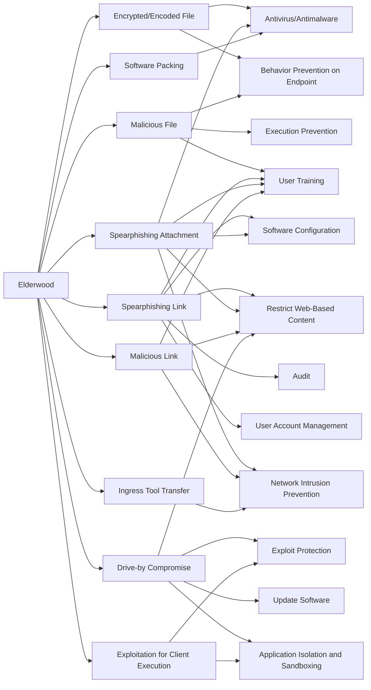

---
tags:
   - groups
---
# Elderwood
## ID:G0066
[Elderwood](groups/G0066) is a suspected Chinese cyber espionage group that was reportedly responsible for the 2009 Google intrusion known as Operation Aurora. (Citation: Security Affairs Elderwood Sept 2012) The group has targeted defense organizations, supply chain manufacturers, human rights and nongovernmental organizations (NGOs), and IT service providers. (Citation: Symantec Elderwood Sept 2012) (Citation: CSM Elderwood Sept 2012)
## Techniques Used By Group
* [Encrypted/Encoded File](techniques/T1027/013)
* [Malicious File](techniques/T1204/002)
* [Spearphishing Link](techniques/T1566/002)
* [Spearphishing Attachment](techniques/T1566/001)
* [Malicious Link](techniques/T1204/001)
* [Drive-by Compromise](techniques/T1189)
* [Exploitation for Client Execution](techniques/T1203)
* [Ingress Tool Transfer](techniques/T1105)
* [Software Packing](techniques/T1027/002)

# Summary of Techniques and Mitigations
