---
tags:
   - groups
---
# APT37
## ID:G0067
[APT37](groups/G0067) is a North Korean state-sponsored cyber espionage group that has been active since at least 2012. The group has targeted victims primarily in South Korea, but also in Japan, Vietnam, Russia, Nepal, China, India, Romania, Kuwait, and other parts of the Middle East. [APT37](groups/G0067) has also been linked to the following campaigns between 2016-2018: Operation Daybreak, Operation Erebus, Golden Time, Evil New Year, Are you Happy?, FreeMilk, North Korean Human Rights, and Evil New Year 2018.(Citation: FireEye APT37 Feb 2018)(Citation: Securelist ScarCruft Jun 2016)(Citation: Talos Group123)

North Korean group definitions are known to have significant overlap, and some security researchers report all North Korean state-sponsored cyber activity under the name [Lazarus Group](groups/G0032) instead of tracking clusters or subgroups.
## Techniques Used By Group
* [Registry Run Keys / Startup Folder](techniques/T1547/001)
* [Peripheral Device Discovery](techniques/T1120)
* [Python](techniques/T1059/006)
* [Ingress Tool Transfer](techniques/T1105)
* [Web Protocols](techniques/T1071/001)
* [Steganography](techniques/T1027/003)
* [Bidirectional Communication](techniques/T1102/002)
* [System Information Discovery](techniques/T1082)
* [Malicious File](techniques/T1204/002)
* [Invalid Code Signature](techniques/T1036/001)
* [Bypass User Account Control](techniques/T1548/002)
* [System Owner/User Discovery](techniques/T1033)
* [Credentials from Web Browsers](techniques/T1555/003)
* [System Shutdown/Reboot](techniques/T1529)
* [Data from Local System](techniques/T1005)
* [Dynamic Data Exchange](techniques/T1559/002)
* [Native API](techniques/T1106)
* [Exploitation for Client Execution](techniques/T1203)
* [Process Injection](techniques/T1055)
* [Obfuscated Files or Information](techniques/T1027)
* [Drive-by Compromise](techniques/T1189)
* [Process Discovery](techniques/T1057)
* [Command and Scripting Interpreter](techniques/T1059)
* [Windows Command Shell](techniques/T1059/003)
* [Spearphishing Attachment](techniques/T1566/001)
* [Audio Capture](techniques/T1123)
* [Visual Basic](techniques/T1059/005)
* [Scheduled Task](techniques/T1053/005)
* [Disk Structure Wipe](techniques/T1561/002)

# Summary of Techniques and Mitigations

```mermaid
flowchart LR
group[APT37] --> T1547.001[Registry Run Keys / Startup Folder]
group[APT37] --> T1120[Peripheral Device Discovery]
group[APT37] --> T1059.006[Python]
group[APT37] --> T1105[Ingress Tool Transfer]
group[APT37] --> T1071.001[Web Protocols]
group[APT37] --> T1027.003[Steganography]
group[APT37] --> T1102.002[Bidirectional Communication]
group[APT37] --> T1082[System Information Discovery]
group[APT37] --> T1204.002[Malicious File]
group[APT37] --> T1036.001[Invalid Code Signature]
group[APT37] --> T1548.002[Bypass User Account Control]
group[APT37] --> T1033[System Owner/User Discovery]
group[APT37] --> T1555.003[Credentials from Web Browsers]
group[APT37] --> T1529[System Shutdown/Reboot]
group[APT37] --> T1005[Data from Local System]
group[APT37] --> T1559.002[Dynamic Data Exchange]
group[APT37] --> T1106[Native API]
group[APT37] --> T1203[Exploitation for Client Execution]
group[APT37] --> T1055[Process Injection]
group[APT37] --> T1027[Obfuscated Files or Information]
group[APT37] --> T1189[Drive-by Compromise]
group[APT37] --> T1057[Process Discovery]
group[APT37] --> T1059[Command and Scripting Interpreter]
group[APT37] --> T1059.003[Windows Command Shell]
group[APT37] --> T1566.001[Spearphishing Attachment]
group[APT37] --> T1123[Audio Capture]
group[APT37] --> T1059.005[Visual Basic]
group[APT37] --> T1053.005[Scheduled Task]
group[APT37] --> T1561.002[Disk Structure Wipe]
T1059.006[Python] --> M1047[Audit]
T1059.006[Python] --> M1049[Antivirus/Antimalware]
T1059.006[Python] --> M1033[Limit Software Installation]
T1059.006[Python] --> M1038[Execution Prevention]
T1105[Ingress Tool Transfer] --> M1031[Network Intrusion Prevention]
T1071.001[Web Protocols] --> M1031[Network Intrusion Prevention]
T1102.002[Bidirectional Communication] --> M1021[Restrict Web-Based Content]
T1102.002[Bidirectional Communication] --> M1031[Network Intrusion Prevention]
T1204.002[Malicious File] --> M1038[Execution Prevention]
T1204.002[Malicious File] --> M1040[Behavior Prevention on Endpoint]
T1204.002[Malicious File] --> M1017[User Training]
T1036.001[Invalid Code Signature] --> M1045[Code Signing]
T1548.002[Bypass User Account Control] --> M1051[Update Software]
T1548.002[Bypass User Account Control] --> M1047[Audit]
T1548.002[Bypass User Account Control] --> M1052[User Account Control]
T1548.002[Bypass User Account Control] --> M1026[Privileged Account Management]
T1555.003[Credentials from Web Browsers] --> M1027[Password Policies]
T1005[Data from Local System] --> M1057[Data Loss Prevention]
T1559.002[Dynamic Data Exchange] --> M1040[Behavior Prevention on Endpoint]
T1559.002[Dynamic Data Exchange] --> M1048[Application Isolation and Sandboxing]
T1559.002[Dynamic Data Exchange] --> M1054[Software Configuration]
T1559.002[Dynamic Data Exchange] --> M1042[Disable or Remove Feature or Program]
T1106[Native API] --> M1038[Execution Prevention]
T1106[Native API] --> M1040[Behavior Prevention on Endpoint]
T1203[Exploitation for Client Execution] --> M1050[Exploit Protection]
T1203[Exploitation for Client Execution] --> M1048[Application Isolation and Sandboxing]
T1055[Process Injection] --> M1026[Privileged Account Management]
T1055[Process Injection] --> M1040[Behavior Prevention on Endpoint]
T1027[Obfuscated Files or Information] --> M1047[Audit]
T1027[Obfuscated Files or Information] --> M1040[Behavior Prevention on Endpoint]
T1027[Obfuscated Files or Information] --> M1017[User Training]
T1027[Obfuscated Files or Information] --> M1049[Antivirus/Antimalware]
T1189[Drive-by Compromise] --> M1050[Exploit Protection]
T1189[Drive-by Compromise] --> M1051[Update Software]
T1189[Drive-by Compromise] --> M1048[Application Isolation and Sandboxing]
T1189[Drive-by Compromise] --> M1021[Restrict Web-Based Content]
T1059[Command and Scripting Interpreter] --> M1045[Code Signing]
T1059[Command and Scripting Interpreter] --> M1042[Disable or Remove Feature or Program]
T1059[Command and Scripting Interpreter] --> M1038[Execution Prevention]
T1059[Command and Scripting Interpreter] --> M1049[Antivirus/Antimalware]
T1059[Command and Scripting Interpreter] --> M1026[Privileged Account Management]
T1059[Command and Scripting Interpreter] --> M1021[Restrict Web-Based Content]
T1059[Command and Scripting Interpreter] --> M1040[Behavior Prevention on Endpoint]
T1059.003[Windows Command Shell] --> M1038[Execution Prevention]
T1566.001[Spearphishing Attachment] --> M1049[Antivirus/Antimalware]
T1566.001[Spearphishing Attachment] --> M1031[Network Intrusion Prevention]
T1566.001[Spearphishing Attachment] --> M1054[Software Configuration]
T1566.001[Spearphishing Attachment] --> M1017[User Training]
T1566.001[Spearphishing Attachment] --> M1021[Restrict Web-Based Content]
T1059.005[Visual Basic] --> M1042[Disable or Remove Feature or Program]
T1059.005[Visual Basic] --> M1049[Antivirus/Antimalware]
T1059.005[Visual Basic] --> M1038[Execution Prevention]
T1059.005[Visual Basic] --> M1040[Behavior Prevention on Endpoint]
T1059.005[Visual Basic] --> M1021[Restrict Web-Based Content]
T1053.005[Scheduled Task] --> M1026[Privileged Account Management]
T1053.005[Scheduled Task] --> M1018[User Account Management]
T1053.005[Scheduled Task] --> M1047[Audit]
T1053.005[Scheduled Task] --> M1028[Operating System Configuration]
T1561.002[Disk Structure Wipe] --> M1053[Data Backup]
```
