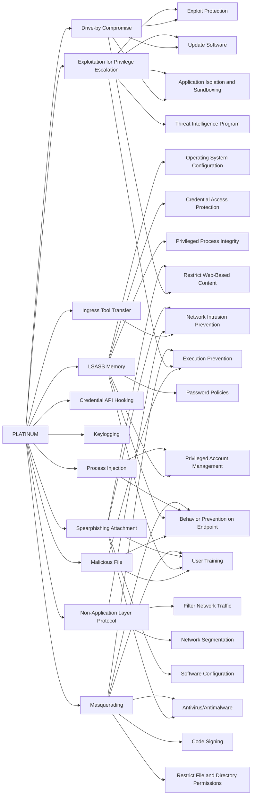

---
tags:
   - groups
---
# PLATINUM
## ID:G0068
[PLATINUM](/mitre/groups/G0068) is an activity group that has targeted victims since at least 2009. The group has focused on targets associated with governments and related organizations in South and Southeast Asia. (Citation: Microsoft PLATINUM April 2016)
## Techniques Used By Group
* [Drive-by Compromise](/mitre/techniques/T1189)
* [Ingress Tool Transfer](/mitre/techniques/T1105)
* [Malicious File](/mitre/techniques/T1204/002)
* [Exploitation for Privilege Escalation](/mitre/techniques/T1068)
* [Credential API Hooking](/mitre/techniques/T1056/004)
* [Keylogging](/mitre/techniques/T1056/001)
* [LSASS Memory](/mitre/techniques/T1003/001)
* [Non-Application Layer Protocol](/mitre/techniques/T1095)
* [Process Injection](/mitre/techniques/T1055)
* [Spearphishing Attachment](/mitre/techniques/T1566/001)
* [Masquerading](/mitre/techniques/T1036)

# Summary of Techniques and Mitigations
