---
tags:
   - groups
---
# MuddyWater
## ID:G0069
[MuddyWater](/mitre/groups/G0069) is a cyber espionage group assessed to be a subordinate element within Iran's Ministry of Intelligence and Security (MOIS).(Citation: CYBERCOM Iranian Intel Cyber January 2022) Since at least 2017, [MuddyWater](/mitre/groups/G0069) has targeted a range of government and private organizations across sectors, including telecommunications, local government, defense, and oil and natural gas organizations, in the Middle East, Asia, Africa, Europe, and North America.(Citation: Unit 42 MuddyWater Nov 2017)(Citation: Symantec MuddyWater Dec 2018)(Citation: ClearSky MuddyWater Nov 2018)(Citation: ClearSky MuddyWater June 2019)(Citation: Reaqta MuddyWater November 2017)(Citation: DHS CISA AA22-055A MuddyWater February 2022)(Citation: Talos MuddyWater Jan 2022)
## Techniques Used By Group
* [Spearphishing Link](/mitre/techniques/T1566/002)
* [Office Template Macros](/mitre/techniques/T1137/001)
* [DLL Side-Loading](/mitre/techniques/T1574/002)
* [Tool](/mitre/techniques/T1588/002)
* [Mshta](/mitre/techniques/T1218/005)
* [Windows Management Instrumentation](/mitre/techniques/T1047)
* [LSA Secrets](/mitre/techniques/T1003/004)
* [Spearphishing Attachment](/mitre/techniques/T1566/001)
* [Component Object Model](/mitre/techniques/T1559/001)
* [Windows Command Shell](/mitre/techniques/T1059/003)
* [CMSTP](/mitre/techniques/T1218/003)
* [Match Legitimate Name or Location](/mitre/techniques/T1036/005)
* [Disable or Modify Tools](/mitre/techniques/T1562/001)
* [Domain Account](/mitre/techniques/T1087/002)
* [JavaScript](/mitre/techniques/T1059/007)
* [Web Services](/mitre/techniques/T1583/006)
* [Visual Basic](/mitre/techniques/T1059/005)
* [System Network Configuration Discovery](/mitre/techniques/T1016)
* [Registry Run Keys / Startup Folder](/mitre/techniques/T1547/001)
* [Deobfuscate/Decode Files or Information](/mitre/techniques/T1140)
* [Dynamic Data Exchange](/mitre/techniques/T1559/002)
* [Command Obfuscation](/mitre/techniques/T1027/010)
* [Compile After Delivery](/mitre/techniques/T1027/004)
* [Security Software Discovery](/mitre/techniques/T1518/001)
* [Local Data Staging](/mitre/techniques/T1074/001)
* [Screen Capture](/mitre/techniques/T1113)
* [Web Protocols](/mitre/techniques/T1071/001)
* [Software Discovery](/mitre/techniques/T1518)
* [File and Directory Discovery](/mitre/techniques/T1083)
* [Bypass User Account Control](/mitre/techniques/T1548/002)
* [Ingress Tool Transfer](/mitre/techniques/T1105)
* [Symmetric Cryptography](/mitre/techniques/T1573/001)
* [Credentials from Web Browsers](/mitre/techniques/T1555/003)
* [Archive via Utility](/mitre/techniques/T1560/001)
* [Python](/mitre/techniques/T1059/006)
* [System Network Connections Discovery](/mitre/techniques/T1049)
* [System Information Discovery](/mitre/techniques/T1082)
* [Credentials from Password Stores](/mitre/techniques/T1555)
* [Process Discovery](/mitre/techniques/T1057)
* [Standard Encoding](/mitre/techniques/T1132/001)
* [Multi-Stage Channels](/mitre/techniques/T1104)
* [Malicious Link](/mitre/techniques/T1204/001)
* [Steganography](/mitre/techniques/T1027/003)
* [LSASS Memory](/mitre/techniques/T1003/001)
* [Scheduled Task](/mitre/techniques/T1053/005)
* [External Proxy](/mitre/techniques/T1090/002)
* [Malicious File](/mitre/techniques/T1204/002)
* [System Owner/User Discovery](/mitre/techniques/T1033)
* [Remote Access Software](/mitre/techniques/T1219)
* [Exfiltration Over C2 Channel](/mitre/techniques/T1041)
* [PowerShell](/mitre/techniques/T1059/001)
* [Bidirectional Communication](/mitre/techniques/T1102/002)
* [Rundll32](/mitre/techniques/T1218/011)
* [Credentials In Files](/mitre/techniques/T1552/001)
* [Exploit Public-Facing Application](/mitre/techniques/T1190)
* [Exploitation of Remote Services](/mitre/techniques/T1210)
* [Exploitation for Client Execution](/mitre/techniques/T1203)
* [Cached Domain Credentials](/mitre/techniques/T1003/005)

# Summary of Techniques and Mitigations

```mermaid
flowchart LR
group[MuddyWater] --> T1566.002[Spearphishing Link]
group[MuddyWater] --> T1137.001[Office Template Macros]
group[MuddyWater] --> T1574.002[DLL Side-Loading]
group[MuddyWater] --> T1588.002[Tool]
group[MuddyWater] --> T1218.005[Mshta]
group[MuddyWater] --> T1047[Windows Management Instrumentation]
group[MuddyWater] --> T1003.004[LSA Secrets]
group[MuddyWater] --> T1566.001[Spearphishing Attachment]
group[MuddyWater] --> T1559.001[Component Object Model]
group[MuddyWater] --> T1059.003[Windows Command Shell]
group[MuddyWater] --> T1218.003[CMSTP]
group[MuddyWater] --> T1036.005[Match Legitimate Name or Location]
group[MuddyWater] --> T1562.001[Disable or Modify Tools]
group[MuddyWater] --> T1087.002[Domain Account]
group[MuddyWater] --> T1059.007[JavaScript]
group[MuddyWater] --> T1583.006[Web Services]
group[MuddyWater] --> T1059.005[Visual Basic]
group[MuddyWater] --> T1016[System Network Configuration Discovery]
group[MuddyWater] --> T1547.001[Registry Run Keys / Startup Folder]
group[MuddyWater] --> T1140[Deobfuscate/Decode Files or Information]
group[MuddyWater] --> T1559.002[Dynamic Data Exchange]
group[MuddyWater] --> T1027.010[Command Obfuscation]
group[MuddyWater] --> T1027.004[Compile After Delivery]
group[MuddyWater] --> T1518.001[Security Software Discovery]
group[MuddyWater] --> T1074.001[Local Data Staging]
group[MuddyWater] --> T1113[Screen Capture]
group[MuddyWater] --> T1071.001[Web Protocols]
group[MuddyWater] --> T1518[Software Discovery]
group[MuddyWater] --> T1083[File and Directory Discovery]
group[MuddyWater] --> T1548.002[Bypass User Account Control]
group[MuddyWater] --> T1105[Ingress Tool Transfer]
group[MuddyWater] --> T1573.001[Symmetric Cryptography]
group[MuddyWater] --> T1555.003[Credentials from Web Browsers]
group[MuddyWater] --> T1560.001[Archive via Utility]
group[MuddyWater] --> T1059.006[Python]
group[MuddyWater] --> T1049[System Network Connections Discovery]
group[MuddyWater] --> T1082[System Information Discovery]
group[MuddyWater] --> T1555[Credentials from Password Stores]
group[MuddyWater] --> T1057[Process Discovery]
group[MuddyWater] --> T1132.001[Standard Encoding]
group[MuddyWater] --> T1104[Multi-Stage Channels]
group[MuddyWater] --> T1204.001[Malicious Link]
group[MuddyWater] --> T1027.003[Steganography]
group[MuddyWater] --> T1003.001[LSASS Memory]
group[MuddyWater] --> T1053.005[Scheduled Task]
group[MuddyWater] --> T1090.002[External Proxy]
group[MuddyWater] --> T1204.002[Malicious File]
group[MuddyWater] --> T1033[System Owner/User Discovery]
group[MuddyWater] --> T1219[Remote Access Software]
group[MuddyWater] --> T1041[Exfiltration Over C2 Channel]
group[MuddyWater] --> T1059.001[PowerShell]
group[MuddyWater] --> T1102.002[Bidirectional Communication]
group[MuddyWater] --> T1218.011[Rundll32]
group[MuddyWater] --> T1552.001[Credentials In Files]
group[MuddyWater] --> T1190[Exploit Public-Facing Application]
group[MuddyWater] --> T1210[Exploitation of Remote Services]
group[MuddyWater] --> T1203[Exploitation for Client Execution]
group[MuddyWater] --> T1003.005[Cached Domain Credentials]
T1566.002[Spearphishing Link] --> M1054[Software Configuration]
T1566.002[Spearphishing Link] --> M1021[Restrict Web-Based Content]
T1566.002[Spearphishing Link] --> M1047[Audit]
T1566.002[Spearphishing Link] --> M1018[User Account Management]
T1566.002[Spearphishing Link] --> M1017[User Training]
T1137.001[Office Template Macros] --> M1040[Behavior Prevention on Endpoint]
T1137.001[Office Template Macros] --> M1042[Disable or Remove Feature or Program]
T1574.002[DLL Side-Loading] --> M1051[Update Software]
T1574.002[DLL Side-Loading] --> M1013[Application Developer Guidance]
T1588.002[Tool] --> M1056[Pre-compromise]
T1218.005[Mshta] --> M1038[Execution Prevention]
T1218.005[Mshta] --> M1042[Disable or Remove Feature or Program]
T1047[Windows Management Instrumentation] --> M1026[Privileged Account Management]
T1047[Windows Management Instrumentation] --> M1040[Behavior Prevention on Endpoint]
T1047[Windows Management Instrumentation] --> M1018[User Account Management]
T1047[Windows Management Instrumentation] --> M1038[Execution Prevention]
T1003.004[LSA Secrets] --> M1027[Password Policies]
T1003.004[LSA Secrets] --> M1026[Privileged Account Management]
T1003.004[LSA Secrets] --> M1017[User Training]
T1566.001[Spearphishing Attachment] --> M1049[Antivirus/Antimalware]
T1566.001[Spearphishing Attachment] --> M1031[Network Intrusion Prevention]
T1566.001[Spearphishing Attachment] --> M1054[Software Configuration]
T1566.001[Spearphishing Attachment] --> M1017[User Training]
T1566.001[Spearphishing Attachment] --> M1021[Restrict Web-Based Content]
T1559.001[Component Object Model] --> M1026[Privileged Account Management]
T1559.001[Component Object Model] --> M1048[Application Isolation and Sandboxing]
T1059.003[Windows Command Shell] --> M1038[Execution Prevention]
T1218.003[CMSTP] --> M1038[Execution Prevention]
T1218.003[CMSTP] --> M1042[Disable or Remove Feature or Program]
T1036.005[Match Legitimate Name or Location] --> M1022[Restrict File and Directory Permissions]
T1036.005[Match Legitimate Name or Location] --> M1038[Execution Prevention]
T1036.005[Match Legitimate Name or Location] --> M1045[Code Signing]
T1562.001[Disable or Modify Tools] --> M1038[Execution Prevention]
T1562.001[Disable or Modify Tools] --> M1024[Restrict Registry Permissions]
T1562.001[Disable or Modify Tools] --> M1018[User Account Management]
T1562.001[Disable or Modify Tools] --> M1022[Restrict File and Directory Permissions]
T1087.002[Domain Account] --> M1028[Operating System Configuration]
T1059.007[JavaScript] --> M1040[Behavior Prevention on Endpoint]
T1059.007[JavaScript] --> M1038[Execution Prevention]
T1059.007[JavaScript] --> M1042[Disable or Remove Feature or Program]
T1059.007[JavaScript] --> M1021[Restrict Web-Based Content]
T1583.006[Web Services] --> M1056[Pre-compromise]
T1059.005[Visual Basic] --> M1042[Disable or Remove Feature or Program]
T1059.005[Visual Basic] --> M1049[Antivirus/Antimalware]
T1059.005[Visual Basic] --> M1038[Execution Prevention]
T1059.005[Visual Basic] --> M1040[Behavior Prevention on Endpoint]
T1059.005[Visual Basic] --> M1021[Restrict Web-Based Content]
T1559.002[Dynamic Data Exchange] --> M1040[Behavior Prevention on Endpoint]
T1559.002[Dynamic Data Exchange] --> M1048[Application Isolation and Sandboxing]
T1559.002[Dynamic Data Exchange] --> M1054[Software Configuration]
T1559.002[Dynamic Data Exchange] --> M1042[Disable or Remove Feature or Program]
T1027.010[Command Obfuscation] --> M1040[Behavior Prevention on Endpoint]
T1027.010[Command Obfuscation] --> M1049[Antivirus/Antimalware]
T1071.001[Web Protocols] --> M1031[Network Intrusion Prevention]
T1548.002[Bypass User Account Control] --> M1051[Update Software]
T1548.002[Bypass User Account Control] --> M1047[Audit]
T1548.002[Bypass User Account Control] --> M1052[User Account Control]
T1548.002[Bypass User Account Control] --> M1026[Privileged Account Management]
T1105[Ingress Tool Transfer] --> M1031[Network Intrusion Prevention]
T1573.001[Symmetric Cryptography] --> M1031[Network Intrusion Prevention]
T1555.003[Credentials from Web Browsers] --> M1027[Password Policies]
T1560.001[Archive via Utility] --> M1047[Audit]
T1059.006[Python] --> M1047[Audit]
T1059.006[Python] --> M1049[Antivirus/Antimalware]
T1059.006[Python] --> M1033[Limit Software Installation]
T1059.006[Python] --> M1038[Execution Prevention]
T1555[Credentials from Password Stores] --> M1026[Privileged Account Management]
T1555[Credentials from Password Stores] --> M1051[Update Software]
T1555[Credentials from Password Stores] --> M1027[Password Policies]
T1132.001[Standard Encoding] --> M1031[Network Intrusion Prevention]
T1104[Multi-Stage Channels] --> M1031[Network Intrusion Prevention]
T1204.001[Malicious Link] --> M1031[Network Intrusion Prevention]
T1204.001[Malicious Link] --> M1017[User Training]
T1204.001[Malicious Link] --> M1021[Restrict Web-Based Content]
T1003.001[LSASS Memory] --> M1028[Operating System Configuration]
T1003.001[LSASS Memory] --> M1043[Credential Access Protection]
T1003.001[LSASS Memory] --> M1025[Privileged Process Integrity]
T1003.001[LSASS Memory] --> M1026[Privileged Account Management]
T1003.001[LSASS Memory] --> M1017[User Training]
T1003.001[LSASS Memory] --> M1040[Behavior Prevention on Endpoint]
T1003.001[LSASS Memory] --> M1027[Password Policies]
T1053.005[Scheduled Task] --> M1026[Privileged Account Management]
T1053.005[Scheduled Task] --> M1018[User Account Management]
T1053.005[Scheduled Task] --> M1047[Audit]
T1053.005[Scheduled Task] --> M1028[Operating System Configuration]
T1090.002[External Proxy] --> M1031[Network Intrusion Prevention]
T1204.002[Malicious File] --> M1038[Execution Prevention]
T1204.002[Malicious File] --> M1040[Behavior Prevention on Endpoint]
T1204.002[Malicious File] --> M1017[User Training]
T1219[Remote Access Software] --> M1038[Execution Prevention]
T1219[Remote Access Software] --> M1037[Filter Network Traffic]
T1219[Remote Access Software] --> M1031[Network Intrusion Prevention]
T1219[Remote Access Software] --> M1042[Disable or Remove Feature or Program]
T1041[Exfiltration Over C2 Channel] --> M1031[Network Intrusion Prevention]
T1041[Exfiltration Over C2 Channel] --> M1057[Data Loss Prevention]
T1059.001[PowerShell] --> M1042[Disable or Remove Feature or Program]
T1059.001[PowerShell] --> M1049[Antivirus/Antimalware]
T1059.001[PowerShell] --> M1045[Code Signing]
T1059.001[PowerShell] --> M1026[Privileged Account Management]
T1059.001[PowerShell] --> M1038[Execution Prevention]
T1102.002[Bidirectional Communication] --> M1021[Restrict Web-Based Content]
T1102.002[Bidirectional Communication] --> M1031[Network Intrusion Prevention]
T1218.011[Rundll32] --> M1050[Exploit Protection]
T1552.001[Credentials In Files] --> M1017[User Training]
T1552.001[Credentials In Files] --> M1047[Audit]
T1552.001[Credentials In Files] --> M1022[Restrict File and Directory Permissions]
T1552.001[Credentials In Files] --> M1027[Password Policies]
T1190[Exploit Public-Facing Application] --> M1048[Application Isolation and Sandboxing]
T1190[Exploit Public-Facing Application] --> M1030[Network Segmentation]
T1190[Exploit Public-Facing Application] --> M1016[Vulnerability Scanning]
T1190[Exploit Public-Facing Application] --> M1026[Privileged Account Management]
T1190[Exploit Public-Facing Application] --> M1050[Exploit Protection]
T1190[Exploit Public-Facing Application] --> M1051[Update Software]
T1210[Exploitation of Remote Services] --> M1042[Disable or Remove Feature or Program]
T1210[Exploitation of Remote Services] --> M1016[Vulnerability Scanning]
T1210[Exploitation of Remote Services] --> M1050[Exploit Protection]
T1210[Exploitation of Remote Services] --> M1030[Network Segmentation]
T1210[Exploitation of Remote Services] --> M1019[Threat Intelligence Program]
T1210[Exploitation of Remote Services] --> M1048[Application Isolation and Sandboxing]
T1210[Exploitation of Remote Services] --> M1026[Privileged Account Management]
T1210[Exploitation of Remote Services] --> M1051[Update Software]
T1203[Exploitation for Client Execution] --> M1050[Exploit Protection]
T1203[Exploitation for Client Execution] --> M1048[Application Isolation and Sandboxing]
T1003.005[Cached Domain Credentials] --> M1015[Active Directory Configuration]
T1003.005[Cached Domain Credentials] --> M1017[User Training]
T1003.005[Cached Domain Credentials] --> M1027[Password Policies]
T1003.005[Cached Domain Credentials] --> M1028[Operating System Configuration]
T1003.005[Cached Domain Credentials] --> M1026[Privileged Account Management]
```
