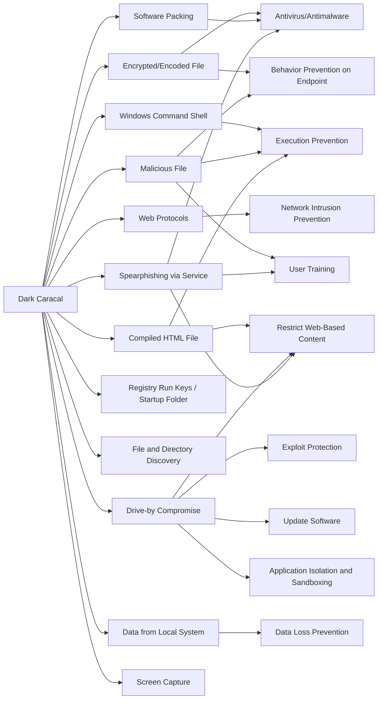

---
tags:
   - groups
---
# Dark Caracal
## ID:G0070
[Dark Caracal](/mitre/groups/G0070) is threat group that has been attributed to the Lebanese General Directorate of General Security (GDGS) and has operated since at least 2012. (Citation: Lookout Dark Caracal Jan 2018)
## Techniques Used By Group
* [Encrypted/Encoded File](techniques/T1027/013)
* [Windows Command Shell](techniques/T1059/003)
* [Web Protocols](techniques/T1071/001)
* [Malicious File](techniques/T1204/002)
* [Software Packing](techniques/T1027/002)
* [Compiled HTML File](techniques/T1218/001)
* [Drive-by Compromise](techniques/T1189)
* [Registry Run Keys / Startup Folder](techniques/T1547/001)
* [File and Directory Discovery](techniques/T1083)
* [Spearphishing via Service](techniques/T1566/003)
* [Data from Local System](techniques/T1005)
* [Screen Capture](techniques/T1113)

# Summary of Techniques and Mitigations
