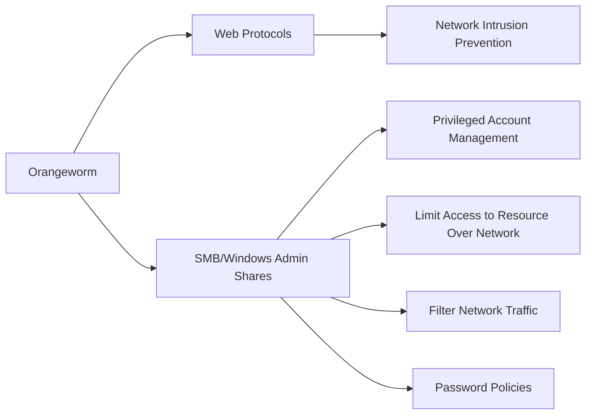

---
tags:
   - groups
---
# Orangeworm
## ID:G0071
[Orangeworm](groups/G0071) is a group that has targeted organizations in the healthcare sector in the United States, Europe, and Asia since at least 2015, likely for the purpose of corporate espionage.(Citation: Symantec Orangeworm April 2018) Reverse engineering of [Kwampirs](software/S0236), directly associated with [Orangeworm](groups/G0071) activity, indicates significant functional and development overlaps with [Shamoon](software/S0140).(Citation: Cylera Kwampirs 2022)
## Techniques Used By Group
* [Web Protocols](techniques/T1071/001)
* [SMB/Windows Admin Shares](techniques/T1021/002)

# Summary of Techniques and Mitigations
