---
tags:
   - groups
---
# APT19
## ID:G0073
[APT19](/mitre/groups/G0073) is a Chinese-based threat group that has targeted a variety of industries, including defense, finance, energy, pharmaceutical, telecommunications, high tech, education, manufacturing, and legal services. In 2017, a phishing campaign was used to target seven law and investment firms. (Citation: FireEye APT19) Some analysts track [APT19](/mitre/groups/G0073) and [Deep Panda](/mitre/groups/G0009) as the same group, but it is unclear from open source information if the groups are the same. (Citation: ICIT China's Espionage Jul 2016) (Citation: FireEye APT Groups) (Citation: Unit 42 C0d0so0 Jan 2016)
## Techniques Used By Group
* [Registry Run Keys / Startup Folder](/mitre/techniques/T1547/001)
* [PowerShell](/mitre/techniques/T1059/001)
* [Hidden Window](/mitre/techniques/T1564/003)
* [System Network Configuration Discovery](/mitre/techniques/T1016)
* [System Owner/User Discovery](/mitre/techniques/T1033)
* [Rundll32](/mitre/techniques/T1218/011)
* [Modify Registry](/mitre/techniques/T1112)
* [Drive-by Compromise](/mitre/techniques/T1189)
* [Windows Service](/mitre/techniques/T1543/003)
* [Web Protocols](/mitre/techniques/T1071/001)
* [Command and Scripting Interpreter](/mitre/techniques/T1059)
* [Encrypted/Encoded File](/mitre/techniques/T1027/013)
* [Spearphishing Attachment](/mitre/techniques/T1566/001)
* [Malicious File](/mitre/techniques/T1204/002)
* [System Information Discovery](/mitre/techniques/T1082)
* [Standard Encoding](/mitre/techniques/T1132/001)
* [Tool](/mitre/techniques/T1588/002)
* [DLL Side-Loading](/mitre/techniques/T1574/002)
* [Regsvr32](/mitre/techniques/T1218/010)
* [Deobfuscate/Decode Files or Information](/mitre/techniques/T1140)
* [Command Obfuscation](/mitre/techniques/T1027/010)

# Summary of Techniques and Mitigations

```mermaid
flowchart LR
group[APT19] --> T1547.001[Registry Run Keys / Startup Folder]
group[APT19] --> T1059.001[PowerShell]
group[APT19] --> T1564.003[Hidden Window]
group[APT19] --> T1016[System Network Configuration Discovery]
group[APT19] --> T1033[System Owner/User Discovery]
group[APT19] --> T1218.011[Rundll32]
group[APT19] --> T1112[Modify Registry]
group[APT19] --> T1189[Drive-by Compromise]
group[APT19] --> T1543.003[Windows Service]
group[APT19] --> T1071.001[Web Protocols]
group[APT19] --> T1059[Command and Scripting Interpreter]
group[APT19] --> T1027.013[Encrypted/Encoded File]
group[APT19] --> T1566.001[Spearphishing Attachment]
group[APT19] --> T1204.002[Malicious File]
group[APT19] --> T1082[System Information Discovery]
group[APT19] --> T1132.001[Standard Encoding]
group[APT19] --> T1588.002[Tool]
group[APT19] --> T1574.002[DLL Side-Loading]
group[APT19] --> T1218.010[Regsvr32]
group[APT19] --> T1140[Deobfuscate/Decode Files or Information]
group[APT19] --> T1027.010[Command Obfuscation]
T1059.001[PowerShell] --> M1042[Disable or Remove Feature or Program]
T1059.001[PowerShell] --> M1049[Antivirus/Antimalware]
T1059.001[PowerShell] --> M1045[Code Signing]
T1059.001[PowerShell] --> M1026[Privileged Account Management]
T1059.001[PowerShell] --> M1038[Execution Prevention]
T1564.003[Hidden Window] --> M1038[Execution Prevention]
T1564.003[Hidden Window] --> M1033[Limit Software Installation]
T1218.011[Rundll32] --> M1050[Exploit Protection]
T1112[Modify Registry] --> M1024[Restrict Registry Permissions]
T1189[Drive-by Compromise] --> M1050[Exploit Protection]
T1189[Drive-by Compromise] --> M1051[Update Software]
T1189[Drive-by Compromise] --> M1048[Application Isolation and Sandboxing]
T1189[Drive-by Compromise] --> M1021[Restrict Web-Based Content]
T1543.003[Windows Service] --> M1040[Behavior Prevention on Endpoint]
T1543.003[Windows Service] --> M1028[Operating System Configuration]
T1543.003[Windows Service] --> M1047[Audit]
T1543.003[Windows Service] --> M1045[Code Signing]
T1543.003[Windows Service] --> M1018[User Account Management]
T1071.001[Web Protocols] --> M1031[Network Intrusion Prevention]
T1059[Command and Scripting Interpreter] --> M1045[Code Signing]
T1059[Command and Scripting Interpreter] --> M1042[Disable or Remove Feature or Program]
T1059[Command and Scripting Interpreter] --> M1038[Execution Prevention]
T1059[Command and Scripting Interpreter] --> M1049[Antivirus/Antimalware]
T1059[Command and Scripting Interpreter] --> M1026[Privileged Account Management]
T1059[Command and Scripting Interpreter] --> M1021[Restrict Web-Based Content]
T1059[Command and Scripting Interpreter] --> M1040[Behavior Prevention on Endpoint]
T1027.013[Encrypted/Encoded File] --> M1049[Antivirus/Antimalware]
T1027.013[Encrypted/Encoded File] --> M1040[Behavior Prevention on Endpoint]
T1566.001[Spearphishing Attachment] --> M1049[Antivirus/Antimalware]
T1566.001[Spearphishing Attachment] --> M1031[Network Intrusion Prevention]
T1566.001[Spearphishing Attachment] --> M1054[Software Configuration]
T1566.001[Spearphishing Attachment] --> M1017[User Training]
T1566.001[Spearphishing Attachment] --> M1021[Restrict Web-Based Content]
T1204.002[Malicious File] --> M1038[Execution Prevention]
T1204.002[Malicious File] --> M1040[Behavior Prevention on Endpoint]
T1204.002[Malicious File] --> M1017[User Training]
T1132.001[Standard Encoding] --> M1031[Network Intrusion Prevention]
T1588.002[Tool] --> M1056[Pre-compromise]
T1574.002[DLL Side-Loading] --> M1051[Update Software]
T1574.002[DLL Side-Loading] --> M1013[Application Developer Guidance]
T1218.010[Regsvr32] --> M1050[Exploit Protection]
T1027.010[Command Obfuscation] --> M1040[Behavior Prevention on Endpoint]
T1027.010[Command Obfuscation] --> M1049[Antivirus/Antimalware]
```
