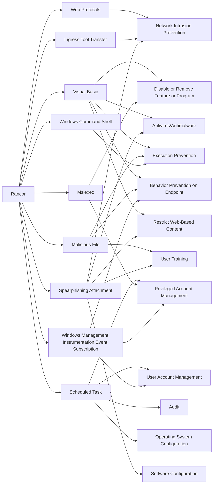

---
tags:
   - groups
---
# Rancor
## ID:G0075
[Rancor](groups/G0075) is a threat group that has led targeted campaigns against the South East Asia region. [Rancor](groups/G0075) uses politically-motivated lures to entice victims to open malicious documents. (Citation: Rancor Unit42 June 2018)
## Techniques Used By Group
* [Web Protocols](techniques/T1071/001)
* [Visual Basic](techniques/T1059/005)
* [Malicious File](techniques/T1204/002)
* [Scheduled Task](techniques/T1053/005)
* [Ingress Tool Transfer](techniques/T1105)
* [Msiexec](techniques/T1218/007)
* [Windows Management Instrumentation Event Subscription](techniques/T1546/003)
* [Windows Command Shell](techniques/T1059/003)
* [Spearphishing Attachment](techniques/T1566/001)

# Summary of Techniques and Mitigations
