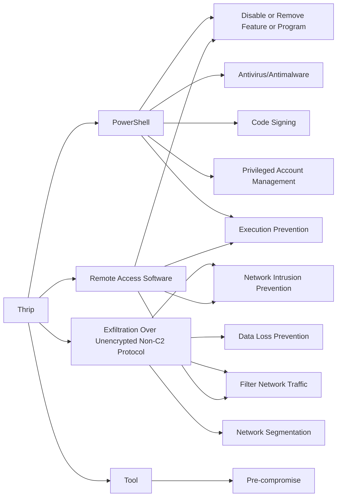

---
tags:
   - groups
---
# Thrip
## ID:G0076
[Thrip](/mitre/groups/G0076) is an espionage group that has targeted satellite communications, telecoms, and defense contractor companies in the U.S. and Southeast Asia. The group uses custom malware as well as "living off the land" techniques. (Citation: Symantec Thrip June 2018)
## Techniques Used By Group
* [PowerShell](/mitre/techniques/T1059/001)
* [Exfiltration Over Unencrypted Non-C2 Protocol](/mitre/techniques/T1048/003)
* [Remote Access Software](/mitre/techniques/T1219)
* [Tool](/mitre/techniques/T1588/002)

# Summary of Techniques and Mitigations
