---
tags:
   - groups
---
# Leafminer
## ID:G0077
[Leafminer](/mitre/groups/G0077) is an Iranian threat group that has targeted government organizations and business entities in the Middle East since at least early 2017. (Citation: Symantec Leafminer July 2018)
## Techniques Used By Group
* [Command Obfuscation](techniques/T1027/010)
* [Tool](techniques/T1588/002)
* [LSASS Memory](techniques/T1003/001)
* [Credentials from Password Stores](techniques/T1555)
* [Network Service Discovery](techniques/T1046)
* [Cached Domain Credentials](techniques/T1003/005)
* [Credentials from Web Browsers](techniques/T1555/003)
* [Credentials In Files](techniques/T1552/001)
* [LSA Secrets](techniques/T1003/004)
* [Process Doppelgänging](techniques/T1055/013)
* [Drive-by Compromise](techniques/T1189)
* [Remote System Discovery](techniques/T1018)
* [Password Spraying](techniques/T1110/003)
* [Local Account](techniques/T1136/001)
* [JavaScript](techniques/T1059/007)
* [Remote Email Collection](techniques/T1114/002)
* [File and Directory Discovery](techniques/T1083)

# Summary of Techniques and Mitigations

```mermaid
flowchart LR
group[Leafminer] --> T1027.010[Command Obfuscation]
group[Leafminer] --> T1588.002[Tool]
group[Leafminer] --> T1003.001[LSASS Memory]
group[Leafminer] --> T1555[Credentials from Password Stores]
group[Leafminer] --> T1046[Network Service Discovery]
group[Leafminer] --> T1003.005[Cached Domain Credentials]
group[Leafminer] --> T1555.003[Credentials from Web Browsers]
group[Leafminer] --> T1552.001[Credentials In Files]
group[Leafminer] --> T1003.004[LSA Secrets]
group[Leafminer] --> T1055.013[Process Doppelgänging]
group[Leafminer] --> T1189[Drive-by Compromise]
group[Leafminer] --> T1018[Remote System Discovery]
group[Leafminer] --> T1110.003[Password Spraying]
group[Leafminer] --> T1136.001[Local Account]
group[Leafminer] --> T1059.007[JavaScript]
group[Leafminer] --> T1114.002[Remote Email Collection]
group[Leafminer] --> T1083[File and Directory Discovery]
T1027.010[Command Obfuscation] --> M1040[Behavior Prevention on Endpoint]
T1027.010[Command Obfuscation] --> M1049[Antivirus/Antimalware]
T1588.002[Tool] --> M1056[Pre-compromise]
T1003.001[LSASS Memory] --> M1028[Operating System Configuration]
T1003.001[LSASS Memory] --> M1043[Credential Access Protection]
T1003.001[LSASS Memory] --> M1025[Privileged Process Integrity]
T1003.001[LSASS Memory] --> M1026[Privileged Account Management]
T1003.001[LSASS Memory] --> M1017[User Training]
T1003.001[LSASS Memory] --> M1040[Behavior Prevention on Endpoint]
T1003.001[LSASS Memory] --> M1027[Password Policies]
T1555[Credentials from Password Stores] --> M1026[Privileged Account Management]
T1555[Credentials from Password Stores] --> M1051[Update Software]
T1555[Credentials from Password Stores] --> M1027[Password Policies]
T1046[Network Service Discovery] --> M1042[Disable or Remove Feature or Program]
T1046[Network Service Discovery] --> M1031[Network Intrusion Prevention]
T1046[Network Service Discovery] --> M1030[Network Segmentation]
T1003.005[Cached Domain Credentials] --> M1015[Active Directory Configuration]
T1003.005[Cached Domain Credentials] --> M1017[User Training]
T1003.005[Cached Domain Credentials] --> M1027[Password Policies]
T1003.005[Cached Domain Credentials] --> M1028[Operating System Configuration]
T1003.005[Cached Domain Credentials] --> M1026[Privileged Account Management]
T1555.003[Credentials from Web Browsers] --> M1027[Password Policies]
T1552.001[Credentials In Files] --> M1017[User Training]
T1552.001[Credentials In Files] --> M1047[Audit]
T1552.001[Credentials In Files] --> M1022[Restrict File and Directory Permissions]
T1552.001[Credentials In Files] --> M1027[Password Policies]
T1003.004[LSA Secrets] --> M1027[Password Policies]
T1003.004[LSA Secrets] --> M1026[Privileged Account Management]
T1003.004[LSA Secrets] --> M1017[User Training]
T1055.013[Process Doppelgänging] --> M1040[Behavior Prevention on Endpoint]
T1189[Drive-by Compromise] --> M1050[Exploit Protection]
T1189[Drive-by Compromise] --> M1051[Update Software]
T1189[Drive-by Compromise] --> M1048[Application Isolation and Sandboxing]
T1189[Drive-by Compromise] --> M1021[Restrict Web-Based Content]
T1110.003[Password Spraying] --> M1032[Multi-factor Authentication]
T1110.003[Password Spraying] --> M1027[Password Policies]
T1110.003[Password Spraying] --> M1036[Account Use Policies]
T1136.001[Local Account] --> M1032[Multi-factor Authentication]
T1136.001[Local Account] --> M1026[Privileged Account Management]
T1059.007[JavaScript] --> M1040[Behavior Prevention on Endpoint]
T1059.007[JavaScript] --> M1038[Execution Prevention]
T1059.007[JavaScript] --> M1042[Disable or Remove Feature or Program]
T1059.007[JavaScript] --> M1021[Restrict Web-Based Content]
T1114.002[Remote Email Collection] --> M1041[Encrypt Sensitive Information]
T1114.002[Remote Email Collection] --> M1032[Multi-factor Authentication]
```
