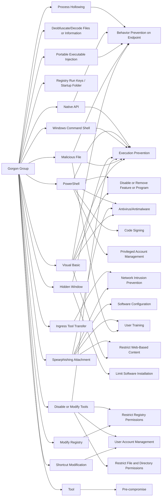

---
tags:
   - groups
---
# Gorgon Group
## ID:G0078
[Gorgon Group](groups/G0078) is a threat group consisting of members who are suspected to be Pakistan-based or have other connections to Pakistan. The group has performed a mix of criminal and targeted attacks, including campaigns against government organizations in the United Kingdom, Spain, Russia, and the United States. (Citation: Unit 42 Gorgon Group Aug 2018)
## Techniques Used By Group
* [Process Hollowing](techniques/T1055/012)
* [Deobfuscate/Decode Files or Information](techniques/T1140)
* [Native API](techniques/T1106)
* [Registry Run Keys / Startup Folder](techniques/T1547/001)
* [PowerShell](techniques/T1059/001)
* [Windows Command Shell](techniques/T1059/003)
* [Ingress Tool Transfer](techniques/T1105)
* [Spearphishing Attachment](techniques/T1566/001)
* [Hidden Window](techniques/T1564/003)
* [Portable Executable Injection](techniques/T1055/002)
* [Disable or Modify Tools](techniques/T1562/001)
* [Modify Registry](techniques/T1112)
* [Shortcut Modification](techniques/T1547/009)
* [Malicious File](techniques/T1204/002)
* [Tool](techniques/T1588/002)
* [Visual Basic](techniques/T1059/005)

# Summary of Techniques and Mitigations
