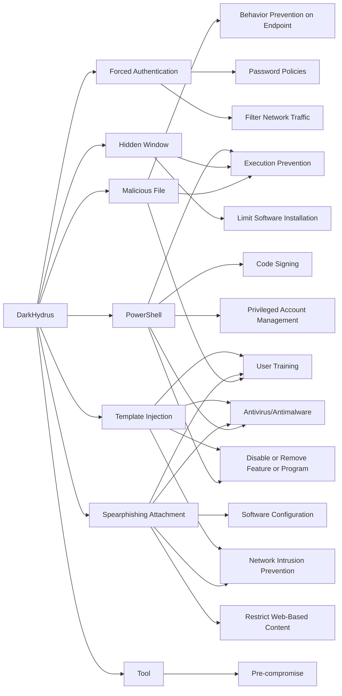

---
tags:
   - groups
---
# DarkHydrus
## ID:G0079
[DarkHydrus](/mitre/groups/G0079) is a threat group that has targeted government agencies and educational institutions in the Middle East since at least 2016. The group heavily leverages open-source tools and custom payloads for carrying out attacks. (Citation: Unit 42 DarkHydrus July 2018) (Citation: Unit 42 Playbook Dec 2017)
## Techniques Used By Group
* [Malicious File](techniques/T1204/002)
* [Forced Authentication](techniques/T1187)
* [Hidden Window](techniques/T1564/003)
* [PowerShell](techniques/T1059/001)
* [Spearphishing Attachment](techniques/T1566/001)
* [Template Injection](techniques/T1221)
* [Tool](techniques/T1588/002)

# Summary of Techniques and Mitigations
