---
tags:
   - groups
---
# Tropic Trooper
## ID:G0081
[Tropic Trooper](/mitre/groups/G0081) is an unaffiliated threat group that has led targeted campaigns against targets in Taiwan, the Philippines, and Hong Kong. [Tropic Trooper](/mitre/groups/G0081) focuses on targeting government, healthcare, transportation, and high-tech industries and has been active since 2011.(Citation: TrendMicro Tropic Trooper Mar 2018)(Citation: Unit 42 Tropic Trooper Nov 2016)(Citation: TrendMicro Tropic Trooper May 2020)
## Techniques Used By Group
* [Windows Service](/mitre/techniques/T1543/003)
* [File Deletion](/mitre/techniques/T1070/004)
* [Spearphishing Attachment](/mitre/techniques/T1566/001)
* [Ingress Tool Transfer](/mitre/techniques/T1105)
* [Process Discovery](/mitre/techniques/T1057)
* [Malicious File](/mitre/techniques/T1204/002)
* [Encrypted Channel](/mitre/techniques/T1573)
* [Web Protocols](/mitre/techniques/T1071/001)
* [Hidden Files and Directories](/mitre/techniques/T1564/001)
* [Template Injection](/mitre/techniques/T1221)
* [System Owner/User Discovery](/mitre/techniques/T1033)
* [Network Service Discovery](/mitre/techniques/T1046)
* [System Network Configuration Discovery](/mitre/techniques/T1016)
* [Exfiltration over USB](/mitre/techniques/T1052/001)
* [Registry Run Keys / Startup Folder](/mitre/techniques/T1547/001)
* [Web Shell](/mitre/techniques/T1505/003)
* [Asymmetric Cryptography](/mitre/techniques/T1573/002)
* [Windows Command Shell](/mitre/techniques/T1059/003)
* [Native API](/mitre/techniques/T1106)
* [DLL Side-Loading](/mitre/techniques/T1574/002)
* [File and Directory Discovery](/mitre/techniques/T1083)
* [Encrypted/Encoded File](/mitre/techniques/T1027/013)
* [Match Legitimate Name or Location](/mitre/techniques/T1036/005)
* [Standard Encoding](/mitre/techniques/T1132/001)
* [Local Accounts](/mitre/techniques/T1078/003)
* [Winlogon Helper DLL](/mitre/techniques/T1547/004)
* [Exploitation for Client Execution](/mitre/techniques/T1203)
* [DNS](/mitre/techniques/T1071/004)
* [Automated Collection](/mitre/techniques/T1119)
* [Dynamic-link Library Injection](/mitre/techniques/T1055/001)
* [Automated Exfiltration](/mitre/techniques/T1020)
* [Network Share Discovery](/mitre/techniques/T1135)
* [System Information Discovery](/mitre/techniques/T1082)
* [Security Software Discovery](/mitre/techniques/T1518/001)
* [Deobfuscate/Decode Files or Information](/mitre/techniques/T1140)
* [System Network Connections Discovery](/mitre/techniques/T1049)
* [Steganography](/mitre/techniques/T1027/003)
* [Software Discovery](/mitre/techniques/T1518)
* [Replication Through Removable Media](/mitre/techniques/T1091)

# Summary of Techniques and Mitigations

```mermaid
flowchart LR
group[Tropic Trooper] --> T1543.003[Windows Service]
group[Tropic Trooper] --> T1070.004[File Deletion]
group[Tropic Trooper] --> T1566.001[Spearphishing Attachment]
group[Tropic Trooper] --> T1105[Ingress Tool Transfer]
group[Tropic Trooper] --> T1057[Process Discovery]
group[Tropic Trooper] --> T1204.002[Malicious File]
group[Tropic Trooper] --> T1573[Encrypted Channel]
group[Tropic Trooper] --> T1071.001[Web Protocols]
group[Tropic Trooper] --> T1564.001[Hidden Files and Directories]
group[Tropic Trooper] --> T1221[Template Injection]
group[Tropic Trooper] --> T1033[System Owner/User Discovery]
group[Tropic Trooper] --> T1046[Network Service Discovery]
group[Tropic Trooper] --> T1016[System Network Configuration Discovery]
group[Tropic Trooper] --> T1052.001[Exfiltration over USB]
group[Tropic Trooper] --> T1547.001[Registry Run Keys / Startup Folder]
group[Tropic Trooper] --> T1505.003[Web Shell]
group[Tropic Trooper] --> T1573.002[Asymmetric Cryptography]
group[Tropic Trooper] --> T1059.003[Windows Command Shell]
group[Tropic Trooper] --> T1106[Native API]
group[Tropic Trooper] --> T1574.002[DLL Side-Loading]
group[Tropic Trooper] --> T1083[File and Directory Discovery]
group[Tropic Trooper] --> T1027.013[Encrypted/Encoded File]
group[Tropic Trooper] --> T1036.005[Match Legitimate Name or Location]
group[Tropic Trooper] --> T1132.001[Standard Encoding]
group[Tropic Trooper] --> T1078.003[Local Accounts]
group[Tropic Trooper] --> T1547.004[Winlogon Helper DLL]
group[Tropic Trooper] --> T1203[Exploitation for Client Execution]
group[Tropic Trooper] --> T1071.004[DNS]
group[Tropic Trooper] --> T1119[Automated Collection]
group[Tropic Trooper] --> T1055.001[Dynamic-link Library Injection]
group[Tropic Trooper] --> T1020[Automated Exfiltration]
group[Tropic Trooper] --> T1135[Network Share Discovery]
group[Tropic Trooper] --> T1082[System Information Discovery]
group[Tropic Trooper] --> T1518.001[Security Software Discovery]
group[Tropic Trooper] --> T1140[Deobfuscate/Decode Files or Information]
group[Tropic Trooper] --> T1049[System Network Connections Discovery]
group[Tropic Trooper] --> T1027.003[Steganography]
group[Tropic Trooper] --> T1518[Software Discovery]
group[Tropic Trooper] --> T1091[Replication Through Removable Media]
T1543.003[Windows Service] --> M1040[Behavior Prevention on Endpoint]
T1543.003[Windows Service] --> M1028[Operating System Configuration]
T1543.003[Windows Service] --> M1047[Audit]
T1543.003[Windows Service] --> M1045[Code Signing]
T1543.003[Windows Service] --> M1018[User Account Management]
T1566.001[Spearphishing Attachment] --> M1049[Antivirus/Antimalware]
T1566.001[Spearphishing Attachment] --> M1031[Network Intrusion Prevention]
T1566.001[Spearphishing Attachment] --> M1054[Software Configuration]
T1566.001[Spearphishing Attachment] --> M1017[User Training]
T1566.001[Spearphishing Attachment] --> M1021[Restrict Web-Based Content]
T1105[Ingress Tool Transfer] --> M1031[Network Intrusion Prevention]
T1204.002[Malicious File] --> M1038[Execution Prevention]
T1204.002[Malicious File] --> M1040[Behavior Prevention on Endpoint]
T1204.002[Malicious File] --> M1017[User Training]
T1573[Encrypted Channel] --> M1031[Network Intrusion Prevention]
T1573[Encrypted Channel] --> M1020[SSL/TLS Inspection]
T1071.001[Web Protocols] --> M1031[Network Intrusion Prevention]
T1221[Template Injection] --> M1049[Antivirus/Antimalware]
T1221[Template Injection] --> M1031[Network Intrusion Prevention]
T1221[Template Injection] --> M1017[User Training]
T1221[Template Injection] --> M1042[Disable or Remove Feature or Program]
T1046[Network Service Discovery] --> M1042[Disable or Remove Feature or Program]
T1046[Network Service Discovery] --> M1031[Network Intrusion Prevention]
T1046[Network Service Discovery] --> M1030[Network Segmentation]
T1052.001[Exfiltration over USB] --> M1042[Disable or Remove Feature or Program]
T1052.001[Exfiltration over USB] --> M1034[Limit Hardware Installation]
T1052.001[Exfiltration over USB] --> M1057[Data Loss Prevention]
T1505.003[Web Shell] --> M1042[Disable or Remove Feature or Program]
T1505.003[Web Shell] --> M1018[User Account Management]
T1573.002[Asymmetric Cryptography] --> M1031[Network Intrusion Prevention]
T1573.002[Asymmetric Cryptography] --> M1020[SSL/TLS Inspection]
T1059.003[Windows Command Shell] --> M1038[Execution Prevention]
T1106[Native API] --> M1038[Execution Prevention]
T1106[Native API] --> M1040[Behavior Prevention on Endpoint]
T1574.002[DLL Side-Loading] --> M1051[Update Software]
T1574.002[DLL Side-Loading] --> M1013[Application Developer Guidance]
T1027.013[Encrypted/Encoded File] --> M1049[Antivirus/Antimalware]
T1027.013[Encrypted/Encoded File] --> M1040[Behavior Prevention on Endpoint]
T1036.005[Match Legitimate Name or Location] --> M1022[Restrict File and Directory Permissions]
T1036.005[Match Legitimate Name or Location] --> M1038[Execution Prevention]
T1036.005[Match Legitimate Name or Location] --> M1045[Code Signing]
T1132.001[Standard Encoding] --> M1031[Network Intrusion Prevention]
T1078.003[Local Accounts] --> M1026[Privileged Account Management]
T1078.003[Local Accounts] --> M1027[Password Policies]
T1547.004[Winlogon Helper DLL] --> M1038[Execution Prevention]
T1547.004[Winlogon Helper DLL] --> M1018[User Account Management]
T1203[Exploitation for Client Execution] --> M1050[Exploit Protection]
T1203[Exploitation for Client Execution] --> M1048[Application Isolation and Sandboxing]
T1071.004[DNS] --> M1037[Filter Network Traffic]
T1071.004[DNS] --> M1031[Network Intrusion Prevention]
T1119[Automated Collection] --> M1029[Remote Data Storage]
T1119[Automated Collection] --> M1041[Encrypt Sensitive Information]
T1055.001[Dynamic-link Library Injection] --> M1040[Behavior Prevention on Endpoint]
T1135[Network Share Discovery] --> M1028[Operating System Configuration]
T1091[Replication Through Removable Media] --> M1042[Disable or Remove Feature or Program]
T1091[Replication Through Removable Media] --> M1034[Limit Hardware Installation]
T1091[Replication Through Removable Media] --> M1040[Behavior Prevention on Endpoint]
```
