---
tags:
   - groups
---
# APT38
## ID:G0082
[APT38](/mitre/groups/G0082) is a North Korean state-sponsored threat group that specializes in financial cyber operations; it has been attributed to the Reconnaissance General Bureau.(Citation: CISA AA20-239A BeagleBoyz August 2020) Active since at least 2014, [APT38](/mitre/groups/G0082) has targeted banks, financial institutions, casinos, cryptocurrency exchanges, SWIFT system endpoints, and ATMs in at least 38 countries worldwide. Significant operations include the 2016 Bank of Bangladesh heist, during which [APT38](/mitre/groups/G0082) stole $81 million, as well as attacks against Bancomext (Citation: FireEye APT38 Oct 2018) and Banco de Chile (Citation: FireEye APT38 Oct 2018); some of their attacks have been destructive.(Citation: CISA AA20-239A BeagleBoyz August 2020)(Citation: FireEye APT38 Oct 2018)(Citation: DOJ North Korea Indictment Feb 2021)(Citation: Kaspersky Lazarus Under The Hood Blog 2017)

North Korean group definitions are known to have significant overlap, and some security researchers report all North Korean state-sponsored cyber activity under the name [Lazarus Group](/mitre/groups/G0032) instead of tracking clusters or subgroups.
## Techniques Used By Group
* [Data Encrypted for Impact](techniques/T1486)
* [System Owner/User Discovery](techniques/T1033)
* [Modify Registry](techniques/T1112)
* [System Network Connections Discovery](techniques/T1049)
* [File Deletion](techniques/T1070/004)
* [Keylogging](techniques/T1056/001)
* [Security Software Discovery](techniques/T1518/001)
* [Windows Service](techniques/T1543/003)
* [Drive-by Compromise](techniques/T1189)
* [File and Directory Discovery](techniques/T1083)
* [Windows Command Shell](techniques/T1059/003)
* [Visual Basic](techniques/T1059/005)
* [System Shutdown/Reboot](techniques/T1529)
* [Web Protocols](techniques/T1071/001)
* [Ingress Tool Transfer](techniques/T1105)
* [Impair Command History Logging](techniques/T1562/003)
* [Software Packing](techniques/T1027/002)
* [Browser Information Discovery](techniques/T1217)
* [Clear Windows Event Logs](techniques/T1070/001)
* [Timestomp](techniques/T1070/006)
* [Data Destruction](techniques/T1485)
* [Brute Force](techniques/T1110)
* [Network Share Discovery](techniques/T1135)
* [System Information Discovery](techniques/T1082)
* [Transmitted Data Manipulation](techniques/T1565/002)
* [Disk Structure Wipe](techniques/T1561/002)
* [Scheduled Task](techniques/T1053/005)
* [Tool](techniques/T1588/002)
* [Web Shell](techniques/T1505/003)
* [Clipboard Data](techniques/T1115)
* [Disable or Modify System Firewall](techniques/T1562/004)
* [Rundll32](techniques/T1218/011)
* [Runtime Data Manipulation](techniques/T1565/003)
* [Native API](techniques/T1106)
* [Compiled HTML File](techniques/T1218/001)
* [Malicious File](techniques/T1204/002)
* [Stored Data Manipulation](techniques/T1565/001)
* [Data from Local System](techniques/T1005)
* [PowerShell](techniques/T1059/001)
* [Cron](techniques/T1053/003)
* [Spearphishing Attachment](techniques/T1566/001)
* [Service Execution](techniques/T1569/002)
* [Process Discovery](techniques/T1057)

# Summary of Techniques and Mitigations

```mermaid
flowchart LR
group[APT38] --> T1486[Data Encrypted for Impact]
group[APT38] --> T1033[System Owner/User Discovery]
group[APT38] --> T1112[Modify Registry]
group[APT38] --> T1049[System Network Connections Discovery]
group[APT38] --> T1070.004[File Deletion]
group[APT38] --> T1056.001[Keylogging]
group[APT38] --> T1518.001[Security Software Discovery]
group[APT38] --> T1543.003[Windows Service]
group[APT38] --> T1189[Drive-by Compromise]
group[APT38] --> T1083[File and Directory Discovery]
group[APT38] --> T1059.003[Windows Command Shell]
group[APT38] --> T1059.005[Visual Basic]
group[APT38] --> T1529[System Shutdown/Reboot]
group[APT38] --> T1071.001[Web Protocols]
group[APT38] --> T1105[Ingress Tool Transfer]
group[APT38] --> T1562.003[Impair Command History Logging]
group[APT38] --> T1027.002[Software Packing]
group[APT38] --> T1217[Browser Information Discovery]
group[APT38] --> T1070.001[Clear Windows Event Logs]
group[APT38] --> T1070.006[Timestomp]
group[APT38] --> T1485[Data Destruction]
group[APT38] --> T1110[Brute Force]
group[APT38] --> T1135[Network Share Discovery]
group[APT38] --> T1082[System Information Discovery]
group[APT38] --> T1565.002[Transmitted Data Manipulation]
group[APT38] --> T1561.002[Disk Structure Wipe]
group[APT38] --> T1053.005[Scheduled Task]
group[APT38] --> T1588.002[Tool]
group[APT38] --> T1505.003[Web Shell]
group[APT38] --> T1115[Clipboard Data]
group[APT38] --> T1562.004[Disable or Modify System Firewall]
group[APT38] --> T1218.011[Rundll32]
group[APT38] --> T1565.003[Runtime Data Manipulation]
group[APT38] --> T1106[Native API]
group[APT38] --> T1218.001[Compiled HTML File]
group[APT38] --> T1204.002[Malicious File]
group[APT38] --> T1565.001[Stored Data Manipulation]
group[APT38] --> T1005[Data from Local System]
group[APT38] --> T1059.001[PowerShell]
group[APT38] --> T1053.003[Cron]
group[APT38] --> T1566.001[Spearphishing Attachment]
group[APT38] --> T1569.002[Service Execution]
group[APT38] --> T1057[Process Discovery]
T1486[Data Encrypted for Impact] --> M1040[Behavior Prevention on Endpoint]
T1486[Data Encrypted for Impact] --> M1053[Data Backup]
T1112[Modify Registry] --> M1024[Restrict Registry Permissions]
T1543.003[Windows Service] --> M1040[Behavior Prevention on Endpoint]
T1543.003[Windows Service] --> M1028[Operating System Configuration]
T1543.003[Windows Service] --> M1047[Audit]
T1543.003[Windows Service] --> M1045[Code Signing]
T1543.003[Windows Service] --> M1018[User Account Management]
T1189[Drive-by Compromise] --> M1050[Exploit Protection]
T1189[Drive-by Compromise] --> M1051[Update Software]
T1189[Drive-by Compromise] --> M1048[Application Isolation and Sandboxing]
T1189[Drive-by Compromise] --> M1021[Restrict Web-Based Content]
T1059.003[Windows Command Shell] --> M1038[Execution Prevention]
T1059.005[Visual Basic] --> M1042[Disable or Remove Feature or Program]
T1059.005[Visual Basic] --> M1049[Antivirus/Antimalware]
T1059.005[Visual Basic] --> M1038[Execution Prevention]
T1059.005[Visual Basic] --> M1040[Behavior Prevention on Endpoint]
T1059.005[Visual Basic] --> M1021[Restrict Web-Based Content]
T1071.001[Web Protocols] --> M1031[Network Intrusion Prevention]
T1105[Ingress Tool Transfer] --> M1031[Network Intrusion Prevention]
T1562.003[Impair Command History Logging] --> M1028[Operating System Configuration]
T1562.003[Impair Command History Logging] --> M1039[Environment Variable Permissions]
T1027.002[Software Packing] --> M1049[Antivirus/Antimalware]
T1070.001[Clear Windows Event Logs] --> M1022[Restrict File and Directory Permissions]
T1070.001[Clear Windows Event Logs] --> M1029[Remote Data Storage]
T1070.001[Clear Windows Event Logs] --> M1041[Encrypt Sensitive Information]
T1485[Data Destruction] --> M1053[Data Backup]
T1110[Brute Force] --> M1018[User Account Management]
T1110[Brute Force] --> M1036[Account Use Policies]
T1110[Brute Force] --> M1032[Multi-factor Authentication]
T1110[Brute Force] --> M1027[Password Policies]
T1135[Network Share Discovery] --> M1028[Operating System Configuration]
T1565.002[Transmitted Data Manipulation] --> M1041[Encrypt Sensitive Information]
T1561.002[Disk Structure Wipe] --> M1053[Data Backup]
T1053.005[Scheduled Task] --> M1026[Privileged Account Management]
T1053.005[Scheduled Task] --> M1018[User Account Management]
T1053.005[Scheduled Task] --> M1047[Audit]
T1053.005[Scheduled Task] --> M1028[Operating System Configuration]
T1588.002[Tool] --> M1056[Pre-compromise]
T1505.003[Web Shell] --> M1042[Disable or Remove Feature or Program]
T1505.003[Web Shell] --> M1018[User Account Management]
T1562.004[Disable or Modify System Firewall] --> M1047[Audit]
T1562.004[Disable or Modify System Firewall] --> M1018[User Account Management]
T1562.004[Disable or Modify System Firewall] --> M1024[Restrict Registry Permissions]
T1562.004[Disable or Modify System Firewall] --> M1022[Restrict File and Directory Permissions]
T1218.011[Rundll32] --> M1050[Exploit Protection]
T1565.003[Runtime Data Manipulation] --> M1030[Network Segmentation]
T1565.003[Runtime Data Manipulation] --> M1022[Restrict File and Directory Permissions]
T1106[Native API] --> M1038[Execution Prevention]
T1106[Native API] --> M1040[Behavior Prevention on Endpoint]
T1218.001[Compiled HTML File] --> M1021[Restrict Web-Based Content]
T1218.001[Compiled HTML File] --> M1038[Execution Prevention]
T1204.002[Malicious File] --> M1038[Execution Prevention]
T1204.002[Malicious File] --> M1040[Behavior Prevention on Endpoint]
T1204.002[Malicious File] --> M1017[User Training]
T1565.001[Stored Data Manipulation] --> M1022[Restrict File and Directory Permissions]
T1565.001[Stored Data Manipulation] --> M1029[Remote Data Storage]
T1565.001[Stored Data Manipulation] --> M1041[Encrypt Sensitive Information]
T1005[Data from Local System] --> M1057[Data Loss Prevention]
T1059.001[PowerShell] --> M1042[Disable or Remove Feature or Program]
T1059.001[PowerShell] --> M1049[Antivirus/Antimalware]
T1059.001[PowerShell] --> M1045[Code Signing]
T1059.001[PowerShell] --> M1026[Privileged Account Management]
T1059.001[PowerShell] --> M1038[Execution Prevention]
T1053.003[Cron] --> M1047[Audit]
T1053.003[Cron] --> M1018[User Account Management]
T1566.001[Spearphishing Attachment] --> M1049[Antivirus/Antimalware]
T1566.001[Spearphishing Attachment] --> M1031[Network Intrusion Prevention]
T1566.001[Spearphishing Attachment] --> M1054[Software Configuration]
T1566.001[Spearphishing Attachment] --> M1017[User Training]
T1566.001[Spearphishing Attachment] --> M1021[Restrict Web-Based Content]
T1569.002[Service Execution] --> M1026[Privileged Account Management]
T1569.002[Service Execution] --> M1040[Behavior Prevention on Endpoint]
T1569.002[Service Execution] --> M1022[Restrict File and Directory Permissions]
```
