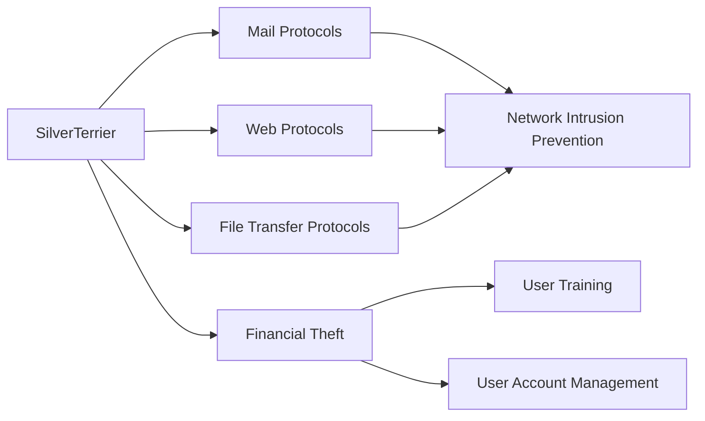

---
tags:
   - groups
---
# SilverTerrier
## ID:G0083
[SilverTerrier](groups/G0083) is a Nigerian threat group that has been seen active since 2014. [SilverTerrier](groups/G0083) mainly targets organizations in high technology, higher education, and manufacturing.(Citation: Unit42 SilverTerrier 2018)(Citation: Unit42 SilverTerrier 2016)
## Techniques Used By Group
* [Mail Protocols](techniques/T1071/003)
* [Web Protocols](techniques/T1071/001)
* [File Transfer Protocols](techniques/T1071/002)
* [Financial Theft](techniques/T1657)

# Summary of Techniques and Mitigations
