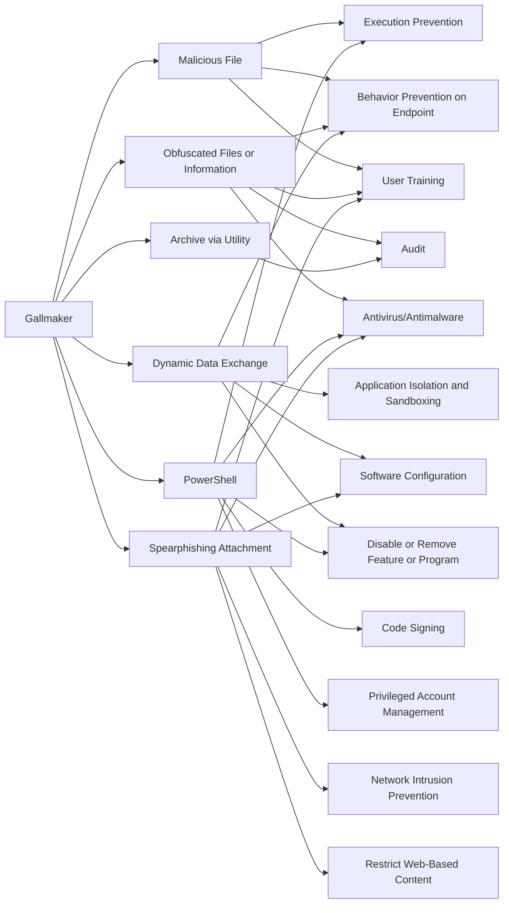

---
tags:
   - groups
---
# Gallmaker
## ID:G0084
[Gallmaker](/mitre/groups/G0084) is a cyberespionage group that has targeted victims in the Middle East and has been active since at least December 2017. The group has mainly targeted victims in the defense, military, and government sectors.(Citation: Symantec Gallmaker Oct 2018)
## Techniques Used By Group
* [Malicious File](/mitre/techniques/T1204/002)
* [Obfuscated Files or Information](/mitre/techniques/T1027)
* [Archive via Utility](/mitre/techniques/T1560/001)
* [Dynamic Data Exchange](/mitre/techniques/T1559/002)
* [PowerShell](/mitre/techniques/T1059/001)
* [Spearphishing Attachment](/mitre/techniques/T1566/001)

# Summary of Techniques and Mitigations
