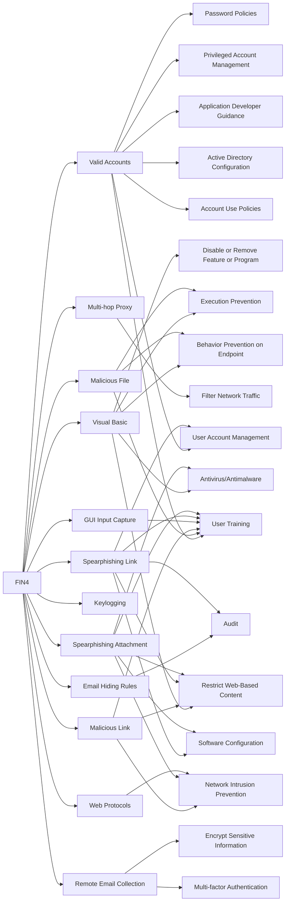

---
tags:
   - groups
---
# FIN4
## ID:G0085
[FIN4](/mitre/groups/G0085) is a financially-motivated threat group that has targeted confidential information related to the public financial market, particularly regarding healthcare and pharmaceutical companies, since at least 2013.(Citation: FireEye Hacking FIN4 Dec 2014)(Citation: FireEye FIN4 Stealing Insider NOV 2014) [FIN4](/mitre/groups/G0085) is unique in that they do not infect victims with typical persistent malware, but rather they focus on capturing credentials authorized to access email and other non-public correspondence.(Citation: FireEye Hacking FIN4 Dec 2014)(Citation: FireEye Hacking FIN4 Video Dec 2014)
## Techniques Used By Group
* [Valid Accounts](/mitre/techniques/T1078)
* [Visual Basic](/mitre/techniques/T1059/005)
* [Multi-hop Proxy](/mitre/techniques/T1090/003)
* [Malicious File](/mitre/techniques/T1204/002)
* [Email Hiding Rules](/mitre/techniques/T1564/008)
* [Malicious Link](/mitre/techniques/T1204/001)
* [Keylogging](/mitre/techniques/T1056/001)
* [GUI Input Capture](/mitre/techniques/T1056/002)
* [Spearphishing Link](/mitre/techniques/T1566/002)
* [Spearphishing Attachment](/mitre/techniques/T1566/001)
* [Web Protocols](/mitre/techniques/T1071/001)
* [Remote Email Collection](/mitre/techniques/T1114/002)

# Summary of Techniques and Mitigations
