---
tags:
   - groups
---
# APT39
## ID:G0087
[APT39](/mitre/groups/G0087) is one of several names for cyber espionage activity conducted by the Iranian Ministry of Intelligence and Security (MOIS) through the front company Rana Intelligence Computing since at least 2014. [APT39](/mitre/groups/G0087) has primarily targeted the travel, hospitality, academic, and telecommunications industries in Iran and across Asia, Africa, Europe, and North America to track individuals and entities considered to be a threat by the MOIS.(Citation: FireEye APT39 Jan 2019)(Citation: Symantec Chafer Dec 2015)(Citation: FBI FLASH APT39 September 2020)(Citation: Dept. of Treasury Iran Sanctions September 2020)(Citation: DOJ Iran Indictments September 2020)
## Techniques Used By Group
* [Network Service Discovery](/mitre/techniques/T1046)
* [Registry Run Keys / Startup Folder](/mitre/techniques/T1547/001)
* [External Proxy](/mitre/techniques/T1090/002)
* [Deobfuscate/Decode Files or Information](/mitre/techniques/T1140)
* [Keylogging](/mitre/techniques/T1056/001)
* [Data from Local System](/mitre/techniques/T1005)
* [PowerShell](/mitre/techniques/T1059/001)
* [Clipboard Data](/mitre/techniques/T1115)
* [OS Credential Dumping](/mitre/techniques/T1003)
* [Code Signing Policy Modification](/mitre/techniques/T1553/006)
* [AppInit DLLs](/mitre/techniques/T1546/010)
* [Shortcut Modification](/mitre/techniques/T1547/009)
* [Network Share Discovery](/mitre/techniques/T1135)
* [Service Execution](/mitre/techniques/T1569/002)
* [Encrypted/Encoded File](/mitre/techniques/T1027/013)
* [Tool](/mitre/techniques/T1588/002)
* [Remote Desktop Protocol](/mitre/techniques/T1021/001)
* [System Owner/User Discovery](/mitre/techniques/T1033)
* [Software Packing](/mitre/techniques/T1027/002)
* [Exfiltration Over C2 Channel](/mitre/techniques/T1041)
* [Malicious File](/mitre/techniques/T1204/002)
* [Scheduled Task](/mitre/techniques/T1053/005)
* [File Deletion](/mitre/techniques/T1070/004)
* [Bidirectional Communication](/mitre/techniques/T1102/002)
* [Archive via Utility](/mitre/techniques/T1560/001)
* [Web Shell](/mitre/techniques/T1505/003)
* [Ingress Tool Transfer](/mitre/techniques/T1105)
* [AutoHotKey & AutoIT](/mitre/techniques/T1059/010)
* [Malicious Link](/mitre/techniques/T1204/001)
* [Credentials from Password Stores](/mitre/techniques/T1555)
* [Screen Capture](/mitre/techniques/T1113)
* [LSASS Memory](/mitre/techniques/T1003/001)
* [Remote System Discovery](/mitre/techniques/T1018)
* [DNS](/mitre/techniques/T1071/004)
* [Command and Scripting Interpreter](/mitre/techniques/T1059)
* [Local Data Staging](/mitre/techniques/T1074/001)
* [File and Directory Discovery](/mitre/techniques/T1083)
* [Query Registry](/mitre/techniques/T1012)
* [Brute Force](/mitre/techniques/T1110)
* [BITS Jobs](/mitre/techniques/T1197)
* [Local Account](/mitre/techniques/T1136/001)
* [Python](/mitre/techniques/T1059/006)
* [Match Legitimate Name or Location](/mitre/techniques/T1036/005)
* [Web Protocols](/mitre/techniques/T1071/001)
* [Internal Proxy](/mitre/techniques/T1090/001)
* [Valid Accounts](/mitre/techniques/T1078)
* [Input Capture](/mitre/techniques/T1056)
* [Spearphishing Link](/mitre/techniques/T1566/002)
* [Spearphishing Attachment](/mitre/techniques/T1566/001)
* [SMB/Windows Admin Shares](/mitre/techniques/T1021/002)
* [Exploit Public-Facing Application](/mitre/techniques/T1190)
* [Visual Basic](/mitre/techniques/T1059/005)
* [SSH](/mitre/techniques/T1021/004)

# Summary of Techniques and Mitigations

```mermaid
flowchart LR
group[APT39] --> T1046[Network Service Discovery]
group[APT39] --> T1547.001[Registry Run Keys / Startup Folder]
group[APT39] --> T1090.002[External Proxy]
group[APT39] --> T1140[Deobfuscate/Decode Files or Information]
group[APT39] --> T1056.001[Keylogging]
group[APT39] --> T1005[Data from Local System]
group[APT39] --> T1059.001[PowerShell]
group[APT39] --> T1115[Clipboard Data]
group[APT39] --> T1003[OS Credential Dumping]
group[APT39] --> T1553.006[Code Signing Policy Modification]
group[APT39] --> T1546.010[AppInit DLLs]
group[APT39] --> T1547.009[Shortcut Modification]
group[APT39] --> T1135[Network Share Discovery]
group[APT39] --> T1569.002[Service Execution]
group[APT39] --> T1027.013[Encrypted/Encoded File]
group[APT39] --> T1588.002[Tool]
group[APT39] --> T1021.001[Remote Desktop Protocol]
group[APT39] --> T1033[System Owner/User Discovery]
group[APT39] --> T1027.002[Software Packing]
group[APT39] --> T1041[Exfiltration Over C2 Channel]
group[APT39] --> T1204.002[Malicious File]
group[APT39] --> T1053.005[Scheduled Task]
group[APT39] --> T1070.004[File Deletion]
group[APT39] --> T1102.002[Bidirectional Communication]
group[APT39] --> T1560.001[Archive via Utility]
group[APT39] --> T1505.003[Web Shell]
group[APT39] --> T1105[Ingress Tool Transfer]
group[APT39] --> T1059.010[AutoHotKey & AutoIT]
group[APT39] --> T1204.001[Malicious Link]
group[APT39] --> T1555[Credentials from Password Stores]
group[APT39] --> T1113[Screen Capture]
group[APT39] --> T1003.001[LSASS Memory]
group[APT39] --> T1018[Remote System Discovery]
group[APT39] --> T1071.004[DNS]
group[APT39] --> T1059[Command and Scripting Interpreter]
group[APT39] --> T1074.001[Local Data Staging]
group[APT39] --> T1083[File and Directory Discovery]
group[APT39] --> T1012[Query Registry]
group[APT39] --> T1110[Brute Force]
group[APT39] --> T1197[BITS Jobs]
group[APT39] --> T1136.001[Local Account]
group[APT39] --> T1059.006[Python]
group[APT39] --> T1036.005[Match Legitimate Name or Location]
group[APT39] --> T1071.001[Web Protocols]
group[APT39] --> T1090.001[Internal Proxy]
group[APT39] --> T1078[Valid Accounts]
group[APT39] --> T1056[Input Capture]
group[APT39] --> T1566.002[Spearphishing Link]
group[APT39] --> T1566.001[Spearphishing Attachment]
group[APT39] --> T1021.002[SMB/Windows Admin Shares]
group[APT39] --> T1190[Exploit Public-Facing Application]
group[APT39] --> T1059.005[Visual Basic]
group[APT39] --> T1021.004[SSH]
T1046[Network Service Discovery] --> M1042[Disable or Remove Feature or Program]
T1046[Network Service Discovery] --> M1031[Network Intrusion Prevention]
T1046[Network Service Discovery] --> M1030[Network Segmentation]
T1090.002[External Proxy] --> M1031[Network Intrusion Prevention]
T1005[Data from Local System] --> M1057[Data Loss Prevention]
T1059.001[PowerShell] --> M1042[Disable or Remove Feature or Program]
T1059.001[PowerShell] --> M1049[Antivirus/Antimalware]
T1059.001[PowerShell] --> M1045[Code Signing]
T1059.001[PowerShell] --> M1026[Privileged Account Management]
T1059.001[PowerShell] --> M1038[Execution Prevention]
T1003[OS Credential Dumping] --> M1041[Encrypt Sensitive Information]
T1003[OS Credential Dumping] --> M1040[Behavior Prevention on Endpoint]
T1003[OS Credential Dumping] --> M1027[Password Policies]
T1003[OS Credential Dumping] --> M1017[User Training]
T1003[OS Credential Dumping] --> M1026[Privileged Account Management]
T1003[OS Credential Dumping] --> M1025[Privileged Process Integrity]
T1003[OS Credential Dumping] --> M1043[Credential Access Protection]
T1003[OS Credential Dumping] --> M1015[Active Directory Configuration]
T1003[OS Credential Dumping] --> M1028[Operating System Configuration]
T1553.006[Code Signing Policy Modification] --> M1026[Privileged Account Management]
T1553.006[Code Signing Policy Modification] --> M1046[Boot Integrity]
T1553.006[Code Signing Policy Modification] --> M1024[Restrict Registry Permissions]
T1546.010[AppInit DLLs] --> M1038[Execution Prevention]
T1546.010[AppInit DLLs] --> M1051[Update Software]
T1547.009[Shortcut Modification] --> M1018[User Account Management]
T1135[Network Share Discovery] --> M1028[Operating System Configuration]
T1569.002[Service Execution] --> M1026[Privileged Account Management]
T1569.002[Service Execution] --> M1040[Behavior Prevention on Endpoint]
T1569.002[Service Execution] --> M1022[Restrict File and Directory Permissions]
T1027.013[Encrypted/Encoded File] --> M1049[Antivirus/Antimalware]
T1027.013[Encrypted/Encoded File] --> M1040[Behavior Prevention on Endpoint]
T1588.002[Tool] --> M1056[Pre-compromise]
T1021.001[Remote Desktop Protocol] --> M1047[Audit]
T1021.001[Remote Desktop Protocol] --> M1035[Limit Access to Resource Over Network]
T1021.001[Remote Desktop Protocol] --> M1030[Network Segmentation]
T1021.001[Remote Desktop Protocol] --> M1028[Operating System Configuration]
T1021.001[Remote Desktop Protocol] --> M1042[Disable or Remove Feature or Program]
T1021.001[Remote Desktop Protocol] --> M1018[User Account Management]
T1021.001[Remote Desktop Protocol] --> M1032[Multi-factor Authentication]
T1021.001[Remote Desktop Protocol] --> M1026[Privileged Account Management]
T1027.002[Software Packing] --> M1049[Antivirus/Antimalware]
T1041[Exfiltration Over C2 Channel] --> M1031[Network Intrusion Prevention]
T1041[Exfiltration Over C2 Channel] --> M1057[Data Loss Prevention]
T1204.002[Malicious File] --> M1038[Execution Prevention]
T1204.002[Malicious File] --> M1040[Behavior Prevention on Endpoint]
T1204.002[Malicious File] --> M1017[User Training]
T1053.005[Scheduled Task] --> M1026[Privileged Account Management]
T1053.005[Scheduled Task] --> M1018[User Account Management]
T1053.005[Scheduled Task] --> M1047[Audit]
T1053.005[Scheduled Task] --> M1028[Operating System Configuration]
T1102.002[Bidirectional Communication] --> M1021[Restrict Web-Based Content]
T1102.002[Bidirectional Communication] --> M1031[Network Intrusion Prevention]
T1560.001[Archive via Utility] --> M1047[Audit]
T1505.003[Web Shell] --> M1042[Disable or Remove Feature or Program]
T1505.003[Web Shell] --> M1018[User Account Management]
T1105[Ingress Tool Transfer] --> M1031[Network Intrusion Prevention]
T1059.010[AutoHotKey & AutoIT] --> M1038[Execution Prevention]
T1204.001[Malicious Link] --> M1031[Network Intrusion Prevention]
T1204.001[Malicious Link] --> M1017[User Training]
T1204.001[Malicious Link] --> M1021[Restrict Web-Based Content]
T1555[Credentials from Password Stores] --> M1026[Privileged Account Management]
T1555[Credentials from Password Stores] --> M1051[Update Software]
T1555[Credentials from Password Stores] --> M1027[Password Policies]
T1003.001[LSASS Memory] --> M1028[Operating System Configuration]
T1003.001[LSASS Memory] --> M1043[Credential Access Protection]
T1003.001[LSASS Memory] --> M1025[Privileged Process Integrity]
T1003.001[LSASS Memory] --> M1026[Privileged Account Management]
T1003.001[LSASS Memory] --> M1017[User Training]
T1003.001[LSASS Memory] --> M1040[Behavior Prevention on Endpoint]
T1003.001[LSASS Memory] --> M1027[Password Policies]
T1071.004[DNS] --> M1037[Filter Network Traffic]
T1071.004[DNS] --> M1031[Network Intrusion Prevention]
T1059[Command and Scripting Interpreter] --> M1045[Code Signing]
T1059[Command and Scripting Interpreter] --> M1042[Disable or Remove Feature or Program]
T1059[Command and Scripting Interpreter] --> M1038[Execution Prevention]
T1059[Command and Scripting Interpreter] --> M1049[Antivirus/Antimalware]
T1059[Command and Scripting Interpreter] --> M1026[Privileged Account Management]
T1059[Command and Scripting Interpreter] --> M1021[Restrict Web-Based Content]
T1059[Command and Scripting Interpreter] --> M1040[Behavior Prevention on Endpoint]
T1110[Brute Force] --> M1018[User Account Management]
T1110[Brute Force] --> M1036[Account Use Policies]
T1110[Brute Force] --> M1032[Multi-factor Authentication]
T1110[Brute Force] --> M1027[Password Policies]
T1197[BITS Jobs] --> M1018[User Account Management]
T1197[BITS Jobs] --> M1037[Filter Network Traffic]
T1197[BITS Jobs] --> M1028[Operating System Configuration]
T1136.001[Local Account] --> M1032[Multi-factor Authentication]
T1136.001[Local Account] --> M1026[Privileged Account Management]
T1059.006[Python] --> M1047[Audit]
T1059.006[Python] --> M1049[Antivirus/Antimalware]
T1059.006[Python] --> M1033[Limit Software Installation]
T1059.006[Python] --> M1038[Execution Prevention]
T1036.005[Match Legitimate Name or Location] --> M1022[Restrict File and Directory Permissions]
T1036.005[Match Legitimate Name or Location] --> M1038[Execution Prevention]
T1036.005[Match Legitimate Name or Location] --> M1045[Code Signing]
T1071.001[Web Protocols] --> M1031[Network Intrusion Prevention]
T1090.001[Internal Proxy] --> M1031[Network Intrusion Prevention]
T1078[Valid Accounts] --> M1027[Password Policies]
T1078[Valid Accounts] --> M1018[User Account Management]
T1078[Valid Accounts] --> M1026[Privileged Account Management]
T1078[Valid Accounts] --> M1013[Application Developer Guidance]
T1078[Valid Accounts] --> M1017[User Training]
T1078[Valid Accounts] --> M1015[Active Directory Configuration]
T1078[Valid Accounts] --> M1036[Account Use Policies]
T1566.002[Spearphishing Link] --> M1054[Software Configuration]
T1566.002[Spearphishing Link] --> M1021[Restrict Web-Based Content]
T1566.002[Spearphishing Link] --> M1047[Audit]
T1566.002[Spearphishing Link] --> M1018[User Account Management]
T1566.002[Spearphishing Link] --> M1017[User Training]
T1566.001[Spearphishing Attachment] --> M1049[Antivirus/Antimalware]
T1566.001[Spearphishing Attachment] --> M1031[Network Intrusion Prevention]
T1566.001[Spearphishing Attachment] --> M1054[Software Configuration]
T1566.001[Spearphishing Attachment] --> M1017[User Training]
T1566.001[Spearphishing Attachment] --> M1021[Restrict Web-Based Content]
T1021.002[SMB/Windows Admin Shares] --> M1026[Privileged Account Management]
T1021.002[SMB/Windows Admin Shares] --> M1035[Limit Access to Resource Over Network]
T1021.002[SMB/Windows Admin Shares] --> M1037[Filter Network Traffic]
T1021.002[SMB/Windows Admin Shares] --> M1027[Password Policies]
T1190[Exploit Public-Facing Application] --> M1048[Application Isolation and Sandboxing]
T1190[Exploit Public-Facing Application] --> M1030[Network Segmentation]
T1190[Exploit Public-Facing Application] --> M1016[Vulnerability Scanning]
T1190[Exploit Public-Facing Application] --> M1026[Privileged Account Management]
T1190[Exploit Public-Facing Application] --> M1050[Exploit Protection]
T1190[Exploit Public-Facing Application] --> M1051[Update Software]
T1059.005[Visual Basic] --> M1042[Disable or Remove Feature or Program]
T1059.005[Visual Basic] --> M1049[Antivirus/Antimalware]
T1059.005[Visual Basic] --> M1038[Execution Prevention]
T1059.005[Visual Basic] --> M1040[Behavior Prevention on Endpoint]
T1059.005[Visual Basic] --> M1021[Restrict Web-Based Content]
T1021.004[SSH] --> M1042[Disable or Remove Feature or Program]
T1021.004[SSH] --> M1032[Multi-factor Authentication]
T1021.004[SSH] --> M1018[User Account Management]
```
