---
tags:
   - groups
---
# TEMP.Veles
## ID:G0088
[TEMP.Veles](/mitre/groups/G0088) is a Russia-based threat group that has targeted critical infrastructure. The group has been observed utilizing [TRITON](/mitre/software/S0609), a malware framework designed to manipulate industrial safety systems.(Citation: FireEye TRITON 2019)(Citation: FireEye TEMP.Veles 2018)(Citation: FireEye TEMP.Veles JSON April 2019)
## Techniques Used By Group
* [Tool](/mitre/techniques/T1588/002)
* [Match Legitimate Name or Location](/mitre/techniques/T1036/005)
* [Scheduled Task](/mitre/techniques/T1053/005)
* [LSASS Memory](/mitre/techniques/T1003/001)
* [Malware](/mitre/techniques/T1587/001)
* [Web Portal Capture](/mitre/techniques/T1056/003)
* [PowerShell](/mitre/techniques/T1059/001)
* [Indicator Removal from Tools](/mitre/techniques/T1027/005)
* [Encrypted Channel](/mitre/techniques/T1573)
* [Active Scanning](/mitre/techniques/T1595)
* [Protocol Tunneling](/mitre/techniques/T1572)
* [Valid Accounts](/mitre/techniques/T1078)
* [Local Data Staging](/mitre/techniques/T1074/001)
* [Virtual Private Server](/mitre/techniques/T1583/003)
* [SSH](/mitre/techniques/T1021/004)
* [Web Shell](/mitre/techniques/T1505/003)
* [Remote Desktop Protocol](/mitre/techniques/T1021/001)
* [Non-Standard Port](/mitre/techniques/T1571)
* [File Deletion](/mitre/techniques/T1070/004)
* [External Remote Services](/mitre/techniques/T1133)
* [Timestomp](/mitre/techniques/T1070/006)
* [Image File Execution Options Injection](/mitre/techniques/T1546/012)

# Summary of Techniques and Mitigations

```mermaid
flowchart LR
group[TEMP.Veles] --> T1588.002[Tool]
group[TEMP.Veles] --> T1036.005[Match Legitimate Name or Location]
group[TEMP.Veles] --> T1053.005[Scheduled Task]
group[TEMP.Veles] --> T1003.001[LSASS Memory]
group[TEMP.Veles] --> T1587.001[Malware]
group[TEMP.Veles] --> T1056.003[Web Portal Capture]
group[TEMP.Veles] --> T1059.001[PowerShell]
group[TEMP.Veles] --> T1027.005[Indicator Removal from Tools]
group[TEMP.Veles] --> T1573[Encrypted Channel]
group[TEMP.Veles] --> T1595[Active Scanning]
group[TEMP.Veles] --> T1572[Protocol Tunneling]
group[TEMP.Veles] --> T1078[Valid Accounts]
group[TEMP.Veles] --> T1074.001[Local Data Staging]
group[TEMP.Veles] --> T1583.003[Virtual Private Server]
group[TEMP.Veles] --> T1021.004[SSH]
group[TEMP.Veles] --> T1505.003[Web Shell]
group[TEMP.Veles] --> T1021.001[Remote Desktop Protocol]
group[TEMP.Veles] --> T1571[Non-Standard Port]
group[TEMP.Veles] --> T1070.004[File Deletion]
group[TEMP.Veles] --> T1133[External Remote Services]
group[TEMP.Veles] --> T1070.006[Timestomp]
group[TEMP.Veles] --> T1546.012[Image File Execution Options Injection]
T1588.002[Tool] --> M1056[Pre-compromise]
T1036.005[Match Legitimate Name or Location] --> M1022[Restrict File and Directory Permissions]
T1036.005[Match Legitimate Name or Location] --> M1038[Execution Prevention]
T1036.005[Match Legitimate Name or Location] --> M1045[Code Signing]
T1053.005[Scheduled Task] --> M1026[Privileged Account Management]
T1053.005[Scheduled Task] --> M1018[User Account Management]
T1053.005[Scheduled Task] --> M1047[Audit]
T1053.005[Scheduled Task] --> M1028[Operating System Configuration]
T1003.001[LSASS Memory] --> M1028[Operating System Configuration]
T1003.001[LSASS Memory] --> M1043[Credential Access Protection]
T1003.001[LSASS Memory] --> M1025[Privileged Process Integrity]
T1003.001[LSASS Memory] --> M1026[Privileged Account Management]
T1003.001[LSASS Memory] --> M1017[User Training]
T1003.001[LSASS Memory] --> M1040[Behavior Prevention on Endpoint]
T1003.001[LSASS Memory] --> M1027[Password Policies]
T1587.001[Malware] --> M1056[Pre-compromise]
T1056.003[Web Portal Capture] --> M1026[Privileged Account Management]
T1059.001[PowerShell] --> M1042[Disable or Remove Feature or Program]
T1059.001[PowerShell] --> M1049[Antivirus/Antimalware]
T1059.001[PowerShell] --> M1045[Code Signing]
T1059.001[PowerShell] --> M1026[Privileged Account Management]
T1059.001[PowerShell] --> M1038[Execution Prevention]
T1573[Encrypted Channel] --> M1031[Network Intrusion Prevention]
T1573[Encrypted Channel] --> M1020[SSL/TLS Inspection]
T1595[Active Scanning] --> M1056[Pre-compromise]
T1572[Protocol Tunneling] --> M1037[Filter Network Traffic]
T1572[Protocol Tunneling] --> M1031[Network Intrusion Prevention]
T1078[Valid Accounts] --> M1027[Password Policies]
T1078[Valid Accounts] --> M1018[User Account Management]
T1078[Valid Accounts] --> M1026[Privileged Account Management]
T1078[Valid Accounts] --> M1013[Application Developer Guidance]
T1078[Valid Accounts] --> M1017[User Training]
T1078[Valid Accounts] --> M1015[Active Directory Configuration]
T1078[Valid Accounts] --> M1036[Account Use Policies]
T1583.003[Virtual Private Server] --> M1056[Pre-compromise]
T1021.004[SSH] --> M1042[Disable or Remove Feature or Program]
T1021.004[SSH] --> M1032[Multi-factor Authentication]
T1021.004[SSH] --> M1018[User Account Management]
T1505.003[Web Shell] --> M1042[Disable or Remove Feature or Program]
T1505.003[Web Shell] --> M1018[User Account Management]
T1021.001[Remote Desktop Protocol] --> M1047[Audit]
T1021.001[Remote Desktop Protocol] --> M1035[Limit Access to Resource Over Network]
T1021.001[Remote Desktop Protocol] --> M1030[Network Segmentation]
T1021.001[Remote Desktop Protocol] --> M1028[Operating System Configuration]
T1021.001[Remote Desktop Protocol] --> M1042[Disable or Remove Feature or Program]
T1021.001[Remote Desktop Protocol] --> M1018[User Account Management]
T1021.001[Remote Desktop Protocol] --> M1032[Multi-factor Authentication]
T1021.001[Remote Desktop Protocol] --> M1026[Privileged Account Management]
T1571[Non-Standard Port] --> M1030[Network Segmentation]
T1571[Non-Standard Port] --> M1031[Network Intrusion Prevention]
T1133[External Remote Services] --> M1030[Network Segmentation]
T1133[External Remote Services] --> M1042[Disable or Remove Feature or Program]
T1133[External Remote Services] --> M1035[Limit Access to Resource Over Network]
T1133[External Remote Services] --> M1032[Multi-factor Authentication]
```
