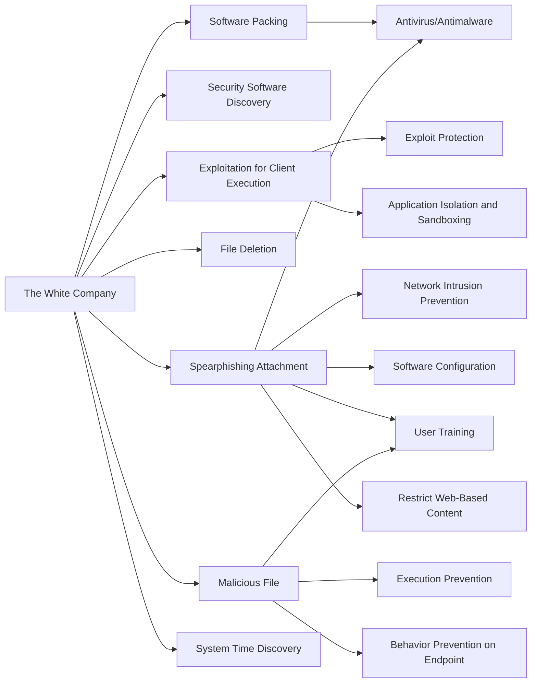

---
tags:
   - groups
---
# The White Company
## ID:G0089
[The White Company](groups/G0089) is a likely state-sponsored threat actor with advanced capabilities. From 2017 through 2018, the group led an espionage campaign called Operation Shaheen targeting government and military organizations in Pakistan.(Citation: Cylance Shaheen Nov 2018)
## Techniques Used By Group
* [Software Packing](techniques/T1027/002)
* [Security Software Discovery](techniques/T1518/001)
* [Exploitation for Client Execution](techniques/T1203)
* [File Deletion](techniques/T1070/004)
* [Spearphishing Attachment](techniques/T1566/001)
* [Malicious File](techniques/T1204/002)
* [System Time Discovery](techniques/T1124)

# Summary of Techniques and Mitigations
