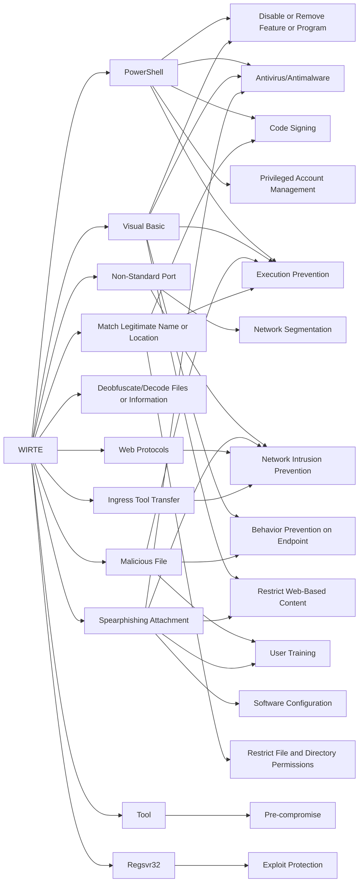

---
tags:
   - groups
---
# WIRTE
## ID:G0090
[WIRTE](/mitre/groups/G0090) is a threat group that has been active since at least August 2018. [WIRTE](/mitre/groups/G0090) has targeted government, diplomatic, financial, military, legal, and technology organizations in the Middle East and Europe.(Citation: Lab52 WIRTE Apr 2019)(Citation: Kaspersky WIRTE November 2021)
## Techniques Used By Group
* [PowerShell](/mitre/techniques/T1059/001)
* [Non-Standard Port](/mitre/techniques/T1571)
* [Visual Basic](/mitre/techniques/T1059/005)
* [Malicious File](/mitre/techniques/T1204/002)
* [Deobfuscate/Decode Files or Information](/mitre/techniques/T1140)
* [Spearphishing Attachment](/mitre/techniques/T1566/001)
* [Match Legitimate Name or Location](/mitre/techniques/T1036/005)
* [Tool](/mitre/techniques/T1588/002)
* [Web Protocols](/mitre/techniques/T1071/001)
* [Regsvr32](/mitre/techniques/T1218/010)
* [Ingress Tool Transfer](/mitre/techniques/T1105)

# Summary of Techniques and Mitigations
