---
tags:
   - groups
---
# Silence
## ID:G0091
[Silence](groups/G0091) is a financially motivated threat actor targeting financial institutions in different countries. The group was first seen in June 2016. Their main targets reside in Russia, Ukraine, Belarus, Azerbaijan, Poland and Kazakhstan. They compromised various banking systems, including the Russian Central Bank's Automated Workstation Client, ATMs, and card processing.(Citation: Cyber Forensicator Silence Jan 2019)(Citation: SecureList Silence Nov 2017) 
## Techniques Used By Group
* [Non-Standard Port](techniques/T1571)
* [Scheduled Task](techniques/T1053/005)
* [Process Injection](techniques/T1055)
* [Registry Run Keys / Startup Folder](techniques/T1547/001)
* [Visual Basic](techniques/T1059/005)
* [Modify Registry](techniques/T1112)
* [Remote Desktop Protocol](techniques/T1021/001)
* [Video Capture](techniques/T1125)
* [JavaScript](techniques/T1059/007)
* [Compiled HTML File](techniques/T1218/001)
* [Software Deployment Tools](techniques/T1072)
* [Screen Capture](techniques/T1113)
* [Command Obfuscation](techniques/T1027/010)
* [Service Execution](techniques/T1569/002)
* [External Proxy](techniques/T1090/002)
* [Code Signing](techniques/T1553/002)
* [Ingress Tool Transfer](techniques/T1105)
* [Valid Accounts](techniques/T1078)
* [Remote System Discovery](techniques/T1018)
* [LSASS Memory](techniques/T1003/001)
* [PowerShell](techniques/T1059/001)
* [Tool](techniques/T1588/002)
* [File Deletion](techniques/T1070/004)
* [Spearphishing Attachment](techniques/T1566/001)
* [Match Legitimate Name or Location](techniques/T1036/005)
* [Malicious File](techniques/T1204/002)
* [Windows Command Shell](techniques/T1059/003)
* [Native API](techniques/T1106)

# Summary of Techniques and Mitigations

```mermaid
flowchart LR
group[Silence] --> T1571[Non-Standard Port]
group[Silence] --> T1053.005[Scheduled Task]
group[Silence] --> T1055[Process Injection]
group[Silence] --> T1547.001[Registry Run Keys / Startup Folder]
group[Silence] --> T1059.005[Visual Basic]
group[Silence] --> T1112[Modify Registry]
group[Silence] --> T1021.001[Remote Desktop Protocol]
group[Silence] --> T1125[Video Capture]
group[Silence] --> T1059.007[JavaScript]
group[Silence] --> T1218.001[Compiled HTML File]
group[Silence] --> T1072[Software Deployment Tools]
group[Silence] --> T1113[Screen Capture]
group[Silence] --> T1027.010[Command Obfuscation]
group[Silence] --> T1569.002[Service Execution]
group[Silence] --> T1090.002[External Proxy]
group[Silence] --> T1553.002[Code Signing]
group[Silence] --> T1105[Ingress Tool Transfer]
group[Silence] --> T1078[Valid Accounts]
group[Silence] --> T1018[Remote System Discovery]
group[Silence] --> T1003.001[LSASS Memory]
group[Silence] --> T1059.001[PowerShell]
group[Silence] --> T1588.002[Tool]
group[Silence] --> T1070.004[File Deletion]
group[Silence] --> T1566.001[Spearphishing Attachment]
group[Silence] --> T1036.005[Match Legitimate Name or Location]
group[Silence] --> T1204.002[Malicious File]
group[Silence] --> T1059.003[Windows Command Shell]
group[Silence] --> T1106[Native API]
T1571[Non-Standard Port] --> M1030[Network Segmentation]
T1571[Non-Standard Port] --> M1031[Network Intrusion Prevention]
T1053.005[Scheduled Task] --> M1026[Privileged Account Management]
T1053.005[Scheduled Task] --> M1018[User Account Management]
T1053.005[Scheduled Task] --> M1047[Audit]
T1053.005[Scheduled Task] --> M1028[Operating System Configuration]
T1055[Process Injection] --> M1026[Privileged Account Management]
T1055[Process Injection] --> M1040[Behavior Prevention on Endpoint]
T1059.005[Visual Basic] --> M1042[Disable or Remove Feature or Program]
T1059.005[Visual Basic] --> M1049[Antivirus/Antimalware]
T1059.005[Visual Basic] --> M1038[Execution Prevention]
T1059.005[Visual Basic] --> M1040[Behavior Prevention on Endpoint]
T1059.005[Visual Basic] --> M1021[Restrict Web-Based Content]
T1112[Modify Registry] --> M1024[Restrict Registry Permissions]
T1021.001[Remote Desktop Protocol] --> M1047[Audit]
T1021.001[Remote Desktop Protocol] --> M1035[Limit Access to Resource Over Network]
T1021.001[Remote Desktop Protocol] --> M1030[Network Segmentation]
T1021.001[Remote Desktop Protocol] --> M1028[Operating System Configuration]
T1021.001[Remote Desktop Protocol] --> M1042[Disable or Remove Feature or Program]
T1021.001[Remote Desktop Protocol] --> M1018[User Account Management]
T1021.001[Remote Desktop Protocol] --> M1032[Multi-factor Authentication]
T1021.001[Remote Desktop Protocol] --> M1026[Privileged Account Management]
T1059.007[JavaScript] --> M1040[Behavior Prevention on Endpoint]
T1059.007[JavaScript] --> M1038[Execution Prevention]
T1059.007[JavaScript] --> M1042[Disable or Remove Feature or Program]
T1059.007[JavaScript] --> M1021[Restrict Web-Based Content]
T1218.001[Compiled HTML File] --> M1021[Restrict Web-Based Content]
T1218.001[Compiled HTML File] --> M1038[Execution Prevention]
T1072[Software Deployment Tools] --> M1018[User Account Management]
T1072[Software Deployment Tools] --> M1015[Active Directory Configuration]
T1072[Software Deployment Tools] --> M1051[Update Software]
T1072[Software Deployment Tools] --> M1026[Privileged Account Management]
T1072[Software Deployment Tools] --> M1027[Password Policies]
T1072[Software Deployment Tools] --> M1033[Limit Software Installation]
T1072[Software Deployment Tools] --> M1030[Network Segmentation]
T1072[Software Deployment Tools] --> M1017[User Training]
T1072[Software Deployment Tools] --> M1032[Multi-factor Authentication]
T1072[Software Deployment Tools] --> M1029[Remote Data Storage]
T1027.010[Command Obfuscation] --> M1040[Behavior Prevention on Endpoint]
T1027.010[Command Obfuscation] --> M1049[Antivirus/Antimalware]
T1569.002[Service Execution] --> M1026[Privileged Account Management]
T1569.002[Service Execution] --> M1040[Behavior Prevention on Endpoint]
T1569.002[Service Execution] --> M1022[Restrict File and Directory Permissions]
T1090.002[External Proxy] --> M1031[Network Intrusion Prevention]
T1105[Ingress Tool Transfer] --> M1031[Network Intrusion Prevention]
T1078[Valid Accounts] --> M1027[Password Policies]
T1078[Valid Accounts] --> M1018[User Account Management]
T1078[Valid Accounts] --> M1026[Privileged Account Management]
T1078[Valid Accounts] --> M1013[Application Developer Guidance]
T1078[Valid Accounts] --> M1017[User Training]
T1078[Valid Accounts] --> M1015[Active Directory Configuration]
T1078[Valid Accounts] --> M1036[Account Use Policies]
T1003.001[LSASS Memory] --> M1028[Operating System Configuration]
T1003.001[LSASS Memory] --> M1043[Credential Access Protection]
T1003.001[LSASS Memory] --> M1025[Privileged Process Integrity]
T1003.001[LSASS Memory] --> M1026[Privileged Account Management]
T1003.001[LSASS Memory] --> M1017[User Training]
T1003.001[LSASS Memory] --> M1040[Behavior Prevention on Endpoint]
T1003.001[LSASS Memory] --> M1027[Password Policies]
T1059.001[PowerShell] --> M1042[Disable or Remove Feature or Program]
T1059.001[PowerShell] --> M1049[Antivirus/Antimalware]
T1059.001[PowerShell] --> M1045[Code Signing]
T1059.001[PowerShell] --> M1026[Privileged Account Management]
T1059.001[PowerShell] --> M1038[Execution Prevention]
T1588.002[Tool] --> M1056[Pre-compromise]
T1566.001[Spearphishing Attachment] --> M1049[Antivirus/Antimalware]
T1566.001[Spearphishing Attachment] --> M1031[Network Intrusion Prevention]
T1566.001[Spearphishing Attachment] --> M1054[Software Configuration]
T1566.001[Spearphishing Attachment] --> M1017[User Training]
T1566.001[Spearphishing Attachment] --> M1021[Restrict Web-Based Content]
T1036.005[Match Legitimate Name or Location] --> M1022[Restrict File and Directory Permissions]
T1036.005[Match Legitimate Name or Location] --> M1038[Execution Prevention]
T1036.005[Match Legitimate Name or Location] --> M1045[Code Signing]
T1204.002[Malicious File] --> M1038[Execution Prevention]
T1204.002[Malicious File] --> M1040[Behavior Prevention on Endpoint]
T1204.002[Malicious File] --> M1017[User Training]
T1059.003[Windows Command Shell] --> M1038[Execution Prevention]
T1106[Native API] --> M1038[Execution Prevention]
T1106[Native API] --> M1040[Behavior Prevention on Endpoint]
```
