---
tags:
   - groups
---
# TA505
## ID:G0092
[TA505](/mitre/groups/G0092) is a cyber criminal group that has been active since at least 2014. [TA505](/mitre/groups/G0092) is known for frequently changing malware, driving global trends in criminal malware distribution, and ransomware campaigns involving [Clop](/mitre/software/S0611).(Citation: Proofpoint TA505 Sep 2017)(Citation: Proofpoint TA505 June 2018)(Citation: Proofpoint TA505 Jan 2019)(Citation: NCC Group TA505)(Citation: Korean FSI TA505 2020)
## Techniques Used By Group
* [Email Account](techniques/T1087/003)
* [Domains](techniques/T1583/001)
* [Mark-of-the-Web Bypass](techniques/T1553/005)
* [Msiexec](techniques/T1218/007)
* [Modify Registry](techniques/T1112)
* [Tool](techniques/T1588/002)
* [Malicious File](techniques/T1204/002)
* [Fast Flux DNS](techniques/T1568/001)
* [Encrypted/Encoded File](techniques/T1027/013)
* [Software Packing](techniques/T1027/002)
* [Credentials In Files](techniques/T1552/001)
* [Visual Basic](techniques/T1059/005)
* [JavaScript](techniques/T1059/007)
* [Malicious Link](techniques/T1204/001)
* [Disable or Modify Tools](techniques/T1562/001)
* [Upload Malware](techniques/T1608/001)
* [Rundll32](techniques/T1218/011)
* [Deobfuscate/Decode Files or Information](techniques/T1140)
* [Credentials from Web Browsers](techniques/T1555/003)
* [Command Obfuscation](techniques/T1027/010)
* [Permission Groups Discovery](techniques/T1069)
* [Ingress Tool Transfer](techniques/T1105)
* [Malware](techniques/T1588/001)
* [Domain Accounts](techniques/T1078/002)
* [Code Signing](techniques/T1553/002)
* [Data Encrypted for Impact](techniques/T1486)
* [PowerShell](techniques/T1059/001)
* [Spearphishing Attachment](techniques/T1566/001)
* [Native API](techniques/T1106)
* [Spearphishing Link](techniques/T1566/002)
* [Dynamic Data Exchange](techniques/T1559/002)
* [Dynamic-link Library Injection](techniques/T1055/001)
* [Web Protocols](techniques/T1071/001)
* [Windows Command Shell](techniques/T1059/003)

# Summary of Techniques and Mitigations

```mermaid
flowchart LR
group[TA505] --> T1087.003[Email Account]
group[TA505] --> T1583.001[Domains]
group[TA505] --> T1553.005[Mark-of-the-Web Bypass]
group[TA505] --> T1218.007[Msiexec]
group[TA505] --> T1112[Modify Registry]
group[TA505] --> T1588.002[Tool]
group[TA505] --> T1204.002[Malicious File]
group[TA505] --> T1568.001[Fast Flux DNS]
group[TA505] --> T1027.013[Encrypted/Encoded File]
group[TA505] --> T1027.002[Software Packing]
group[TA505] --> T1552.001[Credentials In Files]
group[TA505] --> T1059.005[Visual Basic]
group[TA505] --> T1059.007[JavaScript]
group[TA505] --> T1204.001[Malicious Link]
group[TA505] --> T1562.001[Disable or Modify Tools]
group[TA505] --> T1608.001[Upload Malware]
group[TA505] --> T1218.011[Rundll32]
group[TA505] --> T1140[Deobfuscate/Decode Files or Information]
group[TA505] --> T1555.003[Credentials from Web Browsers]
group[TA505] --> T1027.010[Command Obfuscation]
group[TA505] --> T1069[Permission Groups Discovery]
group[TA505] --> T1105[Ingress Tool Transfer]
group[TA505] --> T1588.001[Malware]
group[TA505] --> T1078.002[Domain Accounts]
group[TA505] --> T1553.002[Code Signing]
group[TA505] --> T1486[Data Encrypted for Impact]
group[TA505] --> T1059.001[PowerShell]
group[TA505] --> T1566.001[Spearphishing Attachment]
group[TA505] --> T1106[Native API]
group[TA505] --> T1566.002[Spearphishing Link]
group[TA505] --> T1559.002[Dynamic Data Exchange]
group[TA505] --> T1055.001[Dynamic-link Library Injection]
group[TA505] --> T1071.001[Web Protocols]
group[TA505] --> T1059.003[Windows Command Shell]
T1583.001[Domains] --> M1056[Pre-compromise]
T1553.005[Mark-of-the-Web Bypass] --> M1042[Disable or Remove Feature or Program]
T1553.005[Mark-of-the-Web Bypass] --> M1038[Execution Prevention]
T1218.007[Msiexec] --> M1042[Disable or Remove Feature or Program]
T1218.007[Msiexec] --> M1026[Privileged Account Management]
T1112[Modify Registry] --> M1024[Restrict Registry Permissions]
T1588.002[Tool] --> M1056[Pre-compromise]
T1204.002[Malicious File] --> M1038[Execution Prevention]
T1204.002[Malicious File] --> M1040[Behavior Prevention on Endpoint]
T1204.002[Malicious File] --> M1017[User Training]
T1027.013[Encrypted/Encoded File] --> M1049[Antivirus/Antimalware]
T1027.013[Encrypted/Encoded File] --> M1040[Behavior Prevention on Endpoint]
T1027.002[Software Packing] --> M1049[Antivirus/Antimalware]
T1552.001[Credentials In Files] --> M1017[User Training]
T1552.001[Credentials In Files] --> M1047[Audit]
T1552.001[Credentials In Files] --> M1022[Restrict File and Directory Permissions]
T1552.001[Credentials In Files] --> M1027[Password Policies]
T1059.005[Visual Basic] --> M1042[Disable or Remove Feature or Program]
T1059.005[Visual Basic] --> M1049[Antivirus/Antimalware]
T1059.005[Visual Basic] --> M1038[Execution Prevention]
T1059.005[Visual Basic] --> M1040[Behavior Prevention on Endpoint]
T1059.005[Visual Basic] --> M1021[Restrict Web-Based Content]
T1059.007[JavaScript] --> M1040[Behavior Prevention on Endpoint]
T1059.007[JavaScript] --> M1038[Execution Prevention]
T1059.007[JavaScript] --> M1042[Disable or Remove Feature or Program]
T1059.007[JavaScript] --> M1021[Restrict Web-Based Content]
T1204.001[Malicious Link] --> M1031[Network Intrusion Prevention]
T1204.001[Malicious Link] --> M1017[User Training]
T1204.001[Malicious Link] --> M1021[Restrict Web-Based Content]
T1562.001[Disable or Modify Tools] --> M1038[Execution Prevention]
T1562.001[Disable or Modify Tools] --> M1024[Restrict Registry Permissions]
T1562.001[Disable or Modify Tools] --> M1018[User Account Management]
T1562.001[Disable or Modify Tools] --> M1022[Restrict File and Directory Permissions]
T1608.001[Upload Malware] --> M1056[Pre-compromise]
T1218.011[Rundll32] --> M1050[Exploit Protection]
T1555.003[Credentials from Web Browsers] --> M1027[Password Policies]
T1027.010[Command Obfuscation] --> M1040[Behavior Prevention on Endpoint]
T1027.010[Command Obfuscation] --> M1049[Antivirus/Antimalware]
T1105[Ingress Tool Transfer] --> M1031[Network Intrusion Prevention]
T1588.001[Malware] --> M1056[Pre-compromise]
T1078.002[Domain Accounts] --> M1032[Multi-factor Authentication]
T1078.002[Domain Accounts] --> M1026[Privileged Account Management]
T1078.002[Domain Accounts] --> M1017[User Training]
T1486[Data Encrypted for Impact] --> M1040[Behavior Prevention on Endpoint]
T1486[Data Encrypted for Impact] --> M1053[Data Backup]
T1059.001[PowerShell] --> M1042[Disable or Remove Feature or Program]
T1059.001[PowerShell] --> M1049[Antivirus/Antimalware]
T1059.001[PowerShell] --> M1045[Code Signing]
T1059.001[PowerShell] --> M1026[Privileged Account Management]
T1059.001[PowerShell] --> M1038[Execution Prevention]
T1566.001[Spearphishing Attachment] --> M1049[Antivirus/Antimalware]
T1566.001[Spearphishing Attachment] --> M1031[Network Intrusion Prevention]
T1566.001[Spearphishing Attachment] --> M1054[Software Configuration]
T1566.001[Spearphishing Attachment] --> M1017[User Training]
T1566.001[Spearphishing Attachment] --> M1021[Restrict Web-Based Content]
T1106[Native API] --> M1038[Execution Prevention]
T1106[Native API] --> M1040[Behavior Prevention on Endpoint]
T1566.002[Spearphishing Link] --> M1054[Software Configuration]
T1566.002[Spearphishing Link] --> M1021[Restrict Web-Based Content]
T1566.002[Spearphishing Link] --> M1047[Audit]
T1566.002[Spearphishing Link] --> M1018[User Account Management]
T1566.002[Spearphishing Link] --> M1017[User Training]
T1559.002[Dynamic Data Exchange] --> M1040[Behavior Prevention on Endpoint]
T1559.002[Dynamic Data Exchange] --> M1048[Application Isolation and Sandboxing]
T1559.002[Dynamic Data Exchange] --> M1054[Software Configuration]
T1559.002[Dynamic Data Exchange] --> M1042[Disable or Remove Feature or Program]
T1055.001[Dynamic-link Library Injection] --> M1040[Behavior Prevention on Endpoint]
T1071.001[Web Protocols] --> M1031[Network Intrusion Prevention]
T1059.003[Windows Command Shell] --> M1038[Execution Prevention]
```
