---
tags:
   - groups
---
# GALLIUM
## ID:G0093
[GALLIUM](/mitre/groups/G0093) is a cyberespionage group that has been active since at least 2012, primarily targeting telecommunications companies, financial institutions, and government entities in Afghanistan, Australia, Belgium, Cambodia, Malaysia, Mozambique, the Philippines, Russia, and Vietnam. This group is particularly known for launching Operation Soft Cell, a long-term campaign targeting telecommunications providers.(Citation: Cybereason Soft Cell June 2019) Security researchers have identified [GALLIUM](/mitre/groups/G0093) as a likely Chinese state-sponsored group, based in part on tools used and TTPs commonly associated with Chinese threat actors.(Citation: Cybereason Soft Cell June 2019)(Citation: Microsoft GALLIUM December 2019)(Citation: Unit 42 PingPull Jun 2022)
## Techniques Used By Group
* [Windows Command Shell](techniques/T1059/003)
* [Security Account Manager](techniques/T1003/002)
* [Valid Accounts](techniques/T1078)
* [Scheduled Task](techniques/T1053/005)
* [Obfuscated Files or Information](techniques/T1027)
* [Code Signing](techniques/T1553/002)
* [Exfiltration Over C2 Channel](techniques/T1041)
* [Data from Local System](techniques/T1005)
* [DLL Side-Loading](techniques/T1574/002)
* [Tool](techniques/T1588/002)
* [Windows Management Instrumentation](techniques/T1047)
* [Domain Account](techniques/T1136/002)
* [Server](techniques/T1583/004)
* [External Remote Services](techniques/T1133)
* [Software Packing](techniques/T1027/002)
* [Web Shell](techniques/T1505/003)
* [LSASS Memory](techniques/T1003/001)
* [Archive via Utility](techniques/T1560/001)
* [PowerShell](techniques/T1059/001)
* [Lateral Tool Transfer](techniques/T1570)
* [Indicator Removal from Tools](techniques/T1027/005)
* [External Proxy](techniques/T1090/002)
* [System Network Connections Discovery](techniques/T1049)
* [Local Data Staging](techniques/T1074/001)
* [System Owner/User Discovery](techniques/T1033)
* [Exploit Public-Facing Application](techniques/T1190)
* [System Network Configuration Discovery](techniques/T1016)
* [Ingress Tool Transfer](techniques/T1105)
* [Remote System Discovery](techniques/T1018)
* [Pass the Hash](techniques/T1550/002)
* [Rename System Utilities](techniques/T1036/003)

# Summary of Techniques and Mitigations

```mermaid
flowchart LR
group[GALLIUM] --> T1059.003[Windows Command Shell]
group[GALLIUM] --> T1003.002[Security Account Manager]
group[GALLIUM] --> T1078[Valid Accounts]
group[GALLIUM] --> T1053.005[Scheduled Task]
group[GALLIUM] --> T1027[Obfuscated Files or Information]
group[GALLIUM] --> T1553.002[Code Signing]
group[GALLIUM] --> T1041[Exfiltration Over C2 Channel]
group[GALLIUM] --> T1005[Data from Local System]
group[GALLIUM] --> T1574.002[DLL Side-Loading]
group[GALLIUM] --> T1588.002[Tool]
group[GALLIUM] --> T1047[Windows Management Instrumentation]
group[GALLIUM] --> T1136.002[Domain Account]
group[GALLIUM] --> T1583.004[Server]
group[GALLIUM] --> T1133[External Remote Services]
group[GALLIUM] --> T1027.002[Software Packing]
group[GALLIUM] --> T1505.003[Web Shell]
group[GALLIUM] --> T1003.001[LSASS Memory]
group[GALLIUM] --> T1560.001[Archive via Utility]
group[GALLIUM] --> T1059.001[PowerShell]
group[GALLIUM] --> T1570[Lateral Tool Transfer]
group[GALLIUM] --> T1027.005[Indicator Removal from Tools]
group[GALLIUM] --> T1090.002[External Proxy]
group[GALLIUM] --> T1049[System Network Connections Discovery]
group[GALLIUM] --> T1074.001[Local Data Staging]
group[GALLIUM] --> T1033[System Owner/User Discovery]
group[GALLIUM] --> T1190[Exploit Public-Facing Application]
group[GALLIUM] --> T1016[System Network Configuration Discovery]
group[GALLIUM] --> T1105[Ingress Tool Transfer]
group[GALLIUM] --> T1018[Remote System Discovery]
group[GALLIUM] --> T1550.002[Pass the Hash]
group[GALLIUM] --> T1036.003[Rename System Utilities]
T1059.003[Windows Command Shell] --> M1038[Execution Prevention]
T1003.002[Security Account Manager] --> M1027[Password Policies]
T1003.002[Security Account Manager] --> M1026[Privileged Account Management]
T1003.002[Security Account Manager] --> M1028[Operating System Configuration]
T1003.002[Security Account Manager] --> M1017[User Training]
T1078[Valid Accounts] --> M1027[Password Policies]
T1078[Valid Accounts] --> M1018[User Account Management]
T1078[Valid Accounts] --> M1026[Privileged Account Management]
T1078[Valid Accounts] --> M1013[Application Developer Guidance]
T1078[Valid Accounts] --> M1017[User Training]
T1078[Valid Accounts] --> M1015[Active Directory Configuration]
T1078[Valid Accounts] --> M1036[Account Use Policies]
T1053.005[Scheduled Task] --> M1026[Privileged Account Management]
T1053.005[Scheduled Task] --> M1018[User Account Management]
T1053.005[Scheduled Task] --> M1047[Audit]
T1053.005[Scheduled Task] --> M1028[Operating System Configuration]
T1027[Obfuscated Files or Information] --> M1047[Audit]
T1027[Obfuscated Files or Information] --> M1040[Behavior Prevention on Endpoint]
T1027[Obfuscated Files or Information] --> M1017[User Training]
T1027[Obfuscated Files or Information] --> M1049[Antivirus/Antimalware]
T1041[Exfiltration Over C2 Channel] --> M1031[Network Intrusion Prevention]
T1041[Exfiltration Over C2 Channel] --> M1057[Data Loss Prevention]
T1005[Data from Local System] --> M1057[Data Loss Prevention]
T1574.002[DLL Side-Loading] --> M1051[Update Software]
T1574.002[DLL Side-Loading] --> M1013[Application Developer Guidance]
T1588.002[Tool] --> M1056[Pre-compromise]
T1047[Windows Management Instrumentation] --> M1026[Privileged Account Management]
T1047[Windows Management Instrumentation] --> M1040[Behavior Prevention on Endpoint]
T1047[Windows Management Instrumentation] --> M1018[User Account Management]
T1047[Windows Management Instrumentation] --> M1038[Execution Prevention]
T1136.002[Domain Account] --> M1032[Multi-factor Authentication]
T1136.002[Domain Account] --> M1028[Operating System Configuration]
T1136.002[Domain Account] --> M1030[Network Segmentation]
T1136.002[Domain Account] --> M1026[Privileged Account Management]
T1583.004[Server] --> M1056[Pre-compromise]
T1133[External Remote Services] --> M1030[Network Segmentation]
T1133[External Remote Services] --> M1042[Disable or Remove Feature or Program]
T1133[External Remote Services] --> M1035[Limit Access to Resource Over Network]
T1133[External Remote Services] --> M1032[Multi-factor Authentication]
T1027.002[Software Packing] --> M1049[Antivirus/Antimalware]
T1505.003[Web Shell] --> M1042[Disable or Remove Feature or Program]
T1505.003[Web Shell] --> M1018[User Account Management]
T1003.001[LSASS Memory] --> M1028[Operating System Configuration]
T1003.001[LSASS Memory] --> M1043[Credential Access Protection]
T1003.001[LSASS Memory] --> M1025[Privileged Process Integrity]
T1003.001[LSASS Memory] --> M1026[Privileged Account Management]
T1003.001[LSASS Memory] --> M1017[User Training]
T1003.001[LSASS Memory] --> M1040[Behavior Prevention on Endpoint]
T1003.001[LSASS Memory] --> M1027[Password Policies]
T1560.001[Archive via Utility] --> M1047[Audit]
T1059.001[PowerShell] --> M1042[Disable or Remove Feature or Program]
T1059.001[PowerShell] --> M1049[Antivirus/Antimalware]
T1059.001[PowerShell] --> M1045[Code Signing]
T1059.001[PowerShell] --> M1026[Privileged Account Management]
T1059.001[PowerShell] --> M1038[Execution Prevention]
T1570[Lateral Tool Transfer] --> M1037[Filter Network Traffic]
T1570[Lateral Tool Transfer] --> M1031[Network Intrusion Prevention]
T1090.002[External Proxy] --> M1031[Network Intrusion Prevention]
T1190[Exploit Public-Facing Application] --> M1048[Application Isolation and Sandboxing]
T1190[Exploit Public-Facing Application] --> M1030[Network Segmentation]
T1190[Exploit Public-Facing Application] --> M1016[Vulnerability Scanning]
T1190[Exploit Public-Facing Application] --> M1026[Privileged Account Management]
T1190[Exploit Public-Facing Application] --> M1050[Exploit Protection]
T1190[Exploit Public-Facing Application] --> M1051[Update Software]
T1105[Ingress Tool Transfer] --> M1031[Network Intrusion Prevention]
T1550.002[Pass the Hash] --> M1051[Update Software]
T1550.002[Pass the Hash] --> M1052[User Account Control]
T1550.002[Pass the Hash] --> M1018[User Account Management]
T1550.002[Pass the Hash] --> M1026[Privileged Account Management]
T1036.003[Rename System Utilities] --> M1022[Restrict File and Directory Permissions]
```
