---
tags:
   - groups
---
# Kimsuky
## ID:G0094
[Kimsuky](groups/G0094) is a North Korea-based cyber espionage group that has been active since at least 2012. The group initially focused on targeting South Korean government entities, think tanks, and individuals identified as experts in various fields, and expanded its operations to include the United States, Russia, Europe, and the UN. [Kimsuky](groups/G0094) has focused its intelligence collection activities on foreign policy and national security issues related to the Korean peninsula, nuclear policy, and sanctions.(Citation: EST Kimsuky April 2019)(Citation: BRI Kimsuky April 2019)(Citation: Cybereason Kimsuky November 2020)(Citation: Malwarebytes Kimsuky June 2021)(Citation: CISA AA20-301A Kimsuky)

[Kimsuky](groups/G0094) was assessed to be responsible for the 2014 Korea Hydro & Nuclear Power Co. compromise; other notable campaigns include Operation STOLEN PENCIL (2018), Operation Kabar Cobra (2019), and Operation Smoke Screen (2019).(Citation: Netscout Stolen Pencil Dec 2018)(Citation: EST Kimsuky SmokeScreen April 2019)(Citation: AhnLab Kimsuky Kabar Cobra Feb 2019)

North Korean group definitions are known to have significant overlap, and some security researchers report all North Korean state-sponsored cyber activity under the name [Lazarus Group](groups/G0032) instead of tracking clusters or subgroups.
## Techniques Used By Group
* [Data from Local System](techniques/T1005)
* [Malware](techniques/T1587/001)
* [Remote Desktop Protocol](techniques/T1021/001)
* [Email Accounts](techniques/T1585/002)
* [Malicious File](techniques/T1204/002)
* [Network Sniffing](techniques/T1040)
* [Spearphishing Link](techniques/T1566/002)
* [Tool](techniques/T1588/002)
* [Local Accounts](techniques/T1078/003)
* [Deobfuscate/Decode Files or Information](techniques/T1140)
* [Upload Malware](techniques/T1608/001)
* [Ingress Tool Transfer](techniques/T1105)
* [Develop Capabilities](techniques/T1587)
* [Exfiltration to Cloud Storage](techniques/T1567/002)
* [Code Signing](techniques/T1553/002)
* [Masquerade Task or Service](techniques/T1036/004)
* [Bidirectional Communication](techniques/T1102/002)
* [Malicious Link](techniques/T1204/001)
* [Internal Spearphishing](techniques/T1534)
* [Exploit Public-Facing Application](techniques/T1190)
* [Social Media](techniques/T1593/001)
* [Employee Names](techniques/T1589/003)
* [Rundll32](techniques/T1218/011)
* [Hidden Users](techniques/T1564/002)
* [Browser Extensions](techniques/T1176)
* [File Deletion](techniques/T1070/004)
* [Remote Access Software](techniques/T1219)
* [Server](techniques/T1583/004)
* [Multi-Factor Authentication Interception](techniques/T1111)
* [Search Victim-Owned Websites](techniques/T1594)
* [Windows Command Shell](techniques/T1059/003)
* [Domains](techniques/T1583/001)
* [Query Registry](techniques/T1012)
* [Gather Victim Org Information](techniques/T1591)
* [Web Protocols](techniques/T1071/001)
* [Social Media Accounts](techniques/T1585/001)
* [Local Account](techniques/T1136/001)
* [System Service Discovery](techniques/T1007)
* [Email Accounts](techniques/T1586/002)
* [Archive via Custom Method](techniques/T1560/003)
* [Timestomp](techniques/T1070/006)
* [Spearphishing Link](techniques/T1598/003)
* [Pass the Hash](techniques/T1550/002)
* [Adversary-in-the-Middle](techniques/T1557)
* [Security Software Discovery](techniques/T1518/001)
* [Mshta](techniques/T1218/005)
* [Exfiltration Over C2 Channel](techniques/T1041)
* [External Remote Services](techniques/T1133)
* [System Information Discovery](techniques/T1082)
* [Domains](techniques/T1584/001)
* [Email Addresses](techniques/T1589/002)
* [JavaScript](techniques/T1059/007)
* [Obfuscated Files or Information](techniques/T1027)
* [Local Data Staging](techniques/T1074/001)
* [Mail Protocols](techniques/T1071/003)
* [Keylogging](techniques/T1056/001)
* [Software Packing](techniques/T1027/002)
* [Credentials In Files](techniques/T1552/001)
* [Archive via Utility](techniques/T1560/001)
* [System Network Configuration Discovery](techniques/T1016)
* [Credentials from Web Browsers](techniques/T1555/003)
* [Change Default File Association](techniques/T1546/001)
* [Spearphishing Attachment](techniques/T1566/001)
* [Process Discovery](techniques/T1057)
* [Process Injection](techniques/T1055)
* [Modify Registry](techniques/T1112)
* [PowerShell](techniques/T1059/001)
* [Disable or Modify System Firewall](techniques/T1562/004)
* [Exploits](techniques/T1588/005)
* [Regsvr32](techniques/T1218/010)
* [Registry Run Keys / Startup Folder](techniques/T1547/001)
* [Disable or Modify Tools](techniques/T1562/001)
* [Windows Service](techniques/T1543/003)
* [Web Services](techniques/T1583/006)
* [File and Directory Discovery](techniques/T1083)
* [Hidden Window](techniques/T1564/003)
* [Scheduled Task](techniques/T1053/005)
* [Match Legitimate Name or Location](techniques/T1036/005)
* [Search Engines](techniques/T1593/002)
* [Process Hollowing](techniques/T1055/012)
* [Email Forwarding Rule](techniques/T1114/003)
* [File Transfer Protocols](techniques/T1071/002)
* [LSASS Memory](techniques/T1003/001)
* [Visual Basic](techniques/T1059/005)
* [Account Manipulation](techniques/T1098)
* [Python](techniques/T1059/006)
* [Web Shell](techniques/T1505/003)
* [Remote Email Collection](techniques/T1114/002)

# Summary of Techniques and Mitigations

```mermaid
flowchart LR
group[Kimsuky] --> T1005[Data from Local System]
group[Kimsuky] --> T1587.001[Malware]
group[Kimsuky] --> T1021.001[Remote Desktop Protocol]
group[Kimsuky] --> T1585.002[Email Accounts]
group[Kimsuky] --> T1204.002[Malicious File]
group[Kimsuky] --> T1040[Network Sniffing]
group[Kimsuky] --> T1566.002[Spearphishing Link]
group[Kimsuky] --> T1588.002[Tool]
group[Kimsuky] --> T1078.003[Local Accounts]
group[Kimsuky] --> T1140[Deobfuscate/Decode Files or Information]
group[Kimsuky] --> T1608.001[Upload Malware]
group[Kimsuky] --> T1105[Ingress Tool Transfer]
group[Kimsuky] --> T1587[Develop Capabilities]
group[Kimsuky] --> T1567.002[Exfiltration to Cloud Storage]
group[Kimsuky] --> T1553.002[Code Signing]
group[Kimsuky] --> T1036.004[Masquerade Task or Service]
group[Kimsuky] --> T1102.002[Bidirectional Communication]
group[Kimsuky] --> T1204.001[Malicious Link]
group[Kimsuky] --> T1534[Internal Spearphishing]
group[Kimsuky] --> T1190[Exploit Public-Facing Application]
group[Kimsuky] --> T1593.001[Social Media]
group[Kimsuky] --> T1589.003[Employee Names]
group[Kimsuky] --> T1218.011[Rundll32]
group[Kimsuky] --> T1564.002[Hidden Users]
group[Kimsuky] --> T1176[Browser Extensions]
group[Kimsuky] --> T1070.004[File Deletion]
group[Kimsuky] --> T1219[Remote Access Software]
group[Kimsuky] --> T1583.004[Server]
group[Kimsuky] --> T1111[Multi-Factor Authentication Interception]
group[Kimsuky] --> T1594[Search Victim-Owned Websites]
group[Kimsuky] --> T1059.003[Windows Command Shell]
group[Kimsuky] --> T1583.001[Domains]
group[Kimsuky] --> T1012[Query Registry]
group[Kimsuky] --> T1591[Gather Victim Org Information]
group[Kimsuky] --> T1071.001[Web Protocols]
group[Kimsuky] --> T1585.001[Social Media Accounts]
group[Kimsuky] --> T1136.001[Local Account]
group[Kimsuky] --> T1007[System Service Discovery]
group[Kimsuky] --> T1586.002[Email Accounts]
group[Kimsuky] --> T1560.003[Archive via Custom Method]
group[Kimsuky] --> T1070.006[Timestomp]
group[Kimsuky] --> T1598.003[Spearphishing Link]
group[Kimsuky] --> T1550.002[Pass the Hash]
group[Kimsuky] --> T1557[Adversary-in-the-Middle]
group[Kimsuky] --> T1518.001[Security Software Discovery]
group[Kimsuky] --> T1218.005[Mshta]
group[Kimsuky] --> T1041[Exfiltration Over C2 Channel]
group[Kimsuky] --> T1133[External Remote Services]
group[Kimsuky] --> T1082[System Information Discovery]
group[Kimsuky] --> T1584.001[Domains]
group[Kimsuky] --> T1589.002[Email Addresses]
group[Kimsuky] --> T1059.007[JavaScript]
group[Kimsuky] --> T1027[Obfuscated Files or Information]
group[Kimsuky] --> T1074.001[Local Data Staging]
group[Kimsuky] --> T1071.003[Mail Protocols]
group[Kimsuky] --> T1056.001[Keylogging]
group[Kimsuky] --> T1027.002[Software Packing]
group[Kimsuky] --> T1552.001[Credentials In Files]
group[Kimsuky] --> T1560.001[Archive via Utility]
group[Kimsuky] --> T1016[System Network Configuration Discovery]
group[Kimsuky] --> T1555.003[Credentials from Web Browsers]
group[Kimsuky] --> T1546.001[Change Default File Association]
group[Kimsuky] --> T1566.001[Spearphishing Attachment]
group[Kimsuky] --> T1057[Process Discovery]
group[Kimsuky] --> T1055[Process Injection]
group[Kimsuky] --> T1112[Modify Registry]
group[Kimsuky] --> T1059.001[PowerShell]
group[Kimsuky] --> T1562.004[Disable or Modify System Firewall]
group[Kimsuky] --> T1588.005[Exploits]
group[Kimsuky] --> T1218.010[Regsvr32]
group[Kimsuky] --> T1547.001[Registry Run Keys / Startup Folder]
group[Kimsuky] --> T1562.001[Disable or Modify Tools]
group[Kimsuky] --> T1543.003[Windows Service]
group[Kimsuky] --> T1583.006[Web Services]
group[Kimsuky] --> T1083[File and Directory Discovery]
group[Kimsuky] --> T1564.003[Hidden Window]
group[Kimsuky] --> T1053.005[Scheduled Task]
group[Kimsuky] --> T1036.005[Match Legitimate Name or Location]
group[Kimsuky] --> T1593.002[Search Engines]
group[Kimsuky] --> T1055.012[Process Hollowing]
group[Kimsuky] --> T1114.003[Email Forwarding Rule]
group[Kimsuky] --> T1071.002[File Transfer Protocols]
group[Kimsuky] --> T1003.001[LSASS Memory]
group[Kimsuky] --> T1059.005[Visual Basic]
group[Kimsuky] --> T1098[Account Manipulation]
group[Kimsuky] --> T1059.006[Python]
group[Kimsuky] --> T1505.003[Web Shell]
group[Kimsuky] --> T1114.002[Remote Email Collection]
T1005[Data from Local System] --> M1057[Data Loss Prevention]
T1587.001[Malware] --> M1056[Pre-compromise]
T1021.001[Remote Desktop Protocol] --> M1047[Audit]
T1021.001[Remote Desktop Protocol] --> M1035[Limit Access to Resource Over Network]
T1021.001[Remote Desktop Protocol] --> M1030[Network Segmentation]
T1021.001[Remote Desktop Protocol] --> M1028[Operating System Configuration]
T1021.001[Remote Desktop Protocol] --> M1042[Disable or Remove Feature or Program]
T1021.001[Remote Desktop Protocol] --> M1018[User Account Management]
T1021.001[Remote Desktop Protocol] --> M1032[Multi-factor Authentication]
T1021.001[Remote Desktop Protocol] --> M1026[Privileged Account Management]
T1585.002[Email Accounts] --> M1056[Pre-compromise]
T1204.002[Malicious File] --> M1038[Execution Prevention]
T1204.002[Malicious File] --> M1040[Behavior Prevention on Endpoint]
T1204.002[Malicious File] --> M1017[User Training]
T1040[Network Sniffing] --> M1018[User Account Management]
T1040[Network Sniffing] --> M1032[Multi-factor Authentication]
T1040[Network Sniffing] --> M1041[Encrypt Sensitive Information]
T1040[Network Sniffing] --> M1030[Network Segmentation]
T1566.002[Spearphishing Link] --> M1054[Software Configuration]
T1566.002[Spearphishing Link] --> M1021[Restrict Web-Based Content]
T1566.002[Spearphishing Link] --> M1047[Audit]
T1566.002[Spearphishing Link] --> M1018[User Account Management]
T1566.002[Spearphishing Link] --> M1017[User Training]
T1588.002[Tool] --> M1056[Pre-compromise]
T1078.003[Local Accounts] --> M1026[Privileged Account Management]
T1078.003[Local Accounts] --> M1027[Password Policies]
T1608.001[Upload Malware] --> M1056[Pre-compromise]
T1105[Ingress Tool Transfer] --> M1031[Network Intrusion Prevention]
T1587[Develop Capabilities] --> M1056[Pre-compromise]
T1567.002[Exfiltration to Cloud Storage] --> M1021[Restrict Web-Based Content]
T1102.002[Bidirectional Communication] --> M1021[Restrict Web-Based Content]
T1102.002[Bidirectional Communication] --> M1031[Network Intrusion Prevention]
T1204.001[Malicious Link] --> M1031[Network Intrusion Prevention]
T1204.001[Malicious Link] --> M1017[User Training]
T1204.001[Malicious Link] --> M1021[Restrict Web-Based Content]
T1190[Exploit Public-Facing Application] --> M1048[Application Isolation and Sandboxing]
T1190[Exploit Public-Facing Application] --> M1030[Network Segmentation]
T1190[Exploit Public-Facing Application] --> M1016[Vulnerability Scanning]
T1190[Exploit Public-Facing Application] --> M1026[Privileged Account Management]
T1190[Exploit Public-Facing Application] --> M1050[Exploit Protection]
T1190[Exploit Public-Facing Application] --> M1051[Update Software]
T1593.001[Social Media] --> M1056[Pre-compromise]
T1589.003[Employee Names] --> M1056[Pre-compromise]
T1218.011[Rundll32] --> M1050[Exploit Protection]
T1564.002[Hidden Users] --> M1028[Operating System Configuration]
T1176[Browser Extensions] --> M1033[Limit Software Installation]
T1176[Browser Extensions] --> M1047[Audit]
T1176[Browser Extensions] --> M1051[Update Software]
T1176[Browser Extensions] --> M1017[User Training]
T1176[Browser Extensions] --> M1038[Execution Prevention]
T1219[Remote Access Software] --> M1038[Execution Prevention]
T1219[Remote Access Software] --> M1037[Filter Network Traffic]
T1219[Remote Access Software] --> M1031[Network Intrusion Prevention]
T1219[Remote Access Software] --> M1042[Disable or Remove Feature or Program]
T1583.004[Server] --> M1056[Pre-compromise]
T1111[Multi-Factor Authentication Interception] --> M1017[User Training]
T1594[Search Victim-Owned Websites] --> M1056[Pre-compromise]
T1059.003[Windows Command Shell] --> M1038[Execution Prevention]
T1583.001[Domains] --> M1056[Pre-compromise]
T1591[Gather Victim Org Information] --> M1056[Pre-compromise]
T1071.001[Web Protocols] --> M1031[Network Intrusion Prevention]
T1585.001[Social Media Accounts] --> M1056[Pre-compromise]
T1136.001[Local Account] --> M1032[Multi-factor Authentication]
T1136.001[Local Account] --> M1026[Privileged Account Management]
T1586.002[Email Accounts] --> M1056[Pre-compromise]
T1598.003[Spearphishing Link] --> M1017[User Training]
T1598.003[Spearphishing Link] --> M1054[Software Configuration]
T1550.002[Pass the Hash] --> M1051[Update Software]
T1550.002[Pass the Hash] --> M1052[User Account Control]
T1550.002[Pass the Hash] --> M1018[User Account Management]
T1550.002[Pass the Hash] --> M1026[Privileged Account Management]
T1557[Adversary-in-the-Middle] --> M1037[Filter Network Traffic]
T1557[Adversary-in-the-Middle] --> M1041[Encrypt Sensitive Information]
T1557[Adversary-in-the-Middle] --> M1035[Limit Access to Resource Over Network]
T1557[Adversary-in-the-Middle] --> M1042[Disable or Remove Feature or Program]
T1557[Adversary-in-the-Middle] --> M1017[User Training]
T1557[Adversary-in-the-Middle] --> M1031[Network Intrusion Prevention]
T1557[Adversary-in-the-Middle] --> M1030[Network Segmentation]
T1218.005[Mshta] --> M1038[Execution Prevention]
T1218.005[Mshta] --> M1042[Disable or Remove Feature or Program]
T1041[Exfiltration Over C2 Channel] --> M1031[Network Intrusion Prevention]
T1041[Exfiltration Over C2 Channel] --> M1057[Data Loss Prevention]
T1133[External Remote Services] --> M1030[Network Segmentation]
T1133[External Remote Services] --> M1042[Disable or Remove Feature or Program]
T1133[External Remote Services] --> M1035[Limit Access to Resource Over Network]
T1133[External Remote Services] --> M1032[Multi-factor Authentication]
T1584.001[Domains] --> M1056[Pre-compromise]
T1589.002[Email Addresses] --> M1056[Pre-compromise]
T1059.007[JavaScript] --> M1040[Behavior Prevention on Endpoint]
T1059.007[JavaScript] --> M1038[Execution Prevention]
T1059.007[JavaScript] --> M1042[Disable or Remove Feature or Program]
T1059.007[JavaScript] --> M1021[Restrict Web-Based Content]
T1027[Obfuscated Files or Information] --> M1047[Audit]
T1027[Obfuscated Files or Information] --> M1040[Behavior Prevention on Endpoint]
T1027[Obfuscated Files or Information] --> M1017[User Training]
T1027[Obfuscated Files or Information] --> M1049[Antivirus/Antimalware]
T1071.003[Mail Protocols] --> M1031[Network Intrusion Prevention]
T1027.002[Software Packing] --> M1049[Antivirus/Antimalware]
T1552.001[Credentials In Files] --> M1017[User Training]
T1552.001[Credentials In Files] --> M1047[Audit]
T1552.001[Credentials In Files] --> M1022[Restrict File and Directory Permissions]
T1552.001[Credentials In Files] --> M1027[Password Policies]
T1560.001[Archive via Utility] --> M1047[Audit]
T1555.003[Credentials from Web Browsers] --> M1027[Password Policies]
T1566.001[Spearphishing Attachment] --> M1049[Antivirus/Antimalware]
T1566.001[Spearphishing Attachment] --> M1031[Network Intrusion Prevention]
T1566.001[Spearphishing Attachment] --> M1054[Software Configuration]
T1566.001[Spearphishing Attachment] --> M1017[User Training]
T1566.001[Spearphishing Attachment] --> M1021[Restrict Web-Based Content]
T1055[Process Injection] --> M1026[Privileged Account Management]
T1055[Process Injection] --> M1040[Behavior Prevention on Endpoint]
T1112[Modify Registry] --> M1024[Restrict Registry Permissions]
T1059.001[PowerShell] --> M1042[Disable or Remove Feature or Program]
T1059.001[PowerShell] --> M1049[Antivirus/Antimalware]
T1059.001[PowerShell] --> M1045[Code Signing]
T1059.001[PowerShell] --> M1026[Privileged Account Management]
T1059.001[PowerShell] --> M1038[Execution Prevention]
T1562.004[Disable or Modify System Firewall] --> M1047[Audit]
T1562.004[Disable or Modify System Firewall] --> M1018[User Account Management]
T1562.004[Disable or Modify System Firewall] --> M1024[Restrict Registry Permissions]
T1562.004[Disable or Modify System Firewall] --> M1022[Restrict File and Directory Permissions]
T1588.005[Exploits] --> M1056[Pre-compromise]
T1218.010[Regsvr32] --> M1050[Exploit Protection]
T1562.001[Disable or Modify Tools] --> M1038[Execution Prevention]
T1562.001[Disable or Modify Tools] --> M1024[Restrict Registry Permissions]
T1562.001[Disable or Modify Tools] --> M1018[User Account Management]
T1562.001[Disable or Modify Tools] --> M1022[Restrict File and Directory Permissions]
T1543.003[Windows Service] --> M1040[Behavior Prevention on Endpoint]
T1543.003[Windows Service] --> M1028[Operating System Configuration]
T1543.003[Windows Service] --> M1047[Audit]
T1543.003[Windows Service] --> M1045[Code Signing]
T1543.003[Windows Service] --> M1018[User Account Management]
T1583.006[Web Services] --> M1056[Pre-compromise]
T1564.003[Hidden Window] --> M1038[Execution Prevention]
T1564.003[Hidden Window] --> M1033[Limit Software Installation]
T1053.005[Scheduled Task] --> M1026[Privileged Account Management]
T1053.005[Scheduled Task] --> M1018[User Account Management]
T1053.005[Scheduled Task] --> M1047[Audit]
T1053.005[Scheduled Task] --> M1028[Operating System Configuration]
T1036.005[Match Legitimate Name or Location] --> M1022[Restrict File and Directory Permissions]
T1036.005[Match Legitimate Name or Location] --> M1038[Execution Prevention]
T1036.005[Match Legitimate Name or Location] --> M1045[Code Signing]
T1593.002[Search Engines] --> M1056[Pre-compromise]
T1055.012[Process Hollowing] --> M1040[Behavior Prevention on Endpoint]
T1114.003[Email Forwarding Rule] --> M1042[Disable or Remove Feature or Program]
T1114.003[Email Forwarding Rule] --> M1041[Encrypt Sensitive Information]
T1114.003[Email Forwarding Rule] --> M1047[Audit]
T1071.002[File Transfer Protocols] --> M1031[Network Intrusion Prevention]
T1003.001[LSASS Memory] --> M1028[Operating System Configuration]
T1003.001[LSASS Memory] --> M1043[Credential Access Protection]
T1003.001[LSASS Memory] --> M1025[Privileged Process Integrity]
T1003.001[LSASS Memory] --> M1026[Privileged Account Management]
T1003.001[LSASS Memory] --> M1017[User Training]
T1003.001[LSASS Memory] --> M1040[Behavior Prevention on Endpoint]
T1003.001[LSASS Memory] --> M1027[Password Policies]
T1059.005[Visual Basic] --> M1042[Disable or Remove Feature or Program]
T1059.005[Visual Basic] --> M1049[Antivirus/Antimalware]
T1059.005[Visual Basic] --> M1038[Execution Prevention]
T1059.005[Visual Basic] --> M1040[Behavior Prevention on Endpoint]
T1059.005[Visual Basic] --> M1021[Restrict Web-Based Content]
T1098[Account Manipulation] --> M1030[Network Segmentation]
T1098[Account Manipulation] --> M1018[User Account Management]
T1098[Account Manipulation] --> M1032[Multi-factor Authentication]
T1098[Account Manipulation] --> M1026[Privileged Account Management]
T1098[Account Manipulation] --> M1028[Operating System Configuration]
T1059.006[Python] --> M1047[Audit]
T1059.006[Python] --> M1049[Antivirus/Antimalware]
T1059.006[Python] --> M1033[Limit Software Installation]
T1059.006[Python] --> M1038[Execution Prevention]
T1505.003[Web Shell] --> M1042[Disable or Remove Feature or Program]
T1505.003[Web Shell] --> M1018[User Account Management]
T1114.002[Remote Email Collection] --> M1041[Encrypt Sensitive Information]
T1114.002[Remote Email Collection] --> M1032[Multi-factor Authentication]
```
